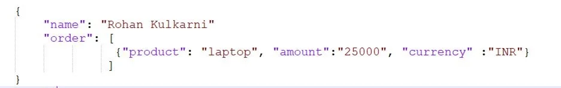
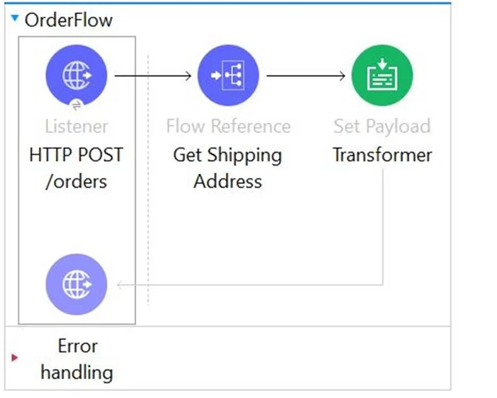
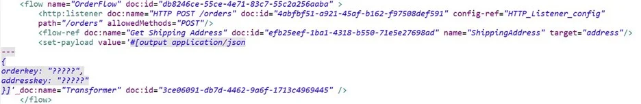
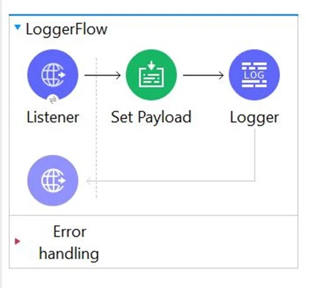
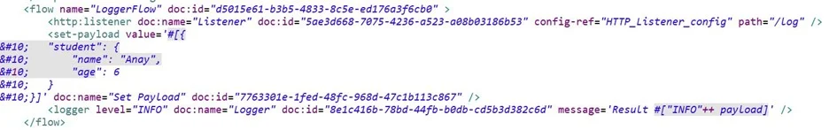

# Cuestionario de prueba 3

Cuestionario de prueba para el examen de certificación de Mulesoft con Explicaciones incluidas

## [Respuestas y explicaciones](respuestas_3.md)

---

1. By default , what happens to a file after it is read using an FTP connector Read operation?
   1. The file is deleted from the folder
   2. The file stays in the same folder unchanged
   3. The file is moved to different folder
   4. The file is renamed in the same folder <br/><br/>
2. To avoid hard-coding values, a flow uses some property placeholders and the corresponding values are stored in a configuration file. Where does the configuration file's location need to be specified in the Mule application?
   1. A flow attribute
   2. A global element
   3. The POM.xml file
   4. The mule-artifact.json file <br/><br/>
3. Refer to the exhibits. A mule application is being developed which will process POST requests coming from clients containing the name and order information. Sample request is as below <br/>  <br/> This main mule application calls a separate flow called as _ShippingAddress_ which returns the address corresponding to the name of the user sent to it as input. Output of this _ShippingAddress_ is stored in a target variable named _address_. <br/> Next set of requirement is to have a setPayload transformer which will set below two values <br/> 1) _orderkey_ which needs to set to be equal to the order element received in the original request payload. <br/> 2) _addressKey_ which needs to be set to be equal to the address received in response of _ShippingAddress_ flow <br/> What is the straightforward way to properly configure the Set Payload transformer with the required data? <br/>  <br/> 

```json
// i.
1. {
2.     orderkey: "attributes.order",
3.     addresskey: "vars.address"
4. }
```

```json
// ii.
1. {
2.     orderkey: "payload.order",
3.     addresskey: "address"
4. }
```

```json
// iii.
1. {
2.     orderkey: "attributes.shippingaddress.order",
3.     addresskey: "payload"
4. }
```

```json
// iv.
1. {
2.     orderkey: "payload.order",
3.     addresskey: "vars.address"
4. }
```

4. What is the output of Dataweave Map operator?
   1. Object
   2. Array
   3. Map
   4. String <br/><br/>
5. What is the difference between a subflow and a sync flow?
   1. Subflow is synchronous and sync flow is asynchronous
   2. Sync flow has no error handling of its own and subflow does
   3. Subflow has no error handling of its own and sync flow does
   4. No difference <br/><br/>
6. What asset cannot be created using Design Center?
   1. API fragments
   2. API specifications
   3. Mule Applications
   4. API portals <br/><br/>

> [!WARNING]
> La pregunta anterior (6) esta desactualizada por ende hay en realidad `2` respuestas correctas, pero igual la incluyo por si el examen de certificación viene algo similar.

7. According to Semantic Versioning, which version would you change for incompatible API changes?
   1. MINIOR
   2. PATCH
   3. MAJOR
   4. No change <br/><br/>
8. A Mule flow has three Set Variable transformers. What global data structure can be used to access the variables?
   1. Mule event attributes
   2. Mule event message
   3. Mule application properties
   4. Mule event <br/><br/>
9. According to Mulesoft, how are Modern APIs treated as?
   1. Rest API's
   2. SOAP API's
   3. Products
   4. Code <br/><br/>
10. What are the latest version of RAML available?
    1. 1.2
    2. 2
    3. 0.8
    4. 1.0 <br/><br/>
11. A flow needs to combine and return data from two different data sources. It contains a Database SELECT operation followed by an HTTP Request operation. What is the method to capture both payloads so the payload from second request does not overwrite that from the first?
    1. Save the payload from the Database SELECT operation to a variable
    2. Nothing as previous payloads are combined into the next payload
    3. Put the Database SELECT operation inside a Message Enricher scope
    4. Put the Database SELECT operation inside a cache scope <br/><br/>
12. How does APIkit determine the number of flows to generate from a RAML specification?
    1. Creates a separate flow for each resource that contains child resources
    2. Creates a separate flow for each HTTP method
    3. Creates a separate flow for each resource
    4. Creates a separate flow for each response status code <br/><br/>
13. What payload is returned by a Database SELECT operation that does not match any rows in database?
    1. FALSE
    2. Empty Array
    3. Exception
    4. null <br/><br/>
14. According to MuleSoft. what is the first step to create a Modern API?
    1. Performance tune and optimize the backend systems and network
    2. Create a prototype of the API implementation
    3. Create an API specification and get feedback from stakeholders
    4. Gather a list of requirements to secure the API environments <br/><br/>
15. Why would a Mule application use the `${http.port}` property placeholder for its HTTP Listener port when it is deployed to CloudHub?
    1. Allows CloudHub to automatically change the HTTP port to allow external clients to connect to the HTTP Listener
    2. Allows clients to VPN directly to the application at the Mule application's configured HTTP port
    3. Allows MuleSoft Support to troubleshoot the application by connecting directly to the HTTP Listener
    4. Allows CloudHub to automatically register the application with API Manager <br/><br/>
16. What MuleSoft product enables publishing, sharing, and searching of APIs?
    1. Anypoint Exchange
    2. API Designer
    3. Runtime Manager
    4. API Notebook <br/><br/>
17. Refer to the payload. The Set payload transformer sets the payload to an object. The logger component's message attribute is configured with the string `"Result #["INFO"++ payload]"` <br/> What is the output of logger component when this flow executes? <br/>  <br/> 
    1. `Error : You evaluated inline expression # without ++`
    2. `Result INFOpayload`
    3. `Result INFO{"student":{"name":"Anay","age":6}}`
    4. ```bash
        You called the function '++' with these arguments:
        1: String ("INFO")
        2: Object ({student: {name: "Anay" as String {class: "java.lang.String"},age: 6 as Numbe...)
        ```
        <br/>
18. How can you call a subflow from Dataweave?
    1. Lookup function
    2. Include function
    3. Import function
    4. Not possible in Mule 4 <br/><br/>
19. What is the minimum Cloudhub worker size that can be specified while deploying mule application?
    1. 0.1 vCores
    2. 0.5 vCores
    3. 0.2 vCores
    4. 1.0 vCores <br/><br/>
20. An SLA based policy has been enabled in API Manager. What is the next step to configure API proxy to enforce new SLA policy?
    1. Add new property placeholders and redeploy the API proxy
    2. Add new environment variables and restart the API proxy
    3. Add required headers to RAML specification and redeploy new API proxy
    4. Restart API proxy to clear the API Policy cache <br/><br/>
21. What happens to the attributes of a Mule event in a flow after an outbound HTTP Request is made?
    1. Previous attributes are passed unchanged
    2. New attributes may be added from the HTTP response headers, but no headers are ever removed
    3. Attributes do not change
    4. Attributes are replaced with new attributes from the HTTP Request response (which might be null) <br/><br/>
22. What MuleSoft API-led connectivity layer is intended to expose part of a backend database without business logic?
    1. System layer
    2. Experience layer
    3. Process layer
    4. Data layer <br/><br/>
23. Which Mule component provides a real-time, graphical representation of the APIs and mule applications that are running and discoverable?
    1. Anypoint Visualizer
    2. Runtime Manager
    3. API Notebook
    4. API Manager <br/><br/>
24. An API has been created in Design Center. What is the next step to make the API discoverable?
    1. Publish the API to Anypoint Exchange
    2. Deploy the API to a Maven repository
    3. Enable autodiscovery in API Manager
    4. Publish the API from inside flow designer <br/><br/>
25. An API specification is designed using RAML . What is the next step to create a REST Connector from this API specification?
    1. Implement the API specification using flow designer in Design Center
    2. Publish the API specification to Anypoint Exchange
    3. Download the API specification and build the interface using APIkit
    4. Add the specification to a Mule project's src/main/resources/api folder <br/><br/>

### Fin del cuestionario de prueba 3 😙

---

### [Respuestas y explicaciones](respuestas_3.md)

### [Cuestionario de prueba 1](cuestionario_1.md)

### [Cuestionario de prueba 2](cuestionario_2.md)

---
