# Cuestionario de prueba 4

## [Respuestas y explicaciones](respuestas_4.md)

---

1. According to MuleSoft, what is the first step to create a API for use in an application network?
   1. Create a prototype of the API implementation
   2. Create an API specification and get feedback from stakeholders
   3. Gather a list of requirements to secure the API
   4. Performance tune and optimize the backend systems and network   
2. Refer to the exhibit. The input array of strings is passed to the batch job, which does NOT do any filtering or aggregating.   What payload is logged by the Logger component?   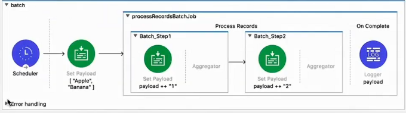
   1. ["Apple1", "Banana1", 2]
   2. ["Apple12", "Banana12"]
   3. Summary report of processed records
   4. ["Apple", "Banana"]   
3. Refer to the exhibits. The main flow contains an HTTP Request in the middle of the flow. The HTTP Request use default configurations.   After a web client sumits a request to http://localhost:8081/order?color=red, what values are accesible to the Logger at the end of the main flow?   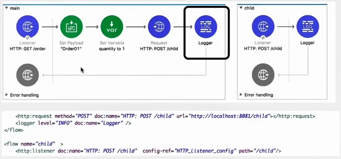
   1. payload   color query param
   2. payload
   3. payload   quantity var
   4. payload   color query param   quantity var   
4. A web client sens a request to http://localhost:8081/books/0471767840. The value "0471767840" is captured by a Set Variable transformer to a variable named bookISBN.   What is a valid DataWeave expression to access the bookISBN variable later in the flow?
   1. bookISBN
   2. attributes.bookISBN
   3. variables.bookISBN
   4. vars.bookISBN   
5. Refer to the exhibit. The main flow contains a Flow Reference for the child flow.   After a web client submits a request to http://localhost:8081/order?color=red, what values are accesible in the child flow?   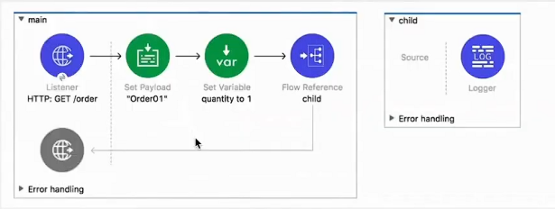
   1. payload   color query param   quantity var
   2. payload   color query param
   3. payload   quantity var
   4. payload   
6. When using MuleSoft's Anypoint API-led connectivity approach, what HTTP method is a RESTful web service is generally recommended to be used to completely replace an existing resource?
   1. POST
   2. GET
   3. PUT
   4. PATCH   
7. A Mule application uses the ${http.port} property placeholder for its HTTP Listener port when it is deployed to CloudHub.   What benefit does this Mule application configuration enable?
   1. Clients to VPN directly to the Mule application at the Mule application's configured HTTP port
   2. MuleSoft Support to trobuleshoot the application by connecting directly to the HTTP Listener
   3. CloudHub to automatically register the application with API Manager
   4. CloudHub to automatically change HTTP port to allow external clients to connect to the HTTP Listener   
8. Refer to the exhibit. How Many private flows does APIkit generate from the RAML specification?   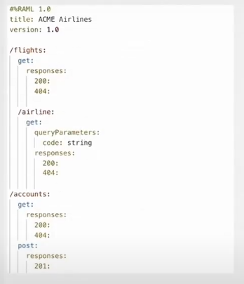
   1. 1
   2. 2
   3. 3
   4. 4   
9. 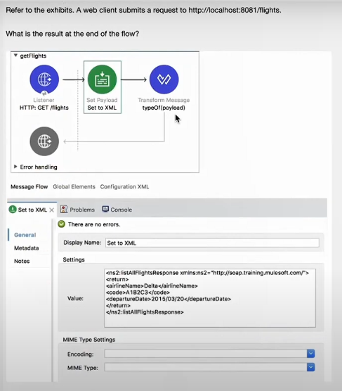   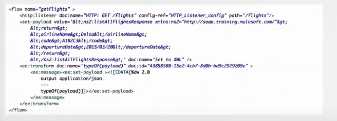
   1. "String"
   2. "XML"
   3. "Object"
   4. "Java"   
10. 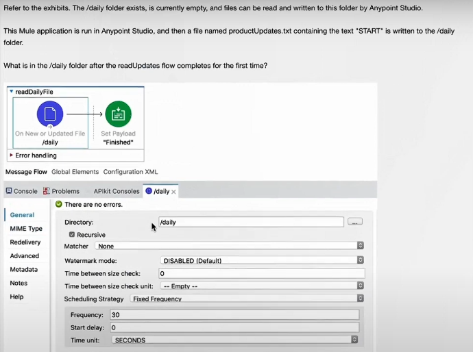   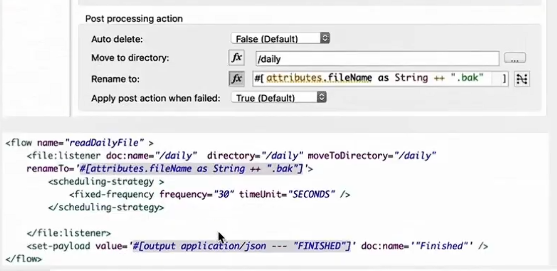
    1. A file named productUpdates.txt.bak containing the text "FINISHED"
    2. A file named productUpdates.txt.bak containing the text "START"
    3. A file named productUpdates.txt containing the text "START"   A file named productUpdates.txt.bak containing the text "FINISHED"
    4. A file named productUpdates.txt containing the text "START"   A file named productUpdates.txt.bak containing the text "START"   
11. An API specification is defined using RAML.   What is the next step to create a REST Connect connector from this API specification?
    1. Download the API specification and build the interface using APIkit
    2. Add the specification to a Mule project's src/main/resources/api folder
    3. Publish the API specification to Anypoint Exchange
    4. Implement the API specification using Flow Designer   
12. A client submits a GET request to a Mule 4 application to the endpoint /customers?id=48493.   Where is the ID stored in the Mule event by the HTTP Listener?
    1. Attributes
    2. Variables
    3. Payload
    4. Inbound Properties   
13. A Mule application contains a global error handler configured to catch any errors.   Where must the global error handler be specified so that it catches all errors from flows that do not have their own error handlers?
    1. In a configuration properties file
    2. In a pom.xml file
    3. In the mule-artifact.json file
    4. In the global element   
14. 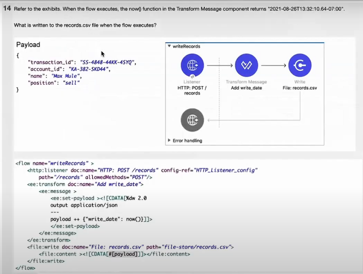
    1. 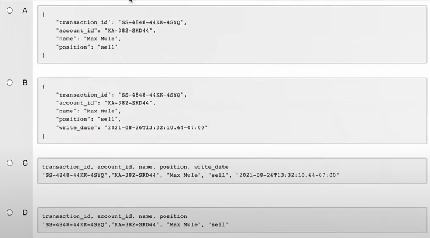   
15. 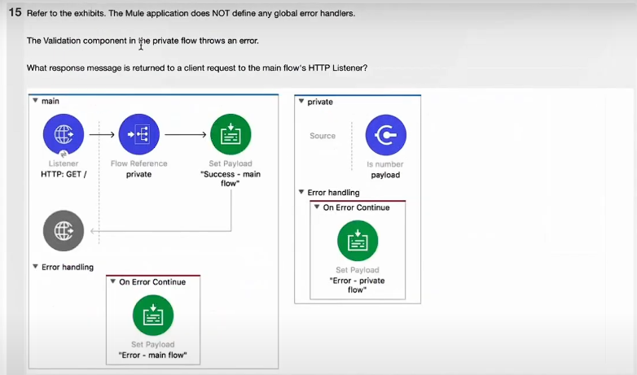   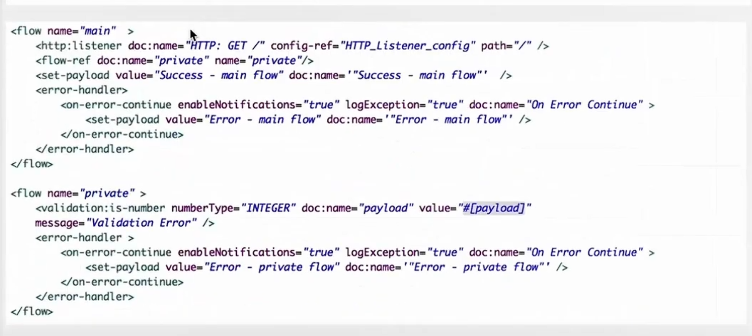
    1. "Success - main flow"
    2. "Error - private flow"
    3. "Error - main flow"
    4. "Validation Error"   
16. 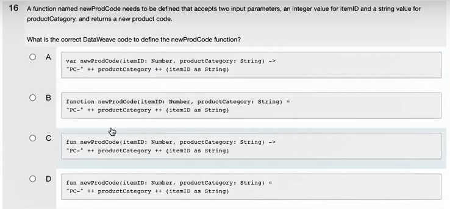   
17. A development team was developing a mobile banking app. It took the team two months to create their own APIs to access transaction information from a central database.   The development team later found out that anoter team had already build an API tha accessed this transaction information.   According to MuleSoft, what organization structure could have saved the development team two months of development time?
    1. Center for Enablement
    2. MuleSoft Support Center
    3. Central API Review Board
    4. Center of Excellence   
18. What is the correct way to format the decimal 20.3844 as a string to two decimal places?
    1. 20.3844 format { String: ".0#" }
    2. 20.3844 as String ( {format: ".0#"} )
    3. 20.3844 {format: ".0·" as String}
    4. 20.3844 as String {format: ".0#"}   
19. An SLA-based policy has been enabled in API Manager.   What should now be changed in the RAML specification and/or the API Proxy to enforce the SLA-based policy?
    1. Restart the API Proxy to clear the API policy cache
    2. Add new property placeholders and redeploy the API Proxy
    3. Add requeride headers to the RAML specification and redeploy the API Proxy
    4. Add new enviroment variables and restart the API Proxy   
20. A flow contains a Database Select operation followed by an HTTP Request operation. The flow must combine and return data recived from these two connector operations.   What is a valid and idiomatic (use for its intended purpose) way to capture both payloads so the payload output from the second HTTP Request operation does not overwrite the payload output from the first Database Select operation?
    1. Save the payload from the Database Select operation to a variable
    2. Set the combined Payloads attribute to true in the Database Select operation configuration
    3. Put the Database Select operation in a Try scope configured with a transaction
    4. Put the Database Select operation inside a Cache scope   
21. 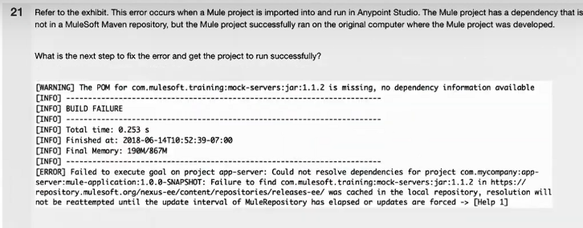
    1. Deploy the dependency to a MuleSoft Maven repository
    2. Edit the dependency in the Mule project's pom.xml file
    3. Add the dependency to the MULE_HOME/lib/bin folder
    4. Install the dependency to the computer's local Maven repository   
22. 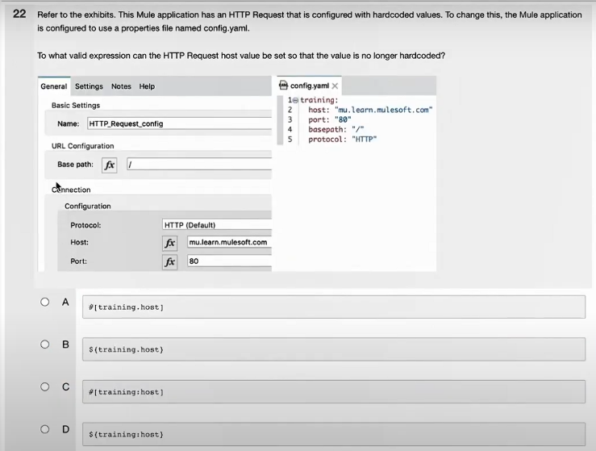   
23. A Mule application contains two HTTP Listeners, each configured for different API endpoints: http://acme.com/apis/orders and http://acme.com/apis/customers.   What base path value should be set in an HTTP Listener config element so that it can be used to configure both HTTP Listeners?
    1. /apis/
    2. /apis/?
    3. /apis/*
    4. /apis/orders|customers   
24. 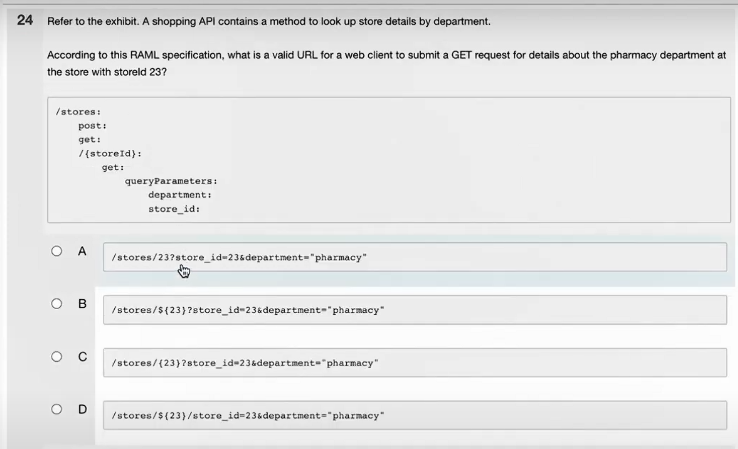
25. 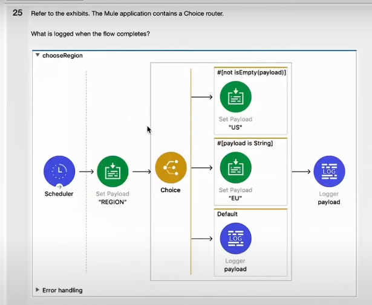   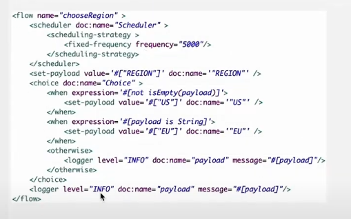
    1. "US"
    2. "REGION"
    3. ["US", "EU"]
    4. "EU"   
26. 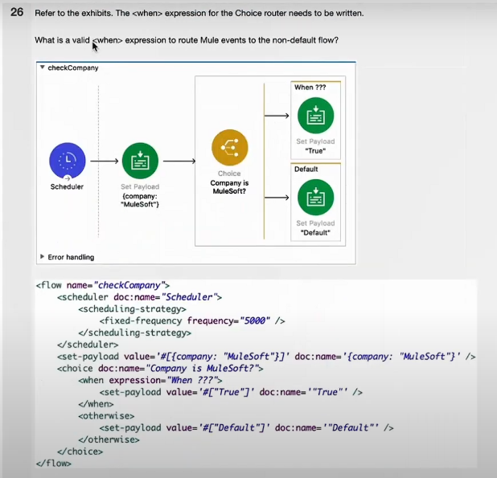
    1. #[ 'MuleSoft' == payload.'company' ]
    2. #[ if( 'MuleSoft' == payload.company ) ]
    3. #[ if( company == "MuleSoft" ) ]
    4. #[ company = "MuleSoft" ]   
27. 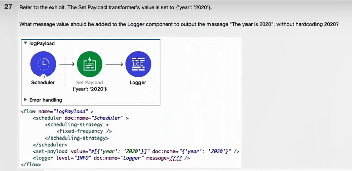
    1. '#['The year is ++ payload.year']'
    2. '#['The year is' ++ payload.year]'
    3. '#[The year is $(payload.year)]'
    4. 'The year is #[payload.year]'   
28. 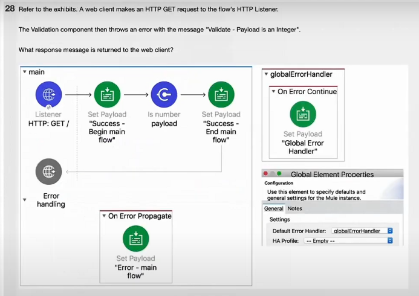   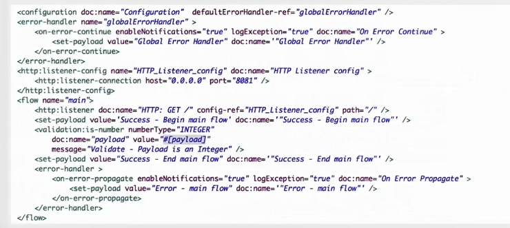
    1. "Error - main flow"
    2. "Success - Begin main flow"
    3. "Success - End main flow"
    4. "Validate - Payload is an integer"   
29. Each HTTP Listener is configured with the same host and with the port number, path, and operation shown in its display name.   What is the minimum number of global elemnts that must be defined to support these HTTP Listeners?   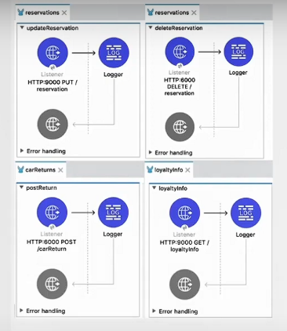
    1. 1
    2. 2
    3. 3
    4. 4   
30. A RAML example fragment named BankAccountsExample.raml is placed in the examples folder in an API specification project.   What is the correct syntax to reference the fragment?
    1. examples: !include BankAccountsExample.raml
    2. examples: #import BankAccountsExample.raml
    3. examples: !include examples/BankAccountsExample.raml
    4. examples: #include examples/BankAccountsExample.raml   
31. What payload is returned by an Anypoint Connector for Database's Select operation that does not match any rows in the database?
    1. null
    2. An empty array
    3. An exception
    4. false   
32. 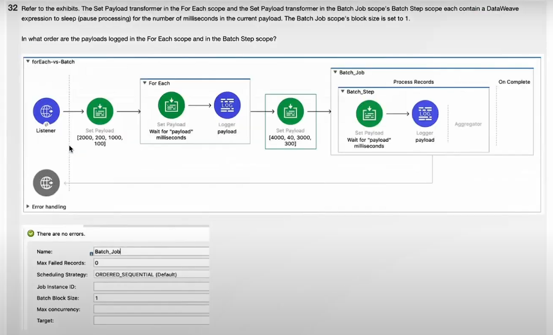
    1. For Each scope: 2000, 200, 1000, 100   Batch Job scope: 4000, 40, 3000, 300
    2. For Each scope: 100, 200, 1000, 2000   Batch Job scope: 4000, 40, 3000, 300
    3. For Each scope: 2000, 200, 1000, 100   Batch Job scope: 40, 300, 3000, 4000
    4. For Each scope: 100, 200, 1000, 2000   Batch Job scope: 40, 300, 3000, 4000   
33. What is the output type of the DataWeave map function?
    1. Array
    2. String
    3. Object
    4. Map   
34. 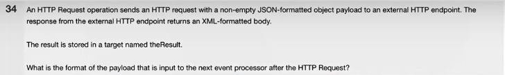
    1. application/xml
    2. application/dw
    3. application/java
    4. application/json   
35. 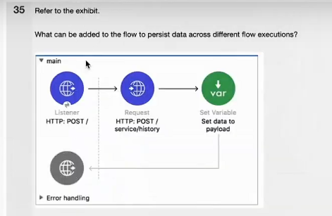
    1. Session variables
    2. Key-value pairs in the ObjectStore
    3. Properties of the Mule runtime app object
    4. Properties of the Mule runtime flow object   
36. 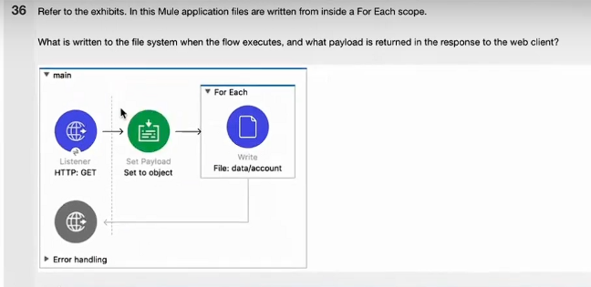   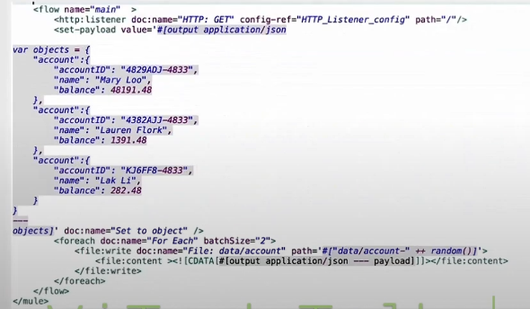
    1. 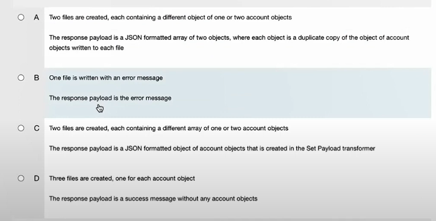   
37. 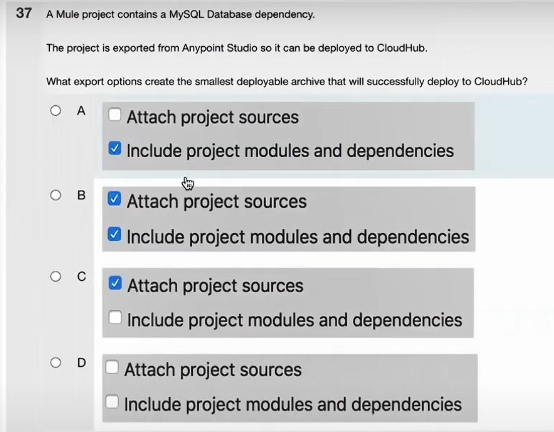   
38. To avoid hard-coding values, a flow uses some property placeholders and the corresponding values are stored in a configuration file.   Where does the configuration file's location need to be specified in the Mule application?
    1. The pom.xml file
    2. A global element
    3. A flow attribute
    4. The mule-artifact.json file   
39. 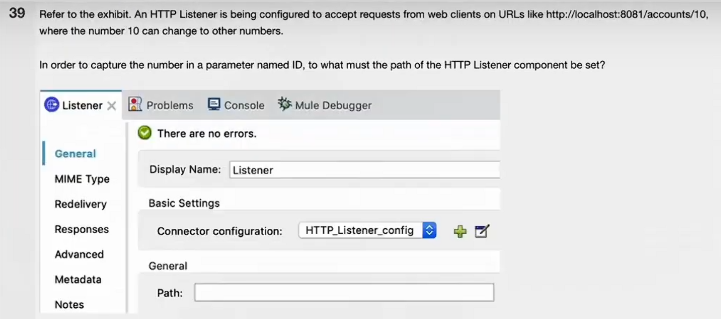
    1. /accounts/#[ID]
    2. /accounts/{ID}
    3. /accounts/ID
    4. #[/accounts/ID]   
40. 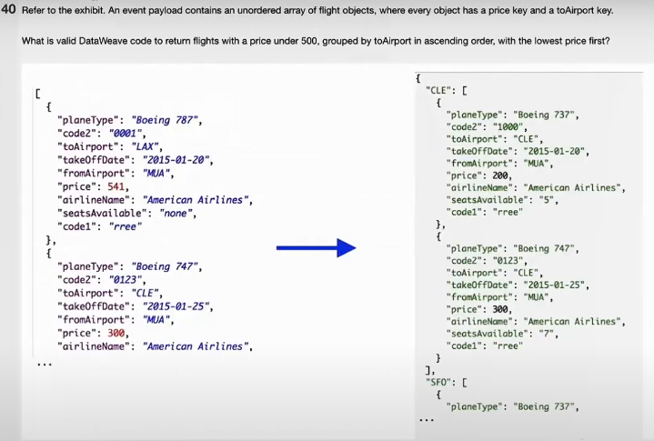
    1. 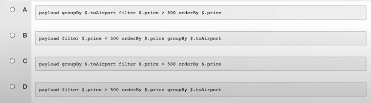   
41. 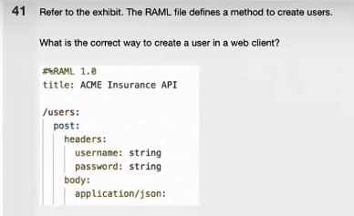
    1. 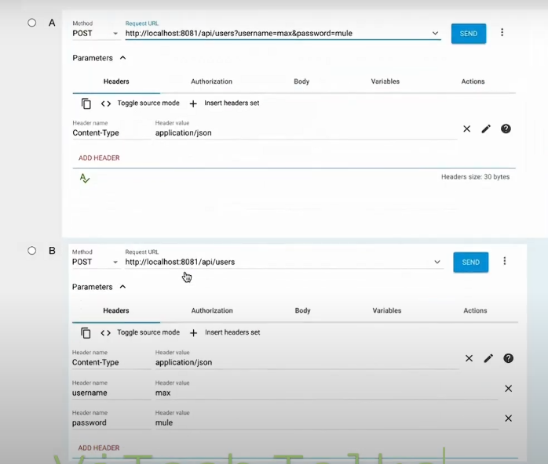
    2. 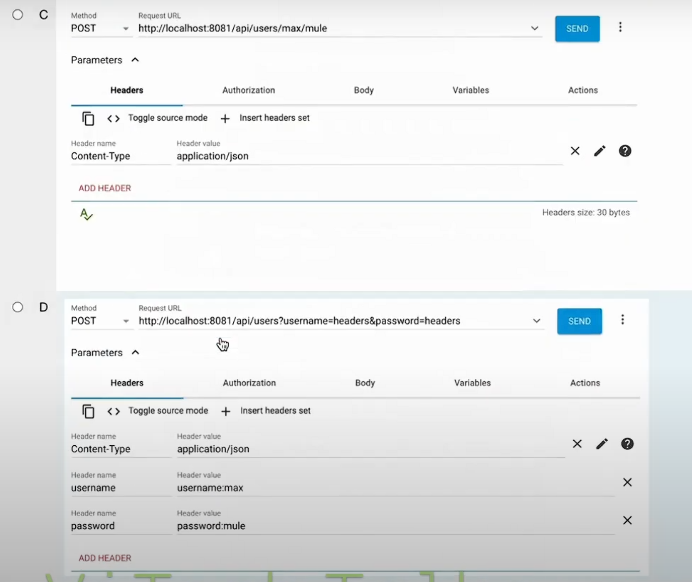   
42. 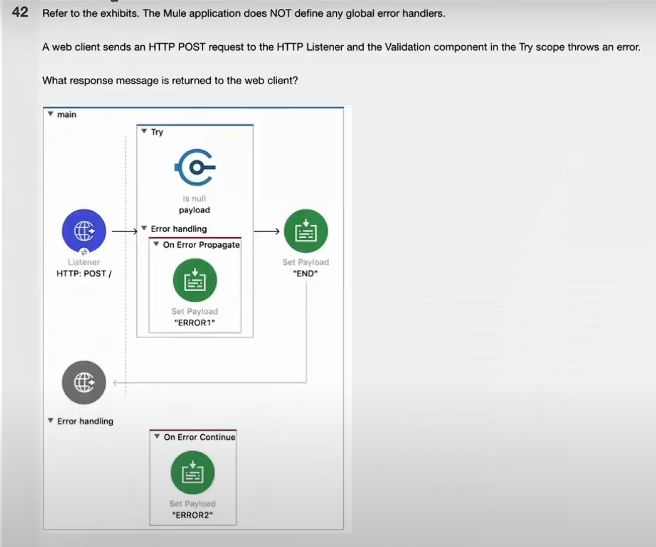   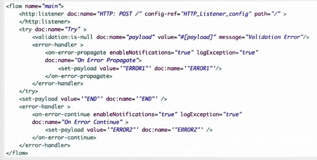
    1. "ERROR2"
    2. "END"
    3. "ERROR1"
    4. "Validation Error"   
43. 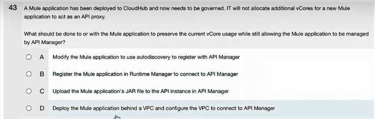   
44. 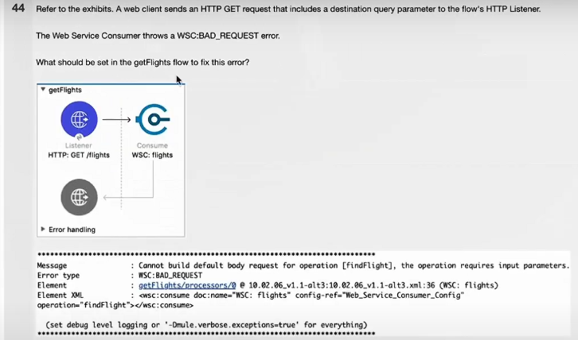
    1. A property in the Consume operation equal to the destination query parameter
    2. A JSON payload before the Consume operation that contains the destination query parameter
    3. A SOAP payload before the Consume operation that contains the destination query parameter
    4. A header in the Consume operation equal to the destination query parameter   
45. A Scatter-Gather processes three separate HTTP requests. Each request returns a Mule Event with a JSON payload.   What is the final output of the Scatter-Gather?
    1. An array of three Mule Event objects
    2. An object containing three JSON payload objects
    3. An object containing three Mule Event objects
    4. An array of three JSON payload objects   
46. 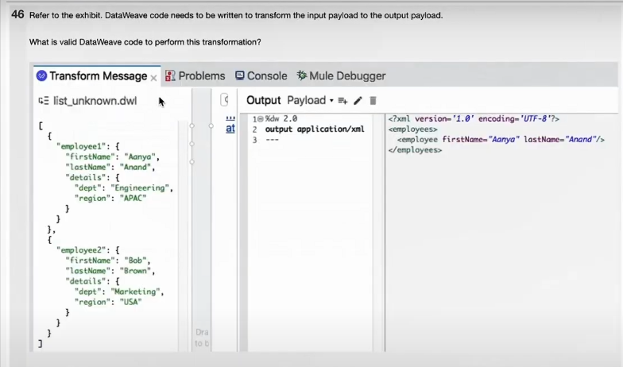
    1. 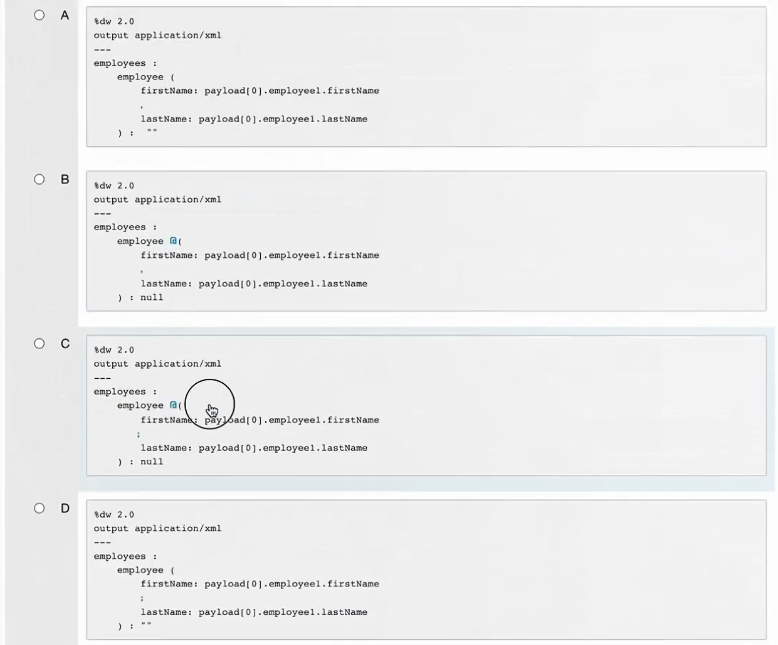   
47. 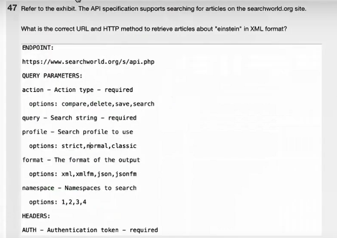
    1. 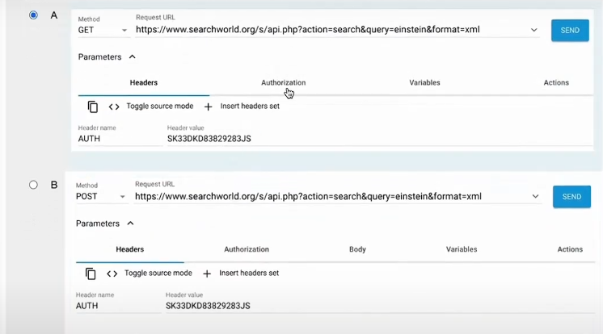   
48. 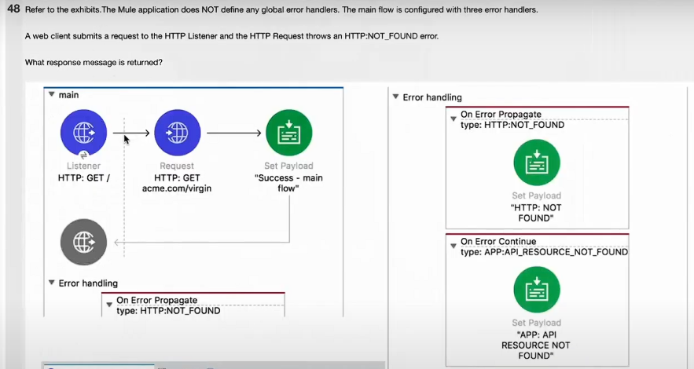   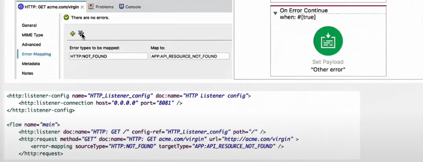
    1. "Success - main flow"
    2. "HTTP: NOT FOUND"
    3. "APP: API RESOURCE NOT FOUND"
    4. "Other error"   
49. 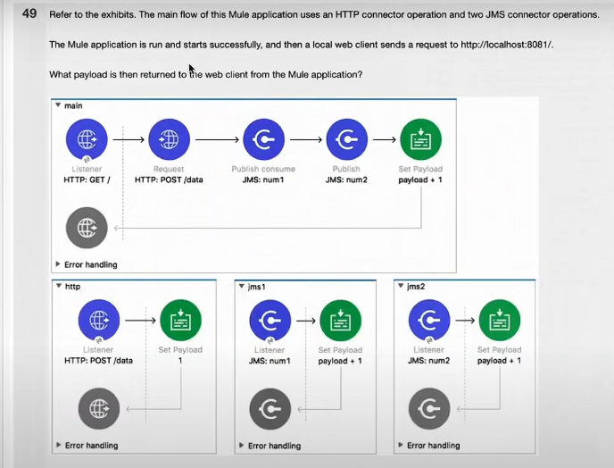   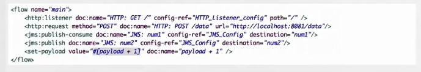
    1. 1
    2. 2
    3. 3
    4. 4   
50. In an application network, the implementation, not the interface, of a product API is being changed.   Does anything need to change in the other APIs associated applications that consume the product API, and if so, what are these changes?
    1. The other APIs must be updated to consume the updated product API
    2. The applications associated with the other APIs must be recoded
    3. Nothing needs to be changed in the other APIs or their associated applications
    4. The application associated with the other APIs must be restarted   
51. 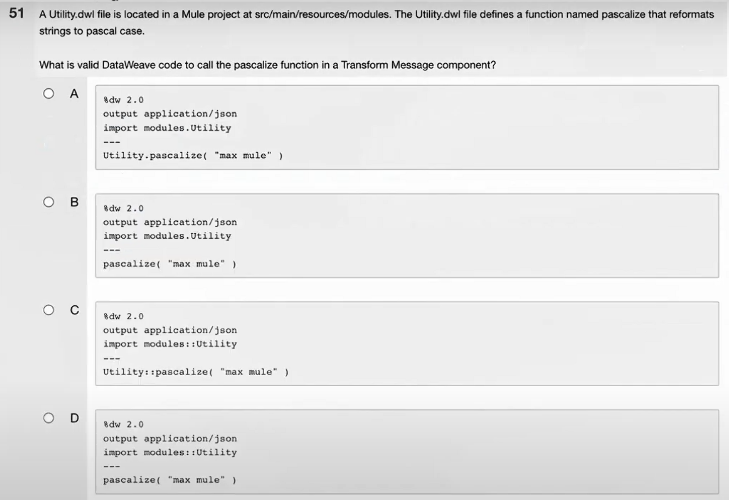   
52. 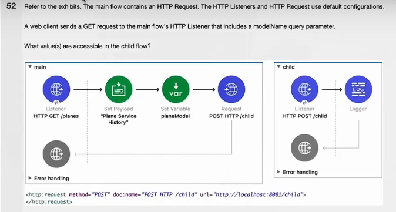
    1. The payload   The modelName query param
    2. The payload   The planeModel var
    3. The payload
    4. The payload   The modelName query param   The planeModel var   
53. 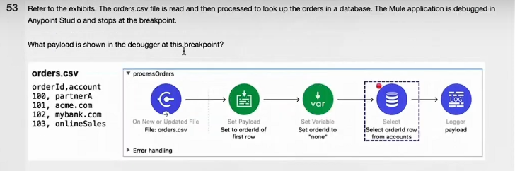
    1. 100
    2. An empty array
    3. The database response
    4. The entire CSV file   
54. 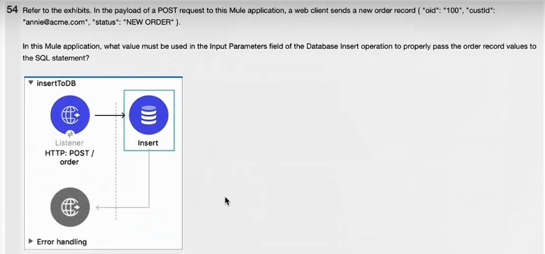   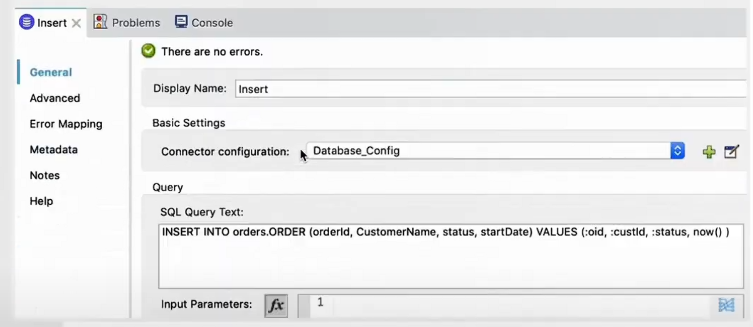
    1. 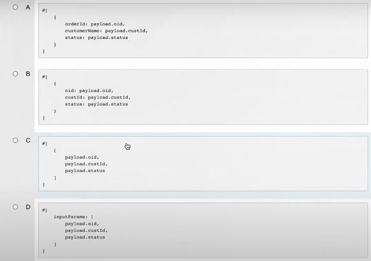   
55. 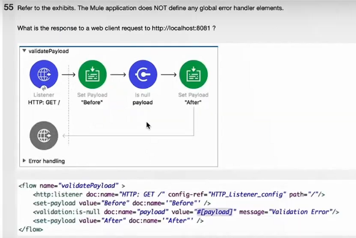
    1. Validation Error
    2. "After"
    3. "Before"
    4. null   
56. 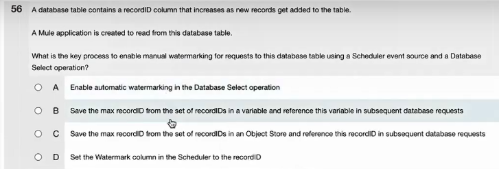   
57. 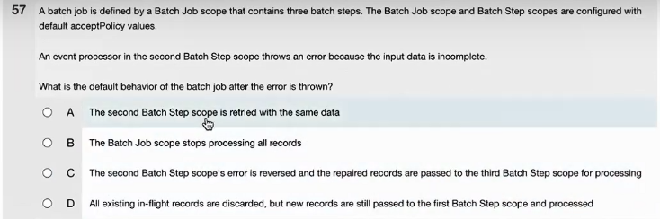   
58. 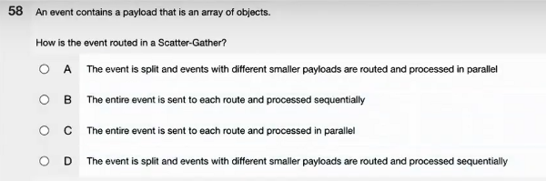   
59. 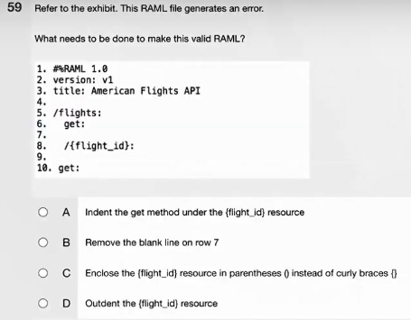   

### Fin del cuestionario de prueba 4 😙

---

### [Respuestas y explicaciones](respuestas_4.md)

### [Cuestionario de prueba 1](cuestionario_1.md)

### [Cuestionario de prueba 2](cuestionario_2.md)

### [Cuestionario de prueba 3](cuestionario_3.md)

---