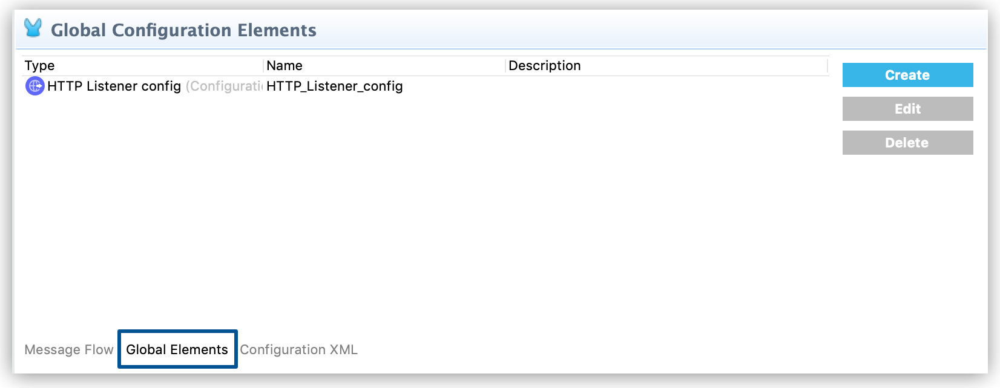
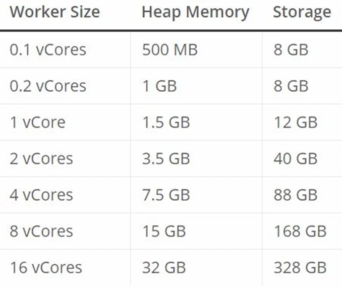
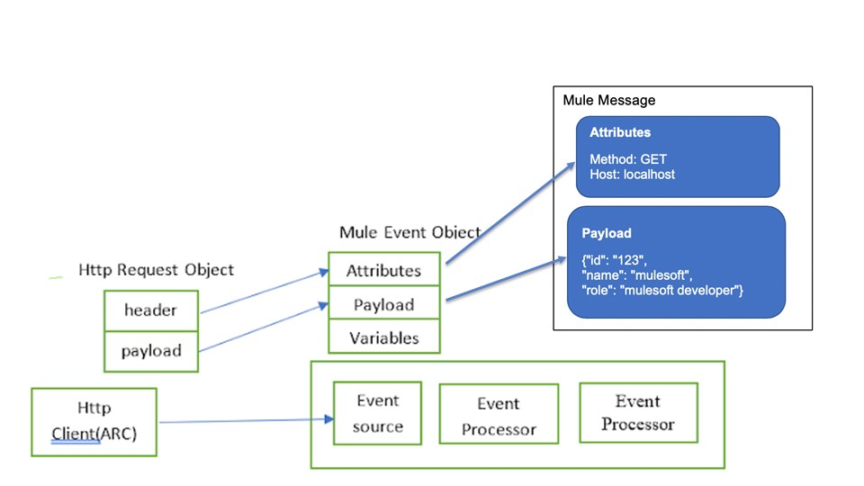
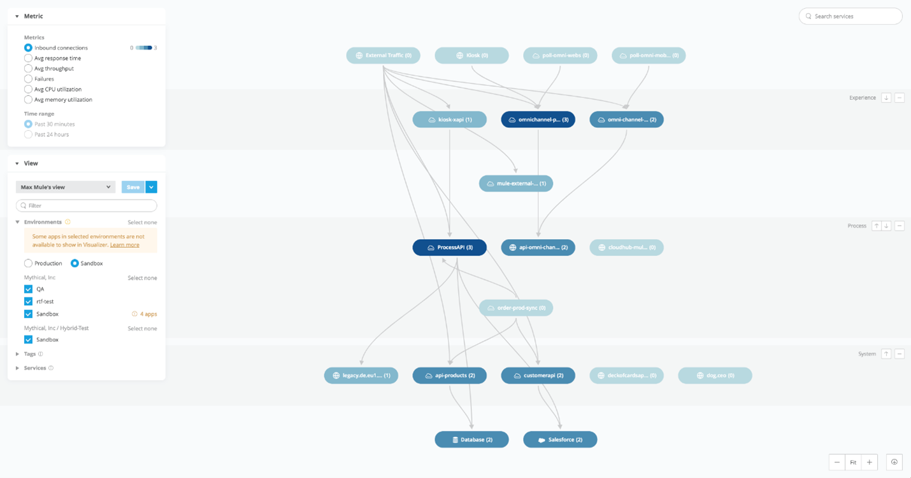
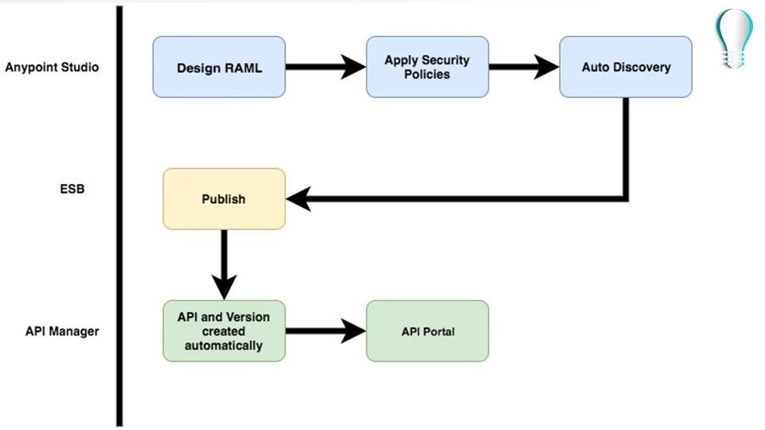
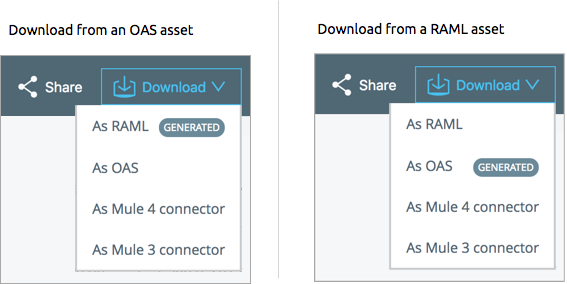

# Respuestas del tercer cuestionario

1. `ii.` - `The file stays in the same folder unchanged`
   1. **Explicación:** File is not modified when FTP read operations is performed. Hence correct answer is **The file stays in the same folder unchanged**.   
2. `ii.` - `A global element`
   1. **Explicación:** When we create a configuration file , that file needs to added as Global Configuration file in Global element. A global element is a reusable object containing parameters that any number of elements in a flow can share. You reference a global element from Anypoint Connectors or components in your Mule application. <h3>Global Elements</h3> A global element is a reusable object containing parameters that any number of elements in a flow can share. You reference a global element from Anypoint Connectors or components in your Mule application.    Use the global element to apply configuration details to multiple local elements in flows. Create one global element that defines parameters and configuration details, and then reference the global element from any flow element that uses this configuration. This practice enables you to ensure consistency across flow elements. <h3>Create a Global Element</h3> You can create global elements in two ways:   From the **Global Elements** tab in the Anypoint Studio canvas   From the properties panel of any connector or module that supports global elements <h3>From the Anypoint Studio Canvas</h3> In the Anypoint Studio visual editor, click the **Global Elements** tab to access a list of all global elements in an application:      Click **Create** to add a new global element.   In the **Choose Global Type** wizard, navigate the directories or use the filter to select the type of global element you want to create, and then click **OK**.   Define the configurable parameters of your global element in the **Global Element Properties** window.   Click **OK** to save.   
3. `iv.`
   1. **Explicación:** This question essentially checks the capability to retrieve value from the payload and the variable from the mule event. <h3>Accessing Variables</h3> **vars** is the Keyword for accessing a variable, for example, through a DataWeave expression in a Mule component, such as the Logger, or from an Input or Output parameter of an operation. If the name of your variable is `myVar`, you can access it like this: `vars.myVar` <h3>Accessing Payload</h3> The message payload contains the content or body of a message. You can select the payload of a Mule message through a DataWeave expression that uses the Mule Runtime variable, **payload**.   Correct answer is as below. In this case address will be stored in a variable. Hence payload will not be overwritten and will contain order details   `{ orderkey: "payload.order",addresskey: "vars.address"}`   
4. `ii.` - `Array`
   1. **Explicación:** Returns an array that is the result of applying a transformation function (lambda) to each of the elements.   
5. `iii.` - `Subflow has no error handling of its own and sync flow does`
   1. **Explicación:** <h3>Subflow</h3> A subflow processes messages **synchronously** (relative to the flow that triggered its execution) and always inherits both the processing strategy and exception strategy employed by the triggering flow. While a subflow is running, processing on the triggering flow pauses, then resumes only after the subflow completes its processing and hands the message back to the triggering flow. <h3>Synchronous Flow</h3> A synchronous flow, like a subflow, processes messages **synchronously** (relative to the flow that triggered its execution). While a synchronous flow is running, processing on the triggering flow pauses, then resumes only after the synchronous flow completes its processing and hands the message back to the triggering flow. However, unlike a subflow, this type of flow does not inherit processing or exception strategies from the triggering flow.   This type of flow processes messages along a single thread, which is ideally suited to transactional processing.   
6. `iii. & iv.` - `Mule Applications & API portals`
   1. **Explicación:** API portal are created by **API Exchange** and cannot be created by Design Center.   Meanwhile Mule Applications are not longer available by Design Center instead they are maked in Anypoint Studio.   
7. `iii.` - `MAJOR`
   1. **Explicación:** MAJOR version when you make incompatible API changes.   MINOR version when you add functionality in a backwards compatible manner.   PATCH version when you make backwards compatible bug fixes.   [Reference doc](https://semver.org/).   
8. `iv.` - `Mule event`
   1. **Explicación:** A Mule event contains the core information processed by the runtime. It travels through components inside your Mule app following the configured application logic.   Note that the Mule event is immutable, so every change to an instance of a Mule event results in the creation of a new instance.   A Mule event is composed of these objects:   - A Mule Message contains a message payload and its associated attributes.   - Variables are Mule event metadata that you use in your flow.   
9. `iii.` - `Products`
   1. **Explicación:** Modern API has three features   1) Treated as products for easy consumption   2) Discoverable and accessible through self-service   3) Easily managed for security , scalability and performance   
10. `iv.` - `1.0`   
11. `i.` - `Save the payload from the Database SELECT operation to a variable`
    1. **Explicación:** Response from HTTP request will override the payload and hence response of database SELECT can be lost. Best way to preserve is to assign payload of first operation to variable using TransformMessage.   This question tests the capability which is quite frequently used in day to day development work. Very often you need to merge the output of different activities. In such requirements, always save response of activity to variable so that it can be used later.   
12. `ii.` - `Creates a separate flow for each HTTP method`   
13. `ii.` - `Empty Array`
    1. **Explicación:** Empty array is returned when no rows are matched.   
14. `iii.` - `Create an API specification and get feedback from stakeholders`
    1. **Explicación:** Mulesoft advocates for users to adopt a "**design first**" approach to creating API’s. A "design first" approach is used to enable API consumers the ability to understand, interact, and solicit feedback on the proposed API contract prior to the development effort.
15. `i.` - `Allows CloudHub to automatically change the HTTP port to allow external clients to connect to the HTTP Listener`
    1. **Explicación:** This helps CloudHub to dynamically allocates a port at deployment time. <h3>Deploying a Mule Application to CloudHub</h3> <h4>Prerequisites</h4> To successfully deploy your Mule application to CloudHub, consider the following requirements:   a) The host and port number of your HTTP Listener flow sources are properly configured. If you are using the HTTP Listener as sources for your flow, you need to set its host to **0.0.0.0** and its port to **${http.port}**. CloudHub then dynamically allocates a port at deployment time.   b) All your external classes and resources are properly declared in the `mule-artifact.json` file of your Mule application. Due to Mule 4.x classloading isolation mechanism, all external classes and resources must be explicitly declared in the "exportedPackages" and "exportedResources" fields on the mule-artifact.json file before packaging and deploying the application.   
16. `i.` - `Anypoint Exchange`
    1. **Explicación:** <h3>Anypoint Exchange</h3> Anypoint Exchange provides the benefit of being able to discover, share, and incorporate assets and resources into your applications. Anypoint Exchange helps you create API developer portals, view and test APIs, simulate data to APIs (Mocking Service), create assets, and use API Notebooks to describe and test API functions.   
17. `iv.`
    1. **Explicación:** Concatenation operation works only when both arguments are string. It throws an error when either of the argument is object. In this case payload is object as mentioned in the question.
18. `iv.` - `Not possible in Mule 4`
    1. **Explicación:** This is a trick question.   You can call only flows from _DataWeave_ using **lookup** function. Note that lookup function does not support calling _subflows_.   A _subflow_ needs a parent context to inherit behaviors from such as exception handling, which a flow does not need.   
19. `i.` - `0.1 vCores`
    1. **Explicación:** <h3>CloudHub Workers</h3> _Workers_ are dedicated instances of Mule runtime engine that run your integration applications on CloudHub. The memory capacity and processing power of a worker depends on how you configure it at the application level.   [Reference doc](https://docs.mulesoft.com/cloudhub/cloudhub-architecture#cloudhub-workers)   Worker sizes have different compute, memory, and storage capacities. You can scale workers vertically by selecting one of the available worker sizes:      
20. `iii.` - `Add required headers to RAML specification and redeploy new API proxy`   
21. `iv.` - `Attributes are replaced with new attributes from the HTTP Request response (which might be null)`
    1. **Explicación:** Attributes include everything apart from Payload/body. For ex: Headers, query parameters, URI parameters.   So, when outbound HTTP request is made, new attributes need to pass the outbound HTTP request and old attributes are replaced.   See below diagram to make it easy for you to understand:      
22. `i.` - `System layer`
    1. **Explicación:** System APIs provide a means for insulating the data consumers from the complexity or changes to the underlying backend systems.   MuleSoft recommends three-layered approach to API-led connectivity, highlighting the three layers:   * System APIs   * Process APIs   * Experience APIs   System APIs are the core systems of record underlying core systems of record (e.g. ERPs, key customer and billing systems, databases, etc.). Process APIs allow you to define a common process which the organization can share, and these APIs perform specific functions, provide access to non-central data, and may be built by either Central IT or Line of Business IT. And finally, the Experience APIs are the means by which data can be reconfigured so that it is most easily consumed by its intended audience, all from a common data source.   
23. `i.` - `Anypoint Visualizer`
    1. **Explicación:** Anypoint Visualizer provides a real-time, graphical representation of the APIs, and Mule applications that are running and discoverable. It also displays third-party systems that are invoked by a Mule API, proxy, or application within your application network. The data displayed in the graph is dynamically updated and does not require prior configuration. Additionally, the data displayed is secure, as only users with the proper permissions can view the application network graph.      [Reference doc](https://docs.mulesoft.com/visualizer/).   
24. `i.` - `Publish the API to Anypoint Exchange`
    1. Anypoint Exchange makes this possible by making it discoverable in below ways   1) In private exchange for internal developers   2) In a public portal for external developers/clients   Here is diagram created by me to help you understand sequence:      
25. `ii.` - `Publish the API specification to Anypoint Exchange`
    1. **Explicación:** <h3>Publish an API Specification</h3> When you want to share your API specification with other developers, you can publish it to Anypoint Exchange. Exchange creates a page that presents the project for anyone in your business group to view and download the project from.   The page that Exchange creates for a published project includes a left pane for viewing the specification’s documentation, a middle pane for viewing a description of the specification, and a right pane for viewing metadata about the specification.   The left pane, which you can navigate to view the documentation. The navigation is generated from the documentation in the specification. The middle pane, which describes the specification. You write the description in Exchange after publishing the specification.T he right pane, which displays metadata about the specification. <h3>REST Connect Connector Generator</h3> The Exchange backend uses REST Connect to transparently convert a REST API specification to a Mule 3 and Mule 4 connector. You can use this connector as you would any other in Anypoint Studio.   The Anypoint Exchange Download button lets you download the Mule 3 or Mule 4 Connector.   REST Connect does not currently support custom TLS configurations. <h3>Access Generated Connectors</h3> In Exchange, you can download the Mule 3 or Mule 4 connector from the Download menu:   
