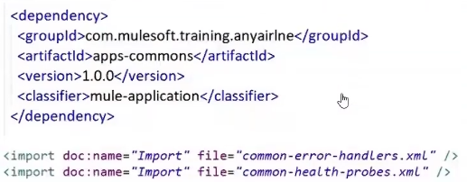
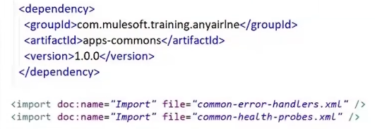
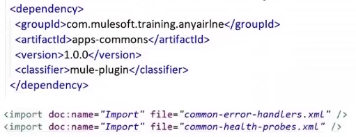
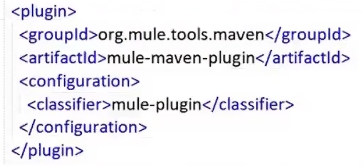
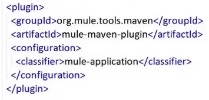
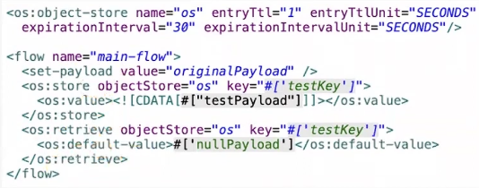
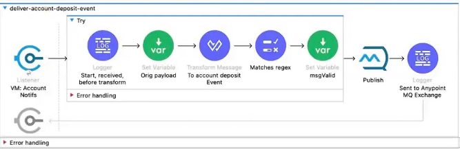
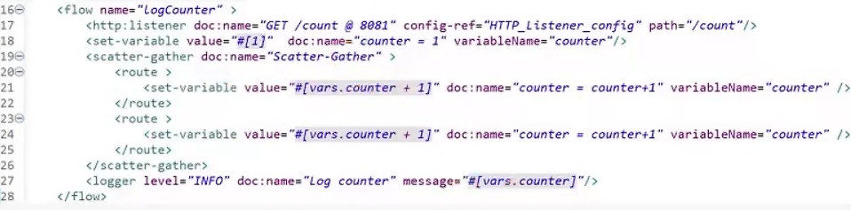
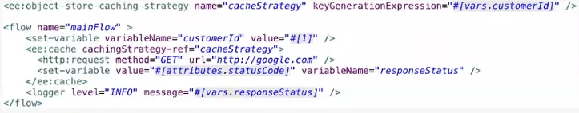

# Cuestionario de prueba 1

Cuestionario de prueba para el examen de certificación de Mulesoft Developer 2

## [Respuestas y explicaciones](respuestas_1.md)
---

1. A developer wants to expose their HTTPS API Mule applications using TLS. Which configuration is needed in the HTTPS Listener?
   1. A TLS context with a mandatory keystore and a mandatory truststore
   2. A TLS context with a mandatory keystore and an optional truststore
   3. An HTTPS context with a keystore
   4. An HTTPS context with a truststore

2. Loggers in a Mule application have been set to DEBUG level with details of the flow name and correlation ID. When deployed locally in Studio, the DEBUG level logs are displayed, but when the application is deployed to CloudHub, the DEBUG level logs do not appear. What action will allo the DEBUG level logs appear in Runtime Manager Logs?
   1. In Anypoint Studio, change the loggin level to ALL in the log4j2.xml file, Redeploy to CloudHub and the DEBUG logs will appear on Runtime Manager.
   2. In Runtime Manager > Application > Settings > Logging, change the logging level to DEBUG with the name package.name=org.mule, Apply changes and the DEBUG level (and higher) logs will appear on Runtime Manager.
   3. In Runtime Manager > Application > Settings > Logging, change the logging level to DEBUG with the package.name=log4j2.xml, Apply changes and the DEBUG level (and higher) logs will appear on Runtime Manager.
   4. In Anypoint Studio, change the logging level to TRACE in the log4j2.xml file, Redeploy to CloudHub and the DEBUG logs will appear on Runtime Manager.

3. When the HTTP Requester recives th eerror type Remotely CLosed, which HTTP methods are retried three times by default?
   1. GET, DELETE
   2. PUT, PATCH
   3. GET, POST
   4. POST, HEAD

4. Which widgets can be added to a custom dashboard in Anypoint Monitoring?
   1. Graphs, singlestats, text
   2. Labels, singlestats, tables
   3. Graphs, tables, labels
   4. Text, values, tables

5. What is the result if a non-text-based payload is uploaded to Anypoint MQ?
   1. Anypoint MQ puts the binary file into the queue without conversion
   2. Anypoint MQ converts it to a JSON Object befor sending it to the MQ
   3. Anypoint MQ generates an "Unsupported format" error
   4. Anypoint MQ converts it to a string before sending it to the MQ

6. A Mule application named "apps-commons" defines two mule configuration files: common-error-handlers.xml and common-health-probes.xml. Which two configurations must be done to bundle "apps-commons" as a library and reuse its functionality in a different Mule application named "check-in-papi"? (Choose two.)
   1. The "check-in-papi" application must add dependency for "apps-commons" and import both of its xml files. <br/> 
   2. The "check-in-papi" application must add dependency for "apps-commons" and import both of its xml files. <br/> 
   3. The "check-in-papi" application must add dependency for "apps-commons" and import both of its xml files. <br/> 
   4. Use the mule-plugin classifier in "apps-commons" to bundle it as a reusable library. <br/> 
   5. Use the mule-application classifier in "apps-commons" to bundle it as a reusable library. <br/> 

7. An HTTPS-based web application is being built and the TLS context must be configured. Which keystores are supported by Mulesoft?
   1. JCEKS, PKCS12
   2. JKS, JCEKS, PKCS12, BKS
   3. JCEKS, PKCS12, JKS
   4. JKS, JCEKS, BKS

8. A Mule Object Store is configured with an entry TTL of one second and an expiration interval of 30 seconds. If processing between os:store and os:retrieve takes 12 seconds, what is the result of the flow? <br/> 
   1. testPayload
   2. nullPayload
   3. OS.KEY_NOT_FOUND
   4. testKey

9. A developer has created a custom policy with version 1.0.0-SNAPSHOT. The developer attempts to publish the policy to Exchange using the Exchange Maven Facade API version 3 and the apply in API Manager. What will happen?
   1. The policu will deploy successfully and will be avaible to be applied in API Manager.
   2. The policy will deploy succesfully but will not be avaible to be applied in API Manager.
   3. The policy will not successfully deploy to Exchange.
   4. The policy will deploy successfully, but the Mule API implementation will fail to apply the policy.

10. Which Anypoint MQ consumer configuration provides protection against repeated delivery failures?
    1. Acknowledgement Mode
    2. Circuit Breaker
    3. Redelivery Policy
    4. Dead-Letter Queue

11. A DataWeave transformation needs to read a property named database.password from a secure property placeholder file. What is the correct syntax to read such a property?
    1. `![secure::database.property]`
    2. `"${secure::database.property}"`
    3. `p('secure::database.property')`
    4. `p('database.property')`

12. What regulates API request traffic by limiting the number of messages processed by an API an ensures that the number of messages processed whithin a specified time, regardless of client, does not exceed the configured limit?
    1. IP Allowlist policy
    2. Spike Control policy
    3. Rate-Limiting Service Level Agreement (SLA) policy
    4. Caching policy

13. During nonfunctional requirements (NFRs) gathering, a team determined that the API responsible for account deposits must have high-availability and high-reliability messaging with no message loss. Which steps should the developer take to ensure that the API can meet these NFRs? <br/> 
    1. Set the VM queue to persistent. <br/> Configure a redelivery policy on the Anypoint MQ Publish operation. <br/> Add an error handler that catches errors of type REDELIVERY-EXHAUSTED and sends messages to a dead-letter queue.
    2. Set the VM queue to transient. <br/> Configure a retry policy to the VM Listener. <br/> Add an error handler that catches errors of type RETRY-EXHAUSTED and sends messages to a dead-letter queue.
    3. Set the VM queue to transient. <br/> Configure a retry policy on the Anypoint MQ Publish operation. <br/> Add an error handler that catches errors of type RETRY-EXHAUSTED and sends messages to a dead-letter queue.
    4. Set the VM queue to persistent. <br/> Configure a redelivery policy on the VM Listener. <br/> Add an error handler that catcher error of type REDELIVERY-EXHAUSTED and sends messages to a dead-letter queue.

14. Which security scheme us not supported by HTTP Connector?
    1. OAuth 2.0 implicit flow
    2. OAuth 2.0 Client Credentials
    3. Digest Authentication
    4. Pass-through Authentication

15. With respect to correlation Id, what will happend when a client application invokes a Mule API?
    1. Mule will autocatically generate a random Correlation ID.
    2. No Correlation ID will be generated or set.
    3. Mule will look for another header with the key "X-Mule-Transaction-Id".
    4. Mule will raise an error.

16. A scheduled batch processing Mule application interacting with Mule applications over HTTP must send a custom correlation ID in the format of "application name"-UUID to each application. What is required to configure the client application to send this custom correlation ID?
    1. Set a global property with name correlationId and value: `#['myapp-$(uuid())'']`
    2. Set the global configuration correlationIdGeneratorExpression attribute with the value: `#['myapp-$(uuid())'']`
    3. Set a value for HTTP header x-correlation-id with each request with the value: `#['x-correlation-id':myapp-$(uuid())]`
    4. Use the set-variable processor to set a variable with name: correlationId and value: `#['myapp-$(uuid())']`

17. Which configuration of the Scatter-Gather router executes routes in a sequential manner?
    1. Set maxConcurrency of the flow containing Scatter-Gather to 1.
    2. Set maxConcurrency of Scatter-Gather to 1.
    3. Use the Anypoint MQ Connector inside Scatter-Gather.
    4. Use the Batch scope inside Scatter-Gather.

18. Some Mule application property values can be displayed in clear text (e.g. DB driver, JMS Queue, HTTP Port, etc.), while some must be encrypted (e.g. DB Password, SSL/TLS Keystore Password, etc.). Which statement is true about clear text and encrypted properties?
    1. Files containing ancrypted property values must end with "-secure.yaml" or "-secure.properties"
    2. Clear text and encrypted property values can be defined in the same property file and clear text properties do not require the secure prefix.
    3. Clear text and ancrypted property values muest be defined in sepárate files.
    4. Clear text and encrypted property values can be defined in the same property file and clear text properties require the secure prefix.

19. An Munit text case defines an assert expression. Which assert expression makes the Munit test case pass?
    1. ```xml
        <munit-tools:assert-that expression="#[true]" is="#[MunitTools::equalTo('true')]" />
        ```
    2. ```xml
        <munit-tools:assert-that expression="#[true]" is="#[true]" />
        ```
    3. ```xml
        <munit-tools:assert-that expression="#[true]" is="#[MunitTools::equalTo(true)]" />
        ```
    4. ```xml
        <munit-tools:assert-that expression="#[true]" is="#[equalTo(true)]" />
        ```

20. API Manager is set up to manage an API from Anypoint Exchange. A Mule application implements the API. What role does autodiscovery in this API?
    1. It links the API ID in API Manager with implementation to download and enforce policies.
    2. It uses the API ID in Anypoint Exchange to retrieve and auto-populate references in Anypoint Studio.
    3. It identifies services that are linked to the current API and renders them on the Anypoint Exchange interface.
    4. It links the API ID in Anypoint Exchange with API Manager to download and enforce policies.

21. Which authentication method is supported by the Mule Maven plugin for the deployment of a Mule application to CloudHub?
    1. JSON Web Token
    2. Authorization Token
    3. SSL certificate
    4. Multi-factor authentication

22. What value of counter is logged by the Logger processor? <br/> 
    1. `[3]`
    2. `[3, 3]`
    3. 1
    4. `[2,2]`

23. At minimum, what is required in the client-side keystore in order to enable mTLS?
    1. A client certificate signed by the server certificate.
    2. A private key.
    3. A matching private key and self-signed certificate.
    4. A private key, a public key, and the known authority certificate.

24. Which statement is true about a Webhook?
    1. It is an event where the consumer polls the provider.
    2. It is a technique where provider and consumer exchange data via a message broker.
    3. It is when a provider initiates the event to a consumer-defined endpoint when a particular event happends so the consumer does not have to poll
    4. It allows developers to intercept HTTP requests and modify the request header and/or payload while it is in transit.

25. A Mule application makes HTTPS requests to an external API that uses a certificate signed by a public Certificate Authority already in the JDK truststore. Two-way authentication is required for this API invocation. What needs to be configured on the client side to enable the Mule application?
    1. A TLS context with a keystore and a truststore.
    2. No configuration is needed, the server should enable mutual authentication using a Dedicated Load Balancer.
    3. A TLS context with a keystore.
    4. A TLS context with a truststore.

26. A customer is building APIs for a digital transformation program and wants to monitor the health of their APIs. Which two methods or tools can be used to cjeck the health of these APIs? (choose two)
    1. API Manager policies.
    2. Dedicated health check endpoints.
    3. API Functional Monitoring.
    4. API mocking service.
    5. Existing resource endpoints.

27. What is the correct ordering of the log4j levels from most verbose to least verbose?
    1. DEBUG, INFO, WARN, ERROR, FATAL, OFF
    2. WARN, ERROR, INFO, OFF, DEBUG, FATAL
    3. ERROR, INFO, DEBUG, WARN, OFF, FATAL
    4. INFO, ERROR, WARN, DEBUG, FATAL, OFF

28. A developer stores static data in Object Store v2 in an application implemented using the latest version of Mule. What should the developer do to guarantee unlimited Time to live (TTL) of all Object Store entries?
    1. Set the entry TTL value to the maximum value.
    2. Set the entry TTL value to -1 and access the data at least once a month.
    3. Configure Object Store to use partitions.
    4. Maintain the default TTL setting and access the data at least once a week.

29. A company has deployed an Orders System API to a CloudHub 2.0 shared space and made it accessible via the default ingress. Which action (if any) is required to implement HTTP mTLS autehntication for this API?
    1. Configure a CA-signed certificate in the API's HTTP Listener and a self-signed certificate in the client's HTTP Requester.
    2. COnfigure a CA-signed certificate in the API's HTTP Listener and in the client's HTTP requester.
    3. No action is required; mTLS authentication is enabled by default for this API.
    4. No action is required; a CloudHub shared does not support mTLS authentication.

30. Which fault tolerance mechanism can be used to protect against an HTTP API that routinely fails with an HTTP 502 status code?
    1. Wrap the http:request connector whithin a Try scopre configured with a transactional action, and rely on automatic rollback an retry.
    2. Set a timeout with an allowance of time that is acceptable for the processing.
    3. Use the First Successful router configured with a fallback API route that can be used in the event the primary API fails.
    4. Configure the circuit breaker configuration whitin the http:request connector.

31. A senior developer created an API and followed design-first standards. Now, the senior developer needs to make a request to return the Gold customers from the implemented API and test them. Which URL follows the MuleSoft best practice to return Gold customers from implemented API in the development environment?
    1. `https://customers-papi.us-e2.cloudhub.io/api/v1/dev/customers?type=gold`
    2. `https://customers-papi-dev.us-e2.cloudhub.io/api/v1.0.0/customers/type/gold`
    3. `https://customers-papi-dev.us-e2.cloudhub.io/api/v1.0.0/customers/gold`
    4. `https://customers-papi-dev.us-e2.cloudhub.io/api/v1/customers?type=gold`

32. After obtaining an authorization code for the OAuth 2.0 Authorization Code grant type, which additional fields must be used to obtain an access token?
    1. The client ID and redirect URL as specified on the client application definition.
    2. The Client ID and client secret.
    3. The client ID, client secret, and scopes to be authorized.
    4. The client ID, client secret, and redirect URL as specified on the client application definition.

33. A flow makes an outbound call to an HTTP endpoint that returns 200 HTTP response status code. The HTTP Request operation is placed whithin a Cache scope for preformance. What is the result of the Logger outside of the Cache scope after executing this flow twice whit identical requests? <br/> 
    1. null, null
    2. 200, error
    3. 200, 200
    4. 200, null

34. The security team at a bank needs to be able to audit and trace HTTP requests. They require all downstream API requests from Mule applications be intercepted and the client IP address be injected as a HTTP request header. How can this be accomplished using API policies?
    1. Create a custom outbound API policy. <br/> Use the mule-http-policy-transform-extension to pass the customer IP address information as a custom HTTP header before the "execute-next" statement.
    2. Create a custom outbound API policy. <br/> Use the mule-http-policy-transform-extension to pass the customer IP address information as a custom HTTP header after the "execute-next" statement.
    3. Use the out-of-the-box HTTP Header Injection policy. <br/> Add an outbound header to pass the customer IP address information.
    4. Use the out-of-the-box HTTP Header Injection policy. <br/> Add an inbound header to pass the customer IP address information.

35. A custom logger Mule XML SDK module is being developed to log the current payload in a particular format. Which code syntax is required to automatically accept the payload as a parameter to an XMLSDK operation?
    1. `<parameter name="payload" role="STATIC" />`
    2. `<parameter name="payload" role="SECONDARY" />`
    3. `<parameter name="payload" role="REQUIRED" />`
    4. `<parameter name="payload" role="PRIMARY" />`

36. A customer experience API (customer-eapi) is calling a system API (oracle-sapi) to create and update customers in a database via HTTP if the customer data sent via customereapi does not exist in the database, then oracle-sapi raises an exception with a 404 status code. This error code should not stop flow processing, but any other HTTP error codes must stop flow processing. Which configuration is needed in customer-eapi on an HTTP Request processor to accept only the 404 status code and standard success status codes as a successful response?
    1. `<http:failure-status-code-validator values="404" />`
    2. `<http:failure-status-code-validator values="200..299, 404" />`
    3. `<http:failure-status-code-validator values="200..500" />`
    4. `<http:failure-status-code-validator values="200..404" />`

37. What is the purpose of the server configuration element of the cloudhubDeployment config in the Mule Maven plugin?
    1. To associate a Maven server from settings.xml so the correct username/password can be used for deployment.
    2. To choose the correct customer-hosted Mule server managed by Anypoint Platform to deploy to.
    3. To associate which Mule server runtime verion to choose when deploying.
    4. To choose which Cloudhub worker to deploy to.

38. An Orders API is deployed to CloudHub and has many clients communicating over HTTP, including external clients with code written in many possible languages. When an order is submitted through the API, a long running process to process the order is initiated. The API clients in CloudHub need to be notified when the order is finally processed. Which approach should be used?
    1. Use VM queues to notify each application asynchronously when the order is complete.
    2. Use webhooks, where each client can submit a callback URL that the Orders API can invoke after the order is complete.
    3. Use JMS topics to notify each client asynchronously when the order is complete.
    4. Use the return address attribute automatically populated by Mule to send a notification back to each client.

39. Which case naming convention must operation names within an XML SDK component follow in order to prevent errors while generating XML tags?
    1. "ExampleOperation"
    2. "example_operation"
    3. "example-operation"
    4. "Exampleoperation"

40. 