# Cuestionario de prueba 2

Cuestionario de prueba para el examen de certificación de Mulesoft Developer 2

## [Respuestas y explicaciones](respuestas_2.md)
---

1. A new Mule project has been created in Anypoint Studio with the default settings. Which file inside the Mule project must be modified before using Maven to successfully deploy the application?
   1. Pom.xml
   2. Config.yaml
   3. Mule.artifact.json
   4. Settings.xml

2. A Flight Management System publishes gate change notification events whenever a flight's arrival gate changes. Other systems, including Baggage Handler System. Inflight Catering System and Passenger Notifications System, must each asynchronously receive the same gate change notification to process the event according. Which configuration is required in Anypoint MQ to achive this publish/subscribe model?
   1. Publish each client subscribe directly to the exchange. <br/> Have each client subscribe directly to the queue.
   2. Publish the gate change notification to an Anypoint MC queue. <br/> Have each client subscirbe directly to the queue.
   3. Publish the gate change notification to an Anypoint MQ queue. <br/> Create different anypoint MQ eschange meant for each of the other subscribing systems. <br/> Bind the queue with each exchanges.
   4. Publish the gate chnage notification to an Anypoint MQ exchnage. <br/> Create different Anypoint MQ queues meant for each of the other subscribing systems. <br/> Bind the exchange with each of the queues.

3. Which configurations are required for HTTP Listener to enable mTLS authentication?
   1. Set an appropiate reconnection strategy and use persistent connections for the listener.
   2. Set an appropiate keystore configuration and use persistent connections for the listener.
   3. Set an appropiate keystore and truststore configuration for the listener.
   4. Set an appropiate truststore configuration and recconection strategy for the listener.

4. Mule application A is deployed to CloudHub and is using Object Store v2. Mule application B is also deployed to CloudHub. Which approach can Mule application B use to remove values from Mule application A´S Object Store?
   1. Object Store v2 REST API
   2. CloudHub Connector
   3. Object Store Connector
   4. CloudHub REST API

5. What is the result if "Insecure" selected as part of the HTTP Listener configuration? <br/> 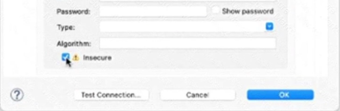
   1. The HTTP Listener will trust any certificate presented by the HTTP client.
   2. The HTTP Listener will accept any unauthenticated request.
   3. The HTTP Listener will only accept HTTP requests.
   4. Mutual TLS authentication will be enabled between this HTTP Listener andan HTTP client.

6. Which pattern can a web API use to notify its client of state changes as soon as they occur?
   1. HTTP Webhook
   2. Shared database trigger
   3. Schedule Event Publisher
   4. ETL data load

7. The flow is invoicing a target API. the API's protocol is HTTPS. The TLS configuration in the HTTP Request Configuration global element is set to None. a web client submits a request to `http:localhost:8081/vehicles`. <br/> 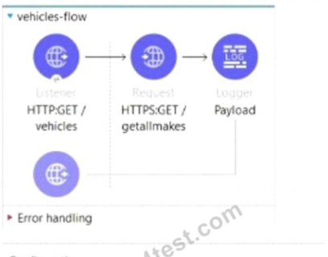 <br/> 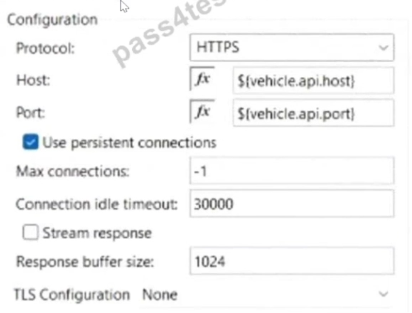
   1. The HTTP Request operation will succeed if the CA'S certificate is present in the JRE's default keystore.
   2. The HTTP Request operation will succeed if the CA'S certificate is present in the JRE's default truststore.
   3. The HTTP Request operation will always succeed regardless of the CA.
   4. The HTTP Request operation will allways fail regardless of the CA.

8. Which plugin or dependency is required to unit test modules created with XML SDK?
   1. XMLUnit.
   2. Junit.
   3. MUnit Extensions Maven plugin.
   4. MUnit Maven plugin.

9. Refer to the exhibit. <br/> 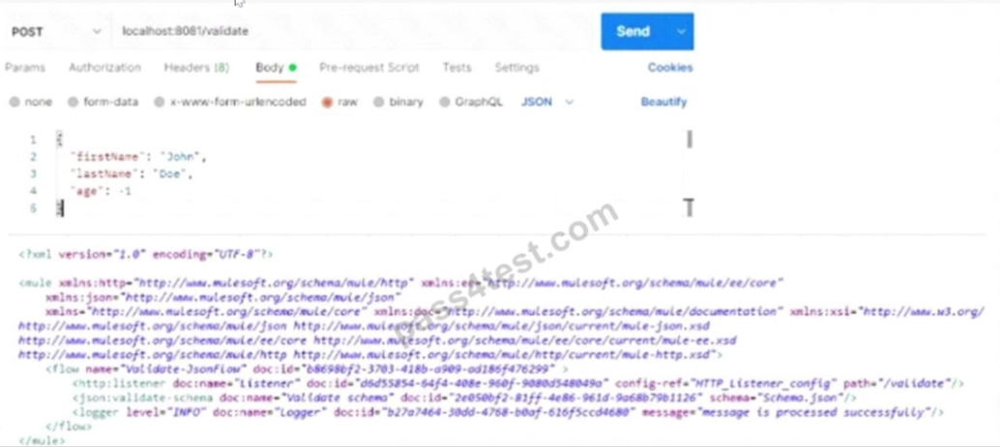 <br/> 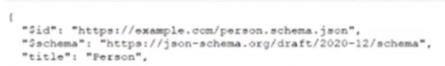 <br/> Based on the code snippet, schema.json file, and payload below, what is the outcome of the given code snippet when a request is sent with the payload?
    1. The Mule flow will execute successfully with status code 200, and the response will be the JSON sent in request.
    2. The Mule flow will execute successfully with status code 204.
    3. The Mule flow will throw the exception 'JSON:SCHEMA_NOT_HONOURED'.
    4. The Mule flow will execute successfully with status code 200m and a response will display the message "Age in years which must equal to or greater than zero".

10. What is the result of the Mule Maven Plugin configuration of the value of property tls.keyStore.password in CloudHub 2.0?
    ```xml
    <secureProperties>
      <tls.keyStore.password>${tls.keyStore.password}</tls.keyStore.password>
    </secureProperties>
    ```
    1. CloudHub encrypts the value.
    2. The Mule server encrypts the value.
    3. Anypoint Studio secures the value.
    4. Runtime Manager masks the value.

11. A company has been using CI/CD. Its developers use Maven to handlw build and deployment activities. What is the correct sequence of activities that takes place during the Maven uild and deployment?
    1. Initialize, validate, compute, test, package, verify, install, deploy.
    2. Validate, initialize, compile, package, test, install, verify, verify, deploy.
    3. Validate, initialize, compile, test, package, verify, install, deploy.
    4. Validation, initialize, compile, test, package, install, verify, deploy.

12. An order processing system is composed of multiple Mule application responsible for warehouse, sales and shipping. Each application communication using Anypoint MQ. Each message must be correlated against the original order ID for observability and tracing. How should a developer propagate the order ID as the correlation ID across the message?
    1. Using the underdiying HTTP request of Anypoint to set the 'X-Correlation-ID' header to the order ID.
    2. Set a custom Anypoint MQ user property to propagate the order ID and set the correlation ID in the reciving applications.
    3. Use the default Correlation ID, Abypoint MQ will automatically propagate it.
    4. Wrap all Anypoint MQ Publish operations within a Whith CorrelationID scope from the Tracing module, setting the correlation ID to the order ID.

13. The Center for Enablement team published a common application as a reusable module to the central Nexus repository. How can the common application be included in all API implementations?
    1. Download the common application from Naxus and copy it to the src/main/resources folder in the API.
    2. Copy the common application's source XML file and out it in a new flow in the src/main/mule folder.
    3. Add a Maven dependency in the PCM file with multiple-plugin as `<classifier>`.
    4. Add a Maven dependency in the POM file with jar as `<classifier>`.

14. Which pattern should be used to invoke multiple HTTP APIs in parallel and roll back failed requests in sequence?
    1. A database as transactional outbox and an Until Successful router to retry any requests.
    2. A Parallel for Each scope with each HTTP request wrapped in a Try scope.
    3. Scatter-Gather as central Saga orchestator for all API request with compensating actions fro falling routes.
    4. VM queues as a reliability pattern with error handlers to roll back any requests.

15. Which statement is true when using XML SDK for creating custom message processors?
    1. Properties are fields defined by an end user of the XML SDK component and serve as a global configuration for the entire Mule project in which they are used.
    2. An XML SDK provides both inbound and outbound operations.
    3. Operations can be reused in recursive calls.
    4. All operations are public.

16. A Mule API recives a JSON payload and updates the target system with the payload. The developer uses JSON schemas to ensure the data is valid. How can the data be validation before posting to the target system?
    1. Use a DataWeave 2.09 transorm operation, and at the log of the DataWeave script, add:
        ```json
        %dw 2.0
        Import.json-moduls
        ```
    2. Using the DataWeave if Else condition test the values of the payload against the examples included in the schema.
    3. Apply the JSON Schema policy in API Manager and reference the correct schema in the policy configuration.
    4. Add the JSON module dependency and add the validate-schema operation in the flow, configured to reference the schema.

17. A company deploys 10 public APIs to CloudHub. Each API has its individual health endpoint defined. The platform operation team wants to configure API Functional Monitoring to monitor the health of the APIs periodically while minimizing operational overhead and cost. How should API Functional Monitoring be configured?
    1. From one public location with each API in its own schedule.
    2. From one private location with all 10 APIs in a single schedule.
    3. From one public location with all 10 APIs in a single schedule.
    4. From 10 public locations with each API in its own schedule.

18. An organization uses CloudHub to deploy all of its applications. How can a common-global-handler flow be configured so that it can be reused across all of the organization's deployed applications?
    1. A Create Mule plugin project <br/> Create a common-global-error-handler flow inside the plugin project. <br/> Use this plugin as a dependency in all Mule applications. <br/> Import that configuration file in Mule applications.
    2. Create a common-global-error-handler flow in all Mule Applications Refer to it flow-ref wherever needed.
    3. Create a Mule Plugin project <br/> Create a common-global-error-handler flow inside the plugin project. <br/> Use thos plugin as a dependency in all Mule applications.
    4. Create a Mule domain project. <br/> Create a common-global-error-handler flow inside the domain project. <br/> Use this domain project as a dependency.

19. Which statement is true working with correlation IDs?
    1. The HTTP Listener regenerates correlation IDs regardless of the HTTP request.
    2. The Anypoint MQ Connector automatically propagates correlation IDs.
    3. The HTTP Listener generates correlation IDs unless a correlation ID is recived in the HTTP request.
    4. The VM Connector does not automatically propagate correlation IDs.
 
20. Which statement is true about using mutual TLS to secure an application?
    1. Mutual TLS requires a hardware security module to be used.
    2. Mutual TLS authenticates the identity of the server before the identity of the client.
    3. Mutual TLS ensures only authorized end users are allowed to access an endpoint.
    4. Mutual TLS increasses the encryption strength versus server-side TLS alone.

21. A Mule application deployed to a standalone Mule runtime uses VM queues to publish messages to be consumed asynchronously by another flow. In the case of a system failure, what happend to in-flight messages in the VM queues that have been consumed?
    1. For any type of queue, the message will be processed after the system comes online.
    2. For persistent queues, the message will be processed after the system comes online.
    3. For transient queues, the message will be processed after the system comes online.
    4. For any type of queue, the message will be lost.

22. What is the MuleSoft recommended method to encrypt sensitive property data?
    1. The encryption key and sensitive data should be different for each environment.
    2. The encryption key should be identical for all environments.
    3. The encryption key should be identical for all enviroments and the sensitive data should be different for each environment.
    4. The encryption key should be different for each enviroment and the sensitive data should be the same for all environments.

23. A Mule application for processing orders must log the order ID for every message output. What is a best practice to enrich every log message with the order ID?
    1. Use flow variables within every logger processor to log the order ID
    2. Set a flow variable and edit the log4j2.xml file to output the variable as part of the message pattern.
    3. Create a custom XML SDK component to wrap the logger and automatically add the order ID within the connector.
    4. Use the Tracing module to set logging variables with a Mapped Diagnostic Context.

24. Which properties are mandatory on the HTTP Connector configuration in order to use the OAuth 2.0 Authorization Code grant type for the authentication?
    1. External callback URL, access token URL, client ID response access token.
    2. Token URL, authorization URL, client ID, client secret local callback URL.
    3. External callback URL, access token URL, client ID, response refresh token.
    4. External callback URL, access token URL, local authorization URL, authorization URL, client ID, client secret.

25. When registering a client application with an existing API instance or API Group instance, what is required to manually approve or reject request access?
    1. To configure the SLA tier for the application and have the role of Organization Administrator, API Manager Enviroment Administrator, or the Manage Contacts permission.
    2. To configure the SLA tier for the application and have the Exchange Administrator permission.
    3. To configure the SLA tier for the application.
    4. To only have Exchange Administrator permission.

26. A Mule application defines as SSL/TLS keystore properly 'tis.keystore.keyPassword' as secure. How can this property be referenced to access its value within the application?
    1. `#{secure::tiskeystore,keyPassowrd}`
    2. `${secure::tis.keystore.keyPassowrd}`
    3. `${secure::tiskeystore,keyPassowrd}`
    4. `p{secure::tiskeystore,keyPassowrd}`

27. The flow name is "implementation" whit code for the Munit test case. When the Munit test case is executed, what is the expected result? <br/> 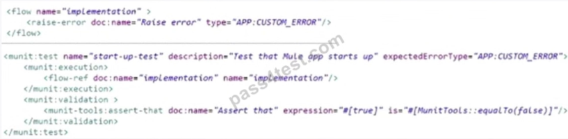
    1. The test case fails with an assertion error.
    2. The test throws an error and does not start.
    3. The test case fails with an unexpected error type.
    4. The test case passes.

28. What required changes can be made to give a partial successful response in case the United Airlines API returns with a timeout? <br/> 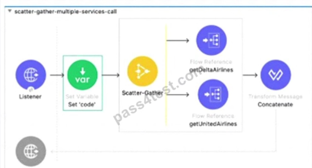
    1. Add a Scatter-gather component inside a Try scope. <br/> Set the payload to a default value 'Error' inside the error handler using the On Error Propagate scope.
    2. Add Flow Reference components inside a Try scope. <br/> Set the payload to a default value '' inisde the error handler using the On Error Continue scope.
    3. add Flow reference components inside a Try scope <br/> Set the payload to a default value '' inside the error handler using the On Error Propagate scope.
    4. Add a Scatter-gather component inside a Try scope. <br/> Set the payload to a default value 'Error' inside the error handler using the On Error Continue scope.

29. A developer deploys an API to CloudHub and applies an OAuth policy on API Manager. During testing, the API response is slow, so the developer reconfigures the API so that the out-of-the-box HTTP Caching policy is applied first, and the OAuth API polocy is applied second. What will happend when an HTTP request is received?
    1. In case of a cache hit, both the OAuth and HTTP Caching policies are evaluated, then the cached response is returned to the caller.
    2. In case of a cache it, only the HTTP Caching policy is evaluating; then the cached response is returned to the caller.
    3. In case of a cache miss, only the HTTP Caching policy is evaluated; then the API recives the data from the API implementation, and the policy stores the data to be cached in Object Store.
    4. In case of a cache miss, both the PAuth and HTTP Caching policies are evluated; then the API reciver the data from the API implementation, and the policy does not store the data in Object Store.

30. A mule application exposes an API for creating payments. An Operations team wants to ensure that the Payment API is up  and running at all times in production. Which approach should be used to test that payment API is working in production?
    1. Create a health check endpoint that listens on a separate port and uses separate HTTP Listener configuration from the API.
    2. Configure the application to send health data to an external system.
    3. Create a health check endpoint that reuses the same port number and HTTP Listener configuration as the API itself.
    4. Monitor the Payment API directly sending real customer payment data.

31. A new Mule project has been created in Anypoint Studio with the default settings. Which file inside the Mule project must be modified before using Maven to successfully deploy the application?
    1. Settings.xml
    2. Config.yaml
    3. pom.xml
    4. Mule.artifact.json

32. A Mule Object Store is configured with an entry TTL of one second and an expiration interval of 30 seconds. What is the result of the flow if processing between os:store and os:retrieve takes 10 seconds? <br/> 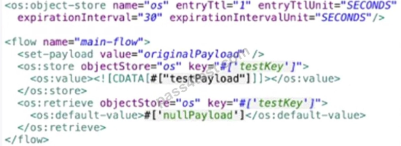
    1. nullPayload
    2. originalPayload
    3. OS:KEY_NOT_FOUND
    4. testPayload

33. When configuring the API Autodiscovery element in a Mule application to enable API Gateway capabilities, what must the flowRef attribute specifically reference?
    1. Northing because flowRef is an optional attribute which can be passed runtime.
    2. The name of the flow that has APIKit Console to recive all incoming RESTful operation requests.
    3. Any of the APIkit generate implement flows.
    4. The name of the flow that has HTTP Listener to recive all incoming RESTful operation requests.

34. Which command is udes to convert a JKS keystore to PKCS12?
    1. Keytool-importkeystore -srckeystore keystore p12-srcstoretype PKC12 -destkeystore keystore.jks -deststoretype JKS
    2. Keytool-importkeystore -srckeystore keystore p12-srcstoretype JKS -destkeystore keystore.p12 -deststoretype PKCS12
    3. Keytool-importkeystore -srckeystore keystore jks-srcstoretype JKS -destkeystore keystore.p13 -deststoretype PKCS12
    4. Keytool-importkeystore -srckeystore keystore jks-srcstoretype PKCS12 -destkeystore keystore.p12 -deststoretype JKS

35. A Mule application deployed to multiple Cloudhub 2.0 replicas needs to temporarily persist large files over 10MB between flow executions, and routinely need to query whether the file data exist on separate executions. How can this be achieved?
    1. Store the contents of the file on separate storeage, and store the key and location of the file Object using Object Store v2.
    2. Use an in-memory Object Store.
    3. Store the key and full contents of the file in an Object Store.
    4. Store the key and full contents of thew file, caching the filename and location between requests.

36. A heathcare customer wants to use hospital system data, which includes code that was developed using legacy tools and methods. The customer has creted reusable Java libraries in order to read the data from the system. What is the most effective way to develop and API retrive the data from the hospital system?
    1. Refer to JAR files in the code.
    2. Include the libraries writes deploying the code into the runtime.
    3. Create the Java code in your project and invoice the data from the code.
    4. Install libraries in a local repository and refer to it in the pom.xml file.

37. The HTTP Request operation raises an HTTP CONNECTIVITY error. Which HTTP status code and body are returned to the web client? <br/> 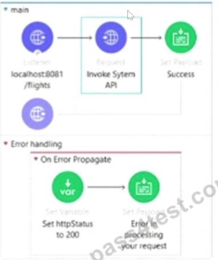 <br/> 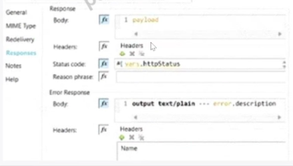
    1. HTTP Status Code:200. <br/> Body 'Error in processing your request'.
    2. HTTP Status Code:500. <br/> Body The HTTP CONNECTIVITY Error description.
    3. HTTP Status Code:500. <br/> Body 'Error in proccessing your request'.
    4. HTTP Status Code:500. <br/> body 'Error in proccessing your request'.

38. A Mule implementation uses a HTTP Request within an Unit Successful scope to connect to an API. How should a permanent error response like HTTP:UNAUTHORIZED be handle inside Until Successful to reduce latency?
    1. Configure retrying until a MULERETRY_EXAHUSTED error is raises or the API responds back with a successful response.
    2. In Until Successful configuration, set the retry count to 1 for error type HTTP:UNAUTHORIZED.
    3. Put the HTTP Request inside a try scope in Until Successful. <br/> In the error handler, use On Error Continue to catch permanent errors like HTTP:UNAUTHORIZED.
    4. Put the HTTP Request inside a try scope in Until Successful. <br/> In the error handler, use On Error Propagate to catch permanent errors like HTTP:UNAUTHORIZED.

39. Multiple individual Mule application need to use the Mule Maven plugin to deploy to CloudHub. The plugin configuration shouldbe reused where necessary and anything project, specific should be property-based. Where should the Mule Maven details be configured?
    1. A parent pom.xml.
    2. Settings.xml.
    3. pom.xml.
    4. A Bill of Materials (BOM) parent pom.

40. Bioinfo System API is implemented and published to Anypoint Exchange. A developer wants to invoke this API using its REST Connector. What should be added to the POM?
    1. 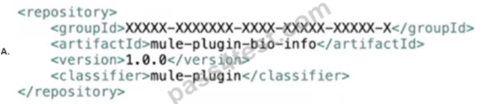
    2. 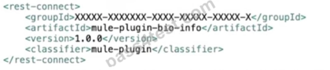
    3. 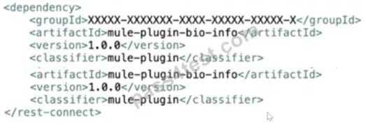
    4. 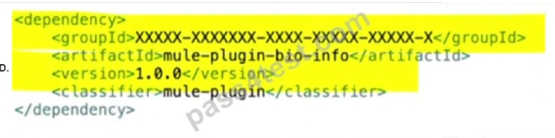
    5. 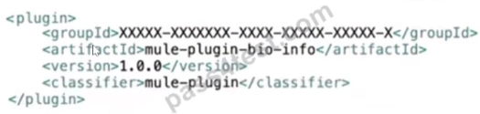

41. An API has been build to enable scheduling email provider. The front-end system does very little data entry validation, and problems have started to appear in the mail that go to patients. A 'validate-customer' flow is added validate the data. What is he expected behavior of the 'validate-customer' flow? <br/> 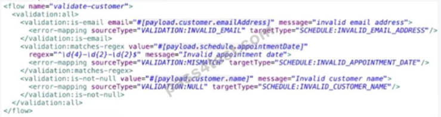
    1. If only the email address is invalid a VALIDATION:INVALID_EMAIL error is raised.
    2. If the email address is invalid, processing continues to see if the appointment data and customer name are also invalid
    3. If the appointment data and customer name are invalid, a SCHEDULE:INVALID_APPOINTMENT_DATE error is raised.
    4. If all of the values are invalid the last validation error is raised SCHEDULE:INVALID_CUSTOMER_NAME.

42. A Mule application include a subflow containing a Scatter-Gather scope. Within each log of the Scatter-Gather an HTTP connector calls a PUT endpoint to modify records in different upstream system. The subflow is called inside an Unit Successful scope to retry if a transitory exception is raised. A technical spike is being performed to increase reliability of the Mule application. Which steps should be preformed within the Mule flow above the ensure indepotent behavior?
    1. Change the PUT requests inside the Scatter-Gather to POST requests.
    2. Ensure an error-handling flow performs corrective actions to roll back all changes if any leg of the Scatter-Gather fails.
    3. Remove the PUT requests from the Scatter-Gather and preform the sequentially.
    4. None, the flow already exhibits indepotent behavior.

43. Which type of cache invalidation does the Cache scope support without having to write any additional code?
    1. Write-through invalidation.
    2. Write-behind invalidation.
    3. Time to live.
    4. Notification-based invalidation.

44. 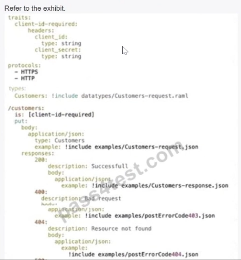 <br/> 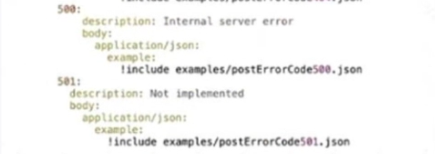 <br/> A developer generates the base scaffolding for an API in Anypoint Studio. Which HTTP status code is returned while testing using the API kit console if no values are entered in the client-secret?
    1. HTTP status code:200
    2. HTTP status code:403
    3. HTTP status code:400
    4. HTTP status code:400

45. When implementing as synchronous API where the event source is an HTTP Listener, a developer needs to return the same correlation ID back to the caller in the HTTP response header. How can this be achieved?
    1. Enable the auto-generate CorrelationID option when scaffolding the flow.
    2. Enable the CorrelationID checkbox in the HTTP Listener configuration.
    3. Configure a custom correlation policy.
    4. No action is needed as the correlation ID is returned to the caller in the response header by default.

46. a Scatter-Gather router is configured with four routes: Route A, B, C and D. Route C is false.
    1. Error, errorMessage.payload.results['2']
    2. Payload failures['2']
    3. Error, errorMessage.payload.failures['2']
    4. Payload ['2']

47. A custom policy needs to be developed to intercept all outbound HTTP requests made by Mule applications. Which XML element must be used to intercept outbound HTTP requests?
    1. It is not possible to intercept outgoing HTTP requests, only inbound requests.
    2. http-policy:source
    3. http-policy:operation
    4. http-policy:processor

48. A Mule application need to invoice an API hosted by an external system to initiate a process. The external API takes anywhere between one minute and 24 hours to compute its process. Which implementation should be uses to get response data from the external API after it completes processing?
    1. Use an HTTP Connector to invoke the API and wait for a response.
    2. Use a Scheduler to check for a response every minute.
    3. Use an HTTP Connector inside Async scope to invoice the API and wait for a response.
    4. Expose an HTTP callback API in Mule and register it with the external system.

49. In a Mule project, Flow-1 contains a flow-ref to Flow-2 depends on data from Flow-1 to execute successfully. Which action ensures the test suites cases written for Flow-1 and Flow-2 will execute successfully?
    1. Chain together the test suites and test cases for Flow-1 and Flow-2.
    2. Use "Set Event" to pass the input that is needes, and keep the test cases for Flow-1 and Flow-2 independent.
    3. Use "Before Test Case" to collect data from Flow-1 test cases before running Flow-2 test cases.
    4. Use "After Test Case" to produce the data needed from Flow-1 test cases to pass to Flow-2 test cases.

50. What action must be preformed to log all the errors raised by the VM connector? <br/> 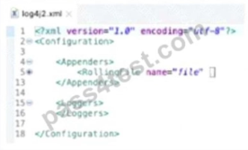
    1. Add `<AsyncLogger name='orgroute.extensions.vm' level='ERROR' />` inside the Logger tag.
    2. Add `<AsyncLogger name='orgroute.extensions.vml' level='ERROR' />` inside the Appenders tag.
    3. Configure `<Logger level='Error' />` inside the VM connector configuration.
    4. Nothing, as error-level events are automatically logged.

51. 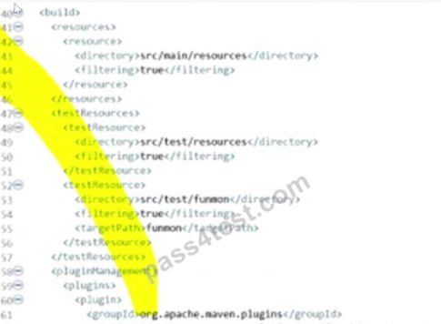 <br/> 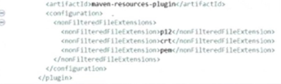 <br/> A Mule application pom.xml configures the Maven Resources plugin to exclude parsing binary files in the project's src/main/resources/certs directory. Which cnfiguration of this plugin archives a successful build?
    1. 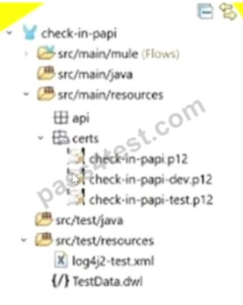
    2. 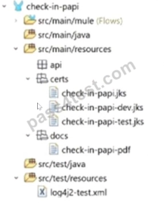
    3. 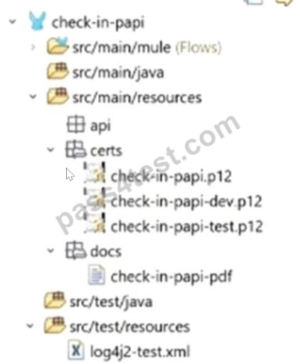

52. Two APIs are deployed to a two-node on-perm cluster. Due to a requeriments change, the two APIs must communicate to exchange data asynchronously.
    1. If the two APIs use the same domain, the VM Connector can be leveraged.
    2. The VM Connector is used to inter-application communication, so it is not possible to use the VM Connector.
    3. Instead of using the VM Connector use <flow-ref> directly.
    4. It is not possible to use the VM Connector since the APIs are running in a cluster mode and each mode has it own set of VM Queues.

53. An API has been developed and deployed to CloudHub Among the policies applied to this API is an allowlist of IP addresses. A developer wants to run a test in Anypoint Studio and does not want any policies applied because their workstation is not included in the allowlist. What must the developer do in order to run this test locally without the policies applied?
    1. Create a properties file specifically for local development and set the API instance ID to a value that is not used in API Manager.
    2. Pass in the runtime parameter "-M-Danypoint.platform.gatekeeper=disabled".
    3. Deactivate the API in API Manager so the Autodiscovery element will not find the application when it runs in Studio.
    4. Run the test as-s, with no changes because the Studio runtime will not attempt to connect to API Manager.

54. A system API that communicates to an underlying MySQL database is deploying to CloudHub. The DevOps team requires a readiness endpoint to monitor all system APIs. Which strategy should be used to implement this endpoint?
    1. Create a dedicated endpoint that responds with the API status and reachability of the underlying systems.
    2. Create a dedicated endpoint that responds with the API status health of the server.
    3. Use an existing resource endpoint of the API.
    4. Create a dedicated endpoint that responds with the API status only.

55. A developer has created the first version of an API designed for business partners to work commodity prices. What should developer do to allow more than one major version of the same API to be exposed by the implementation?
    1. In Design Center, open the RAML and modify each operation to include the major verion number.
    2. In Anypoint Studio, generate scaffolding from RAML, and the modify the `<http:listener>` in the generated flow to include a parameter to replace the version number.
    3. In Design Center, open the RAML and modify baseURI to include a variable that indicates the version number.
    4. In Anypoint Studio, generate scaffolding from the RAML, and then modify the flow names generated by APIkit to include a variable with the major version number.

56. When client and server are exchanging messages during the mTLS handshake, what is being agreed on during the cipher suite exchange?
    1. A protocol.
    2. the TLS version.
    3. An encryption algorithm.
    4. The Public key format.

57. A healthcare portal needs to validate the token that it sends to a Mule API. The developer plans to implement a custom policy using the HTTP Policy Transform Extension to match the token received in the header from the healthcare portal. Which files does the developer need to create in order to package the custom policy?
    1. Deployable ZIP file, YAML configuration file.
    2. JSON properties file, YAML configuration file.
    3. JSON properties file, XML template file.
    4. XML template file, YAML configuration file.

58. 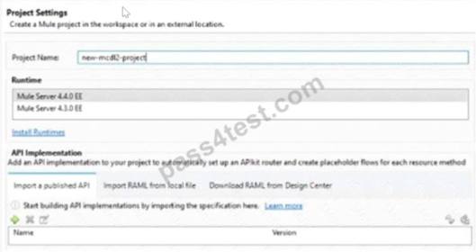 <br/> When creating a new project, which API implementation allows for selecting the correct API version and scaffolding the flows from the API specification?
    1. Import a published API.
    2. Generate a local RAML from anypoint studio.
    3. Download RAML from Design Center.
    4. Import RAML from local file.

59. A Mule application contain two policies Policy A and Policy B. Policy A has order, and Policy B has order 2. Policy A, Policy B and a flow are defined by the configuration below. <br/> 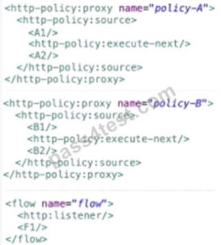 <br/> When a HTTP request arrives at the Mule application's endpoint, what will be the execution order?
    1. A1, B1, F1, B2, A2.
    2. B1, A1, F1, A2, B2.
    3. F1, A1, B1, B2, A2.
    4. F1, B1, A1, A2, B2.

60. A company with MuleSoft Titanium develops a Salesforce System API using MuleSoft out-of-the-box Salesforce Connector and deploys the API to CloudHub. Which steps provide the average number of requests and average response time of the Salesorce Connector?
    1. Access Anypoint Monitoring's built-in dashboard. Select a resource. <br/> Locate the information under the Connectors tab.
    2. Acces Anypoint Monitoring's built-in dashboard. <br/> Select a resource. <br/> Create a custom dashboard to retrive the information.
    3. Access Anypoint Monitoring built-in dashboard. <br/> Select a resource. <br/> Locate the information under Log Manager < Raw Data.
    4. Change the API implementation to capture the information in the log. <br/> Retrive the information from the log file.

61. A developer is working on a project that requires encrypting all data before sending it to a backend application. To accomplish this, the developer will use PGP encryption in the Mule 4 Cryptography Module. What is required to encrypt the data before sending it to the backend application?
    1. The application needs to configure HTTPS TLS context information to encrypt the data.
    2. The application needs to both the provate and public keys to encrypt the data.
    3. The application needs the public key from the backend service to encrypt the data.
    4. The application needs the private key from the backend service to encrypt the data.

---

## [Respuestas y explicaciones](respuestas_2.md)