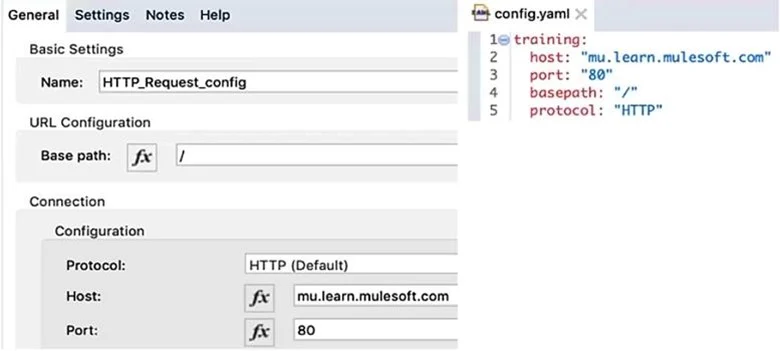
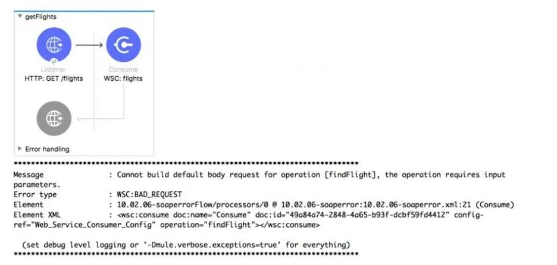
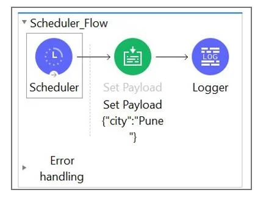
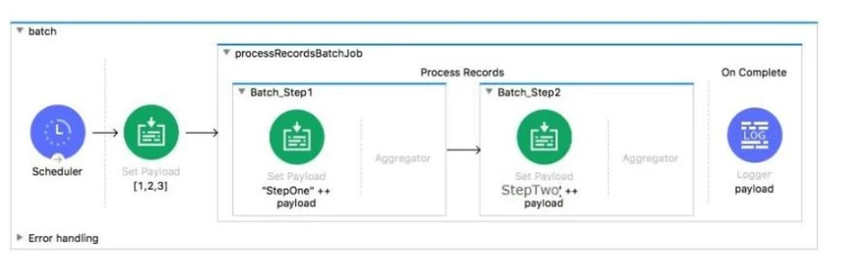

# Cuestionario de prueba 1

Cuestionario de prueba para el examen de certificación de Mulesoft con Explicaciones incluidas

## [Respuestas y explicaciones](respuestas_1.md)

---

1. This Mule application has an HTTP Request that is configured with hardcoded values. To change this, the Mule application is configured to use a properties file named config.yaml. <br/> What valid expression can the HTTP Request host value be set to so that it is no longer hardcoded? <br/> 
   1. $[training:host]
   2. #[training.host]
   3. #{training.host}
   4. ${training.host} <br/><br/>
2. What is the correct syntax to define and and call a function in Dataweave script?

```dw
i.
fun addKV( object: Object, key: String, value: Any) =           
           object ++ {(key):(value)}
 
---
 
addKV ( {"hello': "world"}, "hola", "mundo" )
```

```dw
ii.
%function addKV( object: Object, key: String, value: Any) =           
                  object ++ {(key):(value)}
 
---
 
{ hello: "world"} addKV ( "hola","mundo" )
```

```dw
iii.
%function addKV( object: Object, key: String, value: Any) =           
                 object ++ {(key):(value)}
 
---
 
addKV ( {"hello': "world"}, "hola", "mundo" )
```

```dw
iv.
fun addKV( object: Object, key: String, value: Any) =           
           object ++ {(key):(value)}
 
---
 
{ hello: "world"} addKV ( "hola","mundo" )
```

3. What is correct syntax for a Logger component to output a message with the contents of a JSON Object payload?
   1. The payload is: $(payload)
   2. #["The payload is " ++ payload]
   3. The payload is: #[payload]
   4. #["The payload is " + payload] <br/><br/>
4. Refer to the exhibits. A web client submits the request to ***`http://localhost:8081/flights?destination=SFO`*** and the Web Service Consumer throws a WSC:BAD_REQUEST error. What is the next step to fix this error? <br/> 
   1. Set a header in Consume operation equal to destination query parameter
   2. Set a JSON payload before the Consume operation that contains the destination query parameter
   3. Set a SOAP payload before the Consume operation that contains the destination query parameter
   4. Set a property in Consume operation equal to destination query parameter <br/><br/>
5. Refer to exhibits. What message should be added to Logger component so that logger prints "The city is Pune" (Double quote should not be part of logged message)? <br/> 
   1. #["The city is" ++ payload.City]
   2. The city is #[payload.City]
   3. #[The city is ${payload.City}
   4. The city is + #[payload.City] <br/><br/>
6. Refer to the exhibit. What is the output of Logger activity named payload in the On Complete phase? <br/> 