# Cuestionario de prueba 1

Cuestionario de prueba para el examen de certificación de Mulesoft con Explicaciones incluidas

## [Respuestas y explicaciones](respuestas_1.md)

---

1. This Mule application has an HTTP Request that is configured with hardcoded values. To change this, the Mule application is configured to use a properties file named config.yaml. <br/> What valid expression can the HTTP Request host value be set to so that it is no longer hardcoded? <br/> 
   1. $[training:host]
   2. #[training.host]
   3. #{training.host}
   4. ${training.host} <br/><br/>
2. What is the correct syntax to define and and call a function in Dataweave script?

```dw
i.
fun addKV( object: Object, key: String, value: Any) =           
           object ++ {(key):(value)}
 
---
 
addKV ( {"hello': "world"}, "hola", "mundo" )
```

```dw
ii.
%function addKV( object: Object, key: String, value: Any) =           
                  object ++ {(key):(value)}
 
---
 
{ hello: "world"} addKV ( "hola","mundo" )
```

```dw
iii.
%function addKV( object: Object, key: String, value: Any) =           
                 object ++ {(key):(value)}
 
---
 
addKV ( {"hello': "world"}, "hola", "mundo" )
```

```dw
iv.
fun addKV( object: Object, key: String, value: Any) =           
           object ++ {(key):(value)}
 
---
 
{ hello: "world"} addKV ( "hola","mundo" )
```

3. What is correct syntax for a Logger component to output a message with the contents of a JSON Object payload?
   1. The payload is: $(payload)
   2. #["The payload is " ++ payload]
   3. The payload is: #[payload]
   4. #["The payload is " + payload] <br/><br/>
4. Refer to the exhibits. A web client submits the request to ***`http://localhost:8081/flights?destination=SFO`*** and the Web Service Consumer throws a WSC:BAD_REQUEST error. What is the next step to fix this error? <br/> 
   1. Set a header in Consume operation equal to destination query parameter
   2. Set a JSON payload before the Consume operation that contains the destination query parameter
   3. Set a SOAP payload before the Consume operation that contains the destination query parameter
   4. Set a property in Consume operation equal to destination query parameter <br/><br/>
5. Refer to exhibits. What message should be added to Logger component so that logger prints "The city is Pune" (Double quote should not be part of logged message)? <br/> 
   1. #["The city is" ++ payload.City]
   2. The city is #[payload.City]
   3. #[The city is ${payload.City}
   4. The city is + #[payload.City] <br/><br/>
6. Refer to the exhibit. What is the output of Logger activity named payload in the On Complete phase? <br/> 
   1. Summary statistics with No record data
   2. The records are processed by all batch steps
   3. The records are processed by last batch step
   4. The original payload : [1,2,3] <br/><br/>
7. A Mule application configured with _Autodiscovery_ implements an API. <br/> Where is governance enforced for policies defined for this Mule application?
   1. In API Exchange
   2. In Runtime Manager
   3. In the Mule Application
   4. In API Manager <br/><br/>
8. Following Mulesoft's recommended API-led connectivity approach , an organization has created an application network. The organization now needs to create API's to transform , orchestrate & aggregate the data provided by the other API's in the application network.  This API should be flexible enough to handle the data from additional API's in future. <br/> According to Mulesoft's recommended API-led connectivity approach , what is the best layer for this new API?
   1. Experience Layer
   2. System Layer
   3. Data Layer
   4. Process Layer <br/><br/>
9. Refer to the exhibits. As a Mulesoft developer, what you would change in Database connector configuration to resolve this error? <br/> 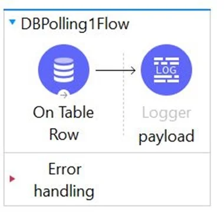 <br/> 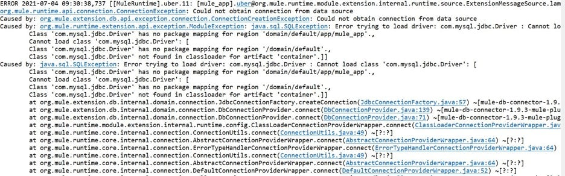
   1. Configure the correct JDBC Driver
   2. Configure the correct table name
   3. Configure the correct database name
   4. Configure the correct host URL <br/><br/>
10. Refer to the exhibits. The mule application is debugged in Anypoint Studio and stops at the breakpoint as shown in below exhibit. <br/> What is the value of the payload displayed in the debugger at this breakpoint? <br/> 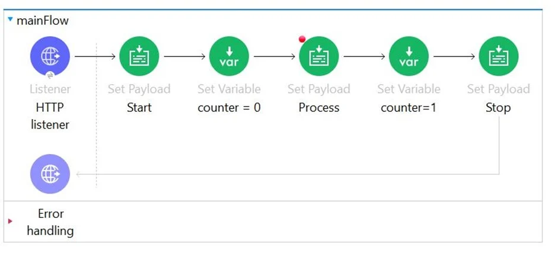
    1. Finished
    2. Process
    3. Payload is always empty at the breakpoint
    4. Start <br/><br/>
11. What statement is a part of MuleSoft's description of an application network?
    1. Leverages Central IT to deliver complete point-to-point solutions with master data management
    2. Creates and manages a collection of JMS messaging services and infrastructure
    3. Creates and manages high availability and fault tolerant services and infrastructure
    4. Creates reusable APIs and assets designed to be consumed by other business units <br/><br/>
12. Refer to the exhibits. Each route in the Scatter-Gather sets the payload to the number shown in the label. <br/> What response is returned to a web client request to the HTTP Listener? <br/> 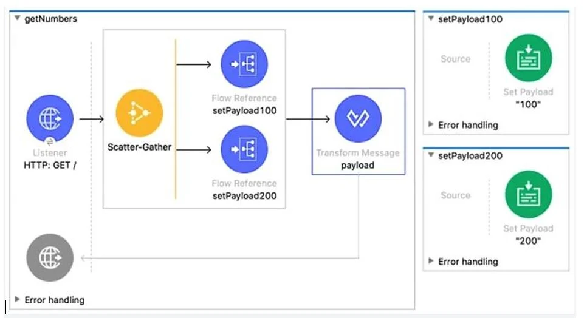 <br/> 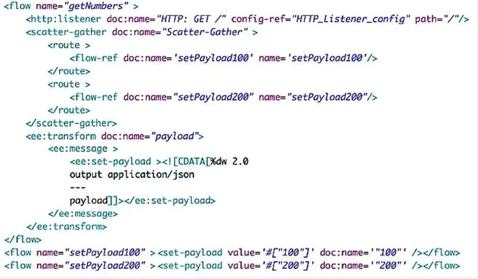

```ts
// i.
["100","200]
```

```json
// ii.
{	
  "0" : "100",	
  "1" : "200"
}
```

```json
// iii.
[	{		
    "attributes": ...,		
    "payload": "100"	
  },	
  {		
    "attributes": ...,		
    "payload": "200"	
  }
]
```

```json
// iv.
{	
  "0": {		
    "attributes": ...,		
    "payload": "100"	
  },	
  "1": {		
    "attributes": ...,		
    "payload": "200"	
  }
}
```

13. Refer to the exhibits. What payload and variable are logged at the end of the main flow? <br/> 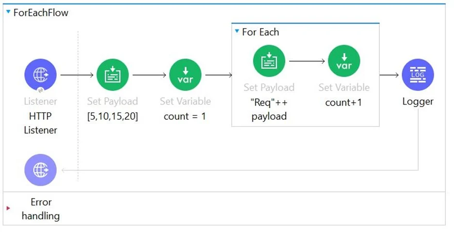 <br/> 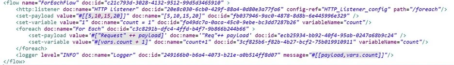
    1. [[5,10,15,20], 1]
    2. [[5,10,15,20], 5]
    3. [[Req5, Req10, Req15, Req20], 5]
    4. [[Req5, Req10, Req15, Req20], 1] <br/><br/>
14. A flow has a JMS Publish consume operation followed by a JMS Publish operation. Both of these operations have the default configurations. Which operation is asynchronous and which one is synchronous?
    1. Publish consume: Asynchronous. <br/> Publish: Synchronous
    2. Publish consume: Synchronous. <br/> Publish: Synchronous
    3. Publish consume: Asynchronous. <br/> Publish: Asynchronous
    4. Publish consume: Synchronous. <br/> Publish: Asynchronous <br/><br/>
15. How can you call a flow from Dataweave?
    1. tag function
    2. include function
    3. lookup function
    4. Not Allowed <br/><br/>
16. What is the correct Syntax to add a customerID as a URI parameter in the HTTP listener's path attribute? <br/> 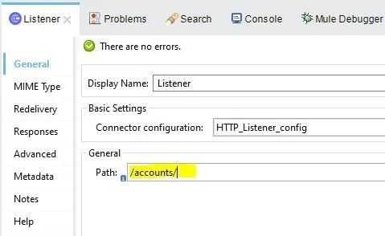
    1. {customerID}
    2. $[customerID]
    3. #[customerID]
    4. (customerID) <br/><br/>
17. Refer to the exhibits. What expression correctly specifies input parameters to pass the city and state values to SQL query? <br/> 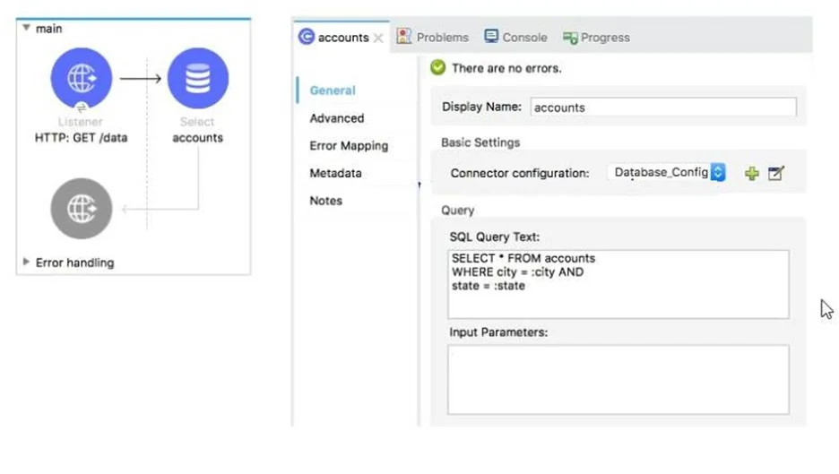
    1. #[inputParams: { city: "San Fransisco", state: "CA"}]
    2. #[inputParams: [ "San Fransisco", "CA"]]
    3. #[{ city: "San Fransisco", state: "CA"}]
    4. #[[ "San Fransisco", "CA"]] <br/><br/>
18. An API instance of type API endpoint with API proxy is created in API manager using an API specification from Anypoint Exchange. The API instance is also configured with an API proxy that is deployed and running in CloudHub. <br/> An SLA- based policy is enabled in API manager for this API instance. <br/> Where can an external API consumer obtain a valid client ID and client secret to successfully send requests to the API proxy?
    1. In the organization's public API portal in Anypoint Exchange, from an approved client application for the API proxy
    2. In Anypoint Studio, from components generated by APIkit for the API specification
    3. In Runtime Manager, from the properties tab of the deployed approved API proxy
    4. In Anypoint Studio, from components generated by Rest Connect for API specification <br/><br/>
19. Refer to the exhibits. The validation component in the private flow throws an error. What response message is returned to a client request to the main flow's HTTP Listener? <br/> 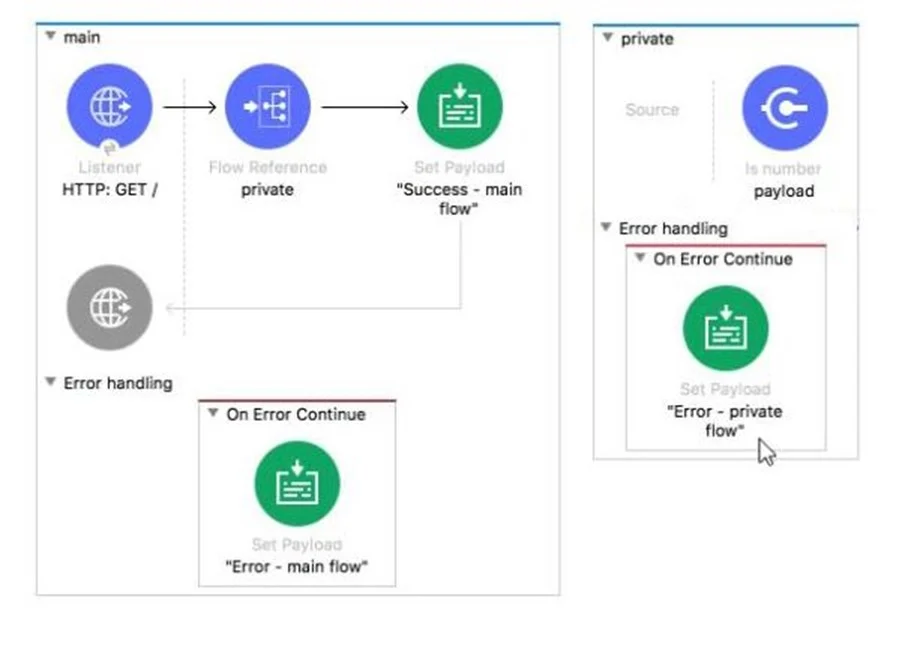 <br/> 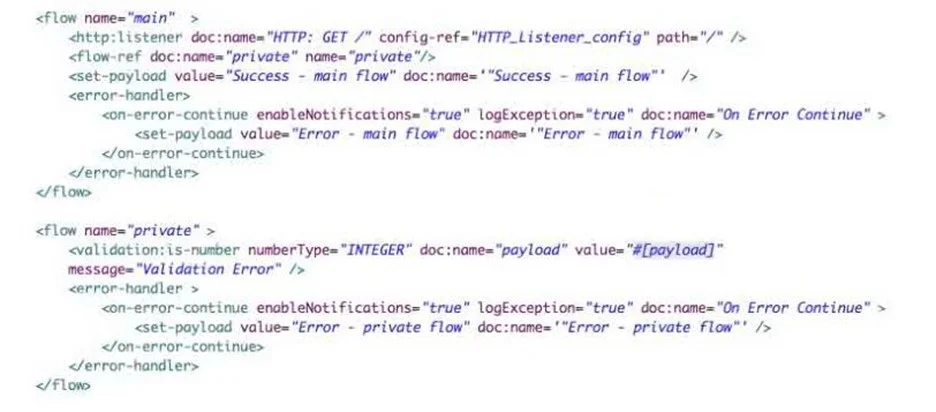
    1. Validation Error
    2. Error - private flow
    3. Success - main flow
    4. Error - main flow <br/><br/>
20. What the correct RAML syntax which retrieves details on a specific order by its orderId as a URI parameter?

```yaml
# i.
/orders:  
      get:     
        /{orderId}:
```

```yaml
# ii.
/orders:  
      /orderId:    
         get:
```

```yaml
# iii.
/orders:  
   /{orderId}:    
      get:
```

```yaml
# iv.
/orders:  
     /get:       
        /orderId
```

21. Refer to the exhibits. The Batch job processes an array of strings. <br/> What information is logged by the logger component after the batch job scope completes processing of the input payload? <br/> 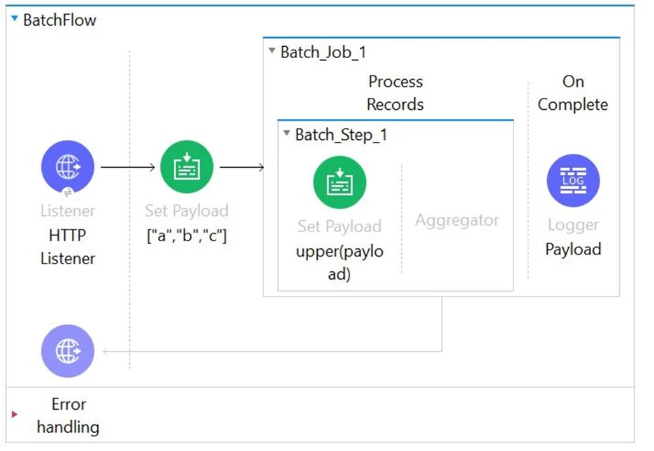 <br/> 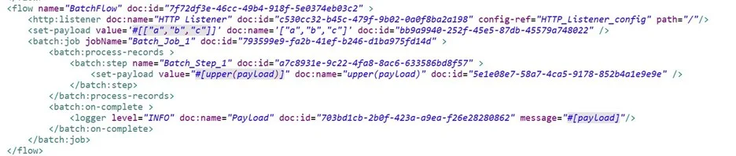
    1. Total Records Processed: 3 <br/> Successful Records: 3 <br/> Failed Records: 0 <br/> payload: ["A","B","C"]
    2. Total Records Processed: 3 <br/> Successful Records: 3 <br/> Failed Records: 0
    3. Total Records Processed: 3 <br/> Successful Records: 3 <br/> Failed Records: 0 <br/> payload: ["a","b","c"]
    4. ["A","B","C"] <br/><br/>
22. Refer to the exhibit. What is the correct DataWeave expression for the Set Payload transformer to call the createCustomerObject flow with values for the first and last names of a new customer? <br/> 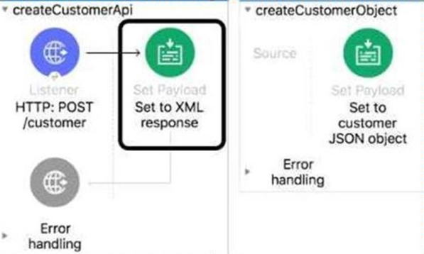
    1. `lookup("createCustomerObject", {first: "Alice, last: "Green"})`
    2. `lookup( "createCustomerObject", ("Alice", "Green"))`
    3. `createCustomerObject({first: "Alice", last' "Green"})`
    4. `createCustomerObject("Alice", "Green")` <br/><br/>
23. Refer to the exhibits. A web client submits the request to the HTTP Listener. What response message would be returned to web client? <br/> 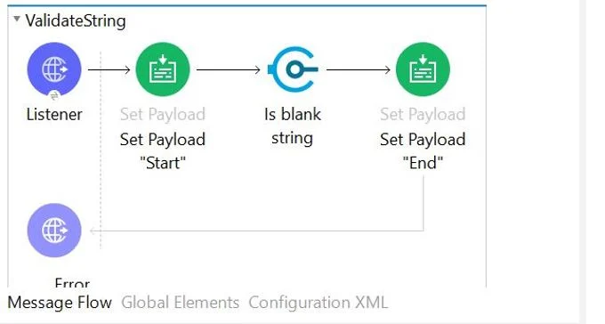
    1. String is not blank
    2. No response would be sent back to client and request will get errored out in Mule
    3. End
    4. Start <br/><br/>
24. What HTTP method in a RESTful web service is typically used to completely replace an existing resource?
    1. PUT
    2. GET
    3. POST
    4. PATCH <br/><br/>
25. What is the main purpose of flow designer in Design Center?
    1. To design and mock Mule application templates that must be implemented using Anypoint Studio
    2. To design API RAML files in a graphical way
    3. To define API lifecycle management in a graphical way
    4. To design and develop fully functional Mule applications in a hosted development environment <br/><br/>
26. In the execution of scatter gather, the "sleep 2 sec" Flow Reference takes about 2 sec to complete, and the "sleep 8 sec" Flow Reference takes about 8 sec to complete. <br/> About how many sec does it take from the Scatter-Gather is called until the Set Payload transformer is called? <br/> 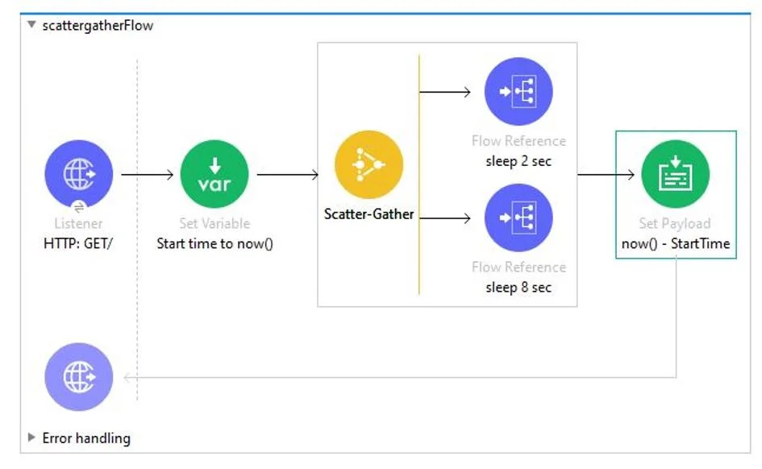
    1. 10
    2. 2
    3. 0
    4. 8 <br/><br/>
27. Refer to the exhibits. A web client sends a POST request to the HTTP Listener with the payload “Hello-“. <br/> What response is returned to the web client? <br/> 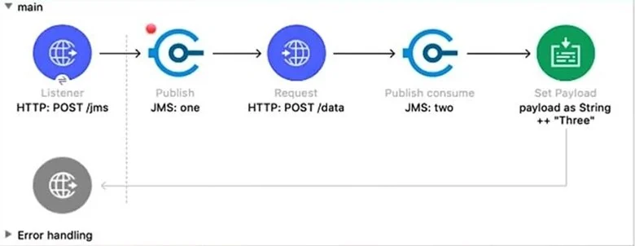 <br/> 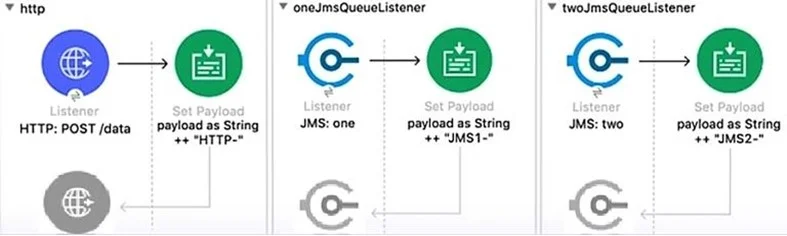 <br/> 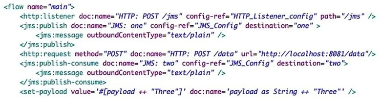
    1. Hello-HTTP-Three
    2. Hello-JMS1-HTTP-JMS2-Three
    3. Hello-HTTP-JMS2-Three
    4. HTTP-JMS2-Three <br/><br/>
28. What is output of Dataweave flatten function?
    1. Array
    2. LinkedHashMap
    3. Map
    4. Object <br/><br/>
29. Refer to the exhibits. Client sends the request to _ClientRequestFlow_ which calls _ShippingFlow_ using HTTP Request activity. <br/> During E2E testing it is found that that _HTTP:METHOD_NOT_ALLOWED_ error is thrown whenever client sends request to this flow. <br/> What attribute you would change in _ClientRequestFlow_ to make this implementation work successfully? <br/> 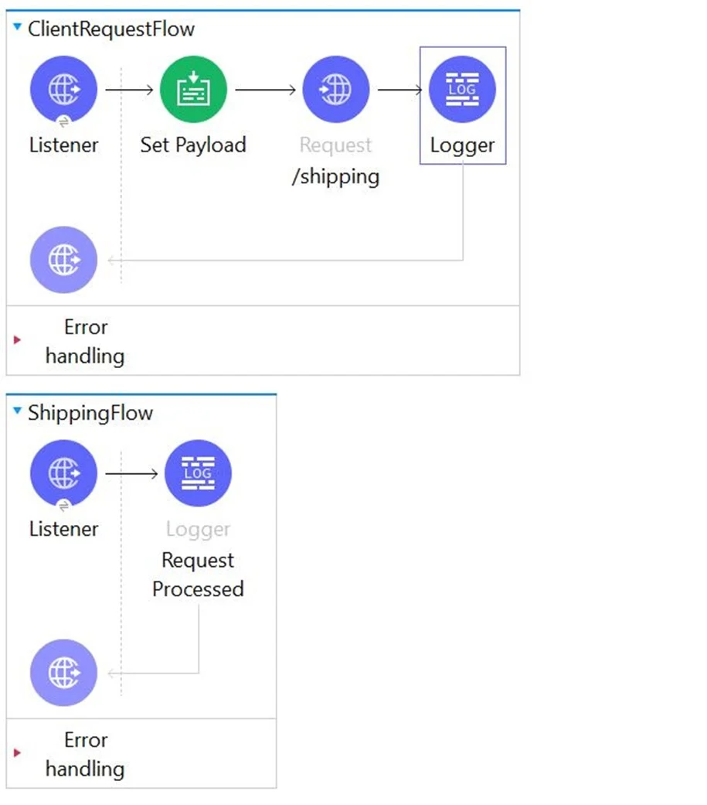 <br/> 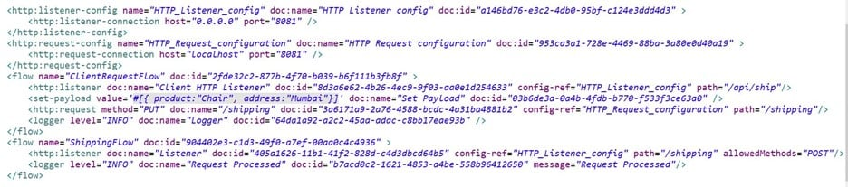 <br/> 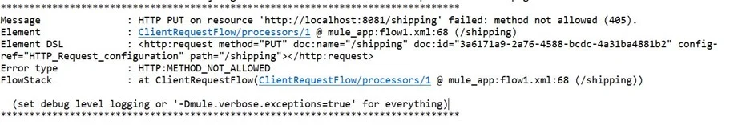
    1. Change the allowed method attributes value to "POST"
    2. Change the protocol attribute value to "HTTPS"
    3. Change the path attribute value to "/api/ship"
    4. Change the method attribute value to "*"
30. An organization is beginning to follow Mulesoft's recommended API led connectivity approach to use modern API to support the development and lifecycle of the integration solutions and to close the IT delivery gap. <br/> What distinguishes between how modern API's are organized in a MuleSoft recommended API-led connectivity approach as compared to other common enterprise integration solutions?
    1. The APIO implementations are monitored with common tools, centralized monitoring and security systems
    2. The API interfaces are specified as macroservices with one API representing all the business logic of an existing and proven end to end solution
    3. The API interfaces are specified at a granularity intended for developers to consume specific aspect of integration processes
    4. The API implementation are built with standards using common lifecycle and centralized configuration management tools
31. 