# Cuestionario de prueba 2

Segundo cuestionario de prueba para el examen de certificación de Mulesoft con Explicaciones incluidas

## [Respuestas y explicaciones](respuestas_2.md)

---

1. Refer to the exhibit. The error occurs when a project is run in Anypoint Studio. The project, which has a dependency that is not in the MuleSoft Maven repository, was created and successfully run on a different computer. What is the next step to fix the error to get the project to run successfully? <br/> 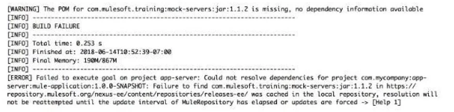
   1. Install the dependency to the computer's local Maven repository
   2. Add the dependency to the MULE_HOME/bin folder
   3. Edit the dependency in the Mule project's pom.xml file
   4. Deploy the dependency to MuleSoft's Maven repository <br/><br/>
2. According to MuleSoft, what is the Center for Enablement’s role in the new IT operating model?
   1. Implements line of business projects to enforce common security requirements
   2. Creates and manages discoverable assets to be consumed by line of business developers
   3. Implements line of business projects to enforce common security requirements
   4. Centrally manages partners and consultants to implement line of business projects <br/><br/>
3. As a part of requirement , application property defined below needs to be accessed as Dataweave expression. What is the correct expression to map it to port value?
   1. `{ port : p('db.port')}`
   2. `{ port : p['db.port']}`
   3. Application property cannot be accessed in Dataweave
   4. `{ port : {db:port}}` <br/><br/>
4. Refer to the exhibit. What payload is returned when client sends request to `http://localhost:8081/`? <br/> 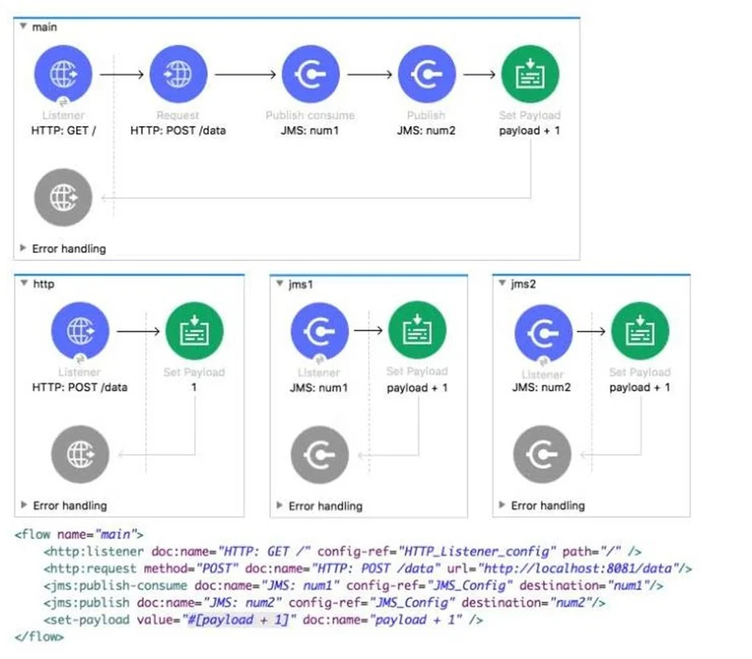
   1. 1
   2. 2
   3. 3
   4. 4 <br/><br/>
5. Refer to the exhibits. A web client submits a request to below flow. What is the output at the end of the flow? <br/> 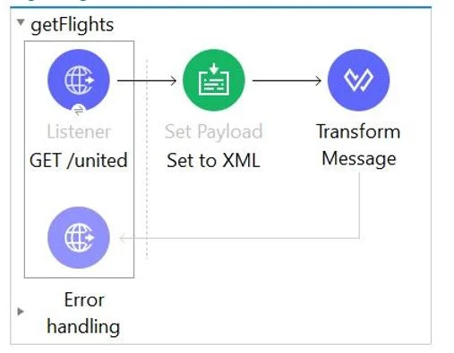 <br/> 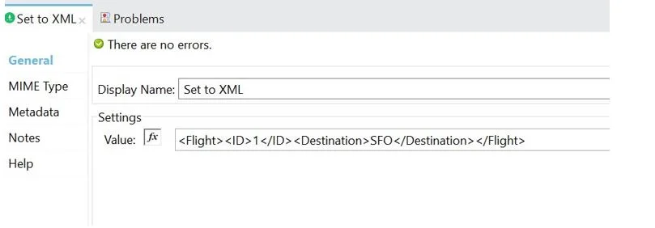 <br/> 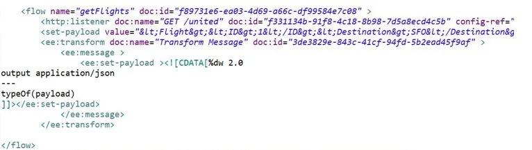
   1. Java
   2. XML
   3. String
   4. Object <br/><br/>
6. Which of the below functionality is provided by zip operator in DataWeave?
   1. Merges elements of two lists (arrays) into a single list
   2. All of the above
   3. Minimize the size of long text using encoding.
   4. Used for sending attachments <br/><br/>
7. Refer to the exhibits. What is the response received when a client submits a GET request to `http://localhost:8081`? <br/> 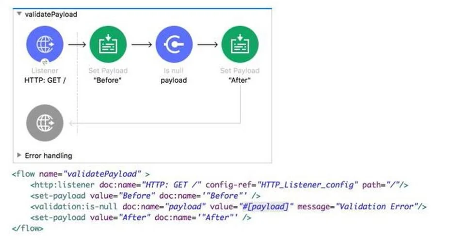
   1. Before
   2. After
   3. null
   4. Validation error <br/><br/>
8. There are three routes configured for Scatter-Gather and incoming event has a payload is an Array of three objects. How routing will take place in this scenario?
   1. Incoming array objects would be split into three and each part would be sent to one route each in parallel
   2. Incoming array objects would be split into three and each part would be sent to one route each in sequential manner
   3. Entire event would be sent to each route sequentially
   4. Entire event would be sent to each route in parallel <br/><br/>
9. A Utlility.dwl is located in a Mule project at src/main/resources/modules. <br/> The Utility.dwl file defines a function named encryptString that encrypts a String What is the correct DataWeave to call the encryptString function in a Transform Message component?

```js
// i.
%dw 2.0
output application/json
import modules::Utility
---
Utility::encryptString( "John Smith" )
```

```js
// ii.
%dw 2.0
output application/json
import modules.Utility
---
Utility.encryptString( "John Smith" )
```

```js
// iii.
%dw 2.0
output application/json
import modules::Utility
---
encryptString( "John Smith" )
```

```js
// iv.
%dw 2.0
output application/json
import modules.Utility
---
encryptString( "John Smith" )
```

10. A Database On Table Row listener retrieves data from a CUSTOMER table that contains a primary key user_id column and an increasing login_date_time column. Neither column allows duplicate values. How should the listener be configured so it retrieves each row at most one time?
    1. Set the watermark column to the user_id column
    2. Set the target value to the last retrieved user_id value
    3. Set the watermark column to the login_date_time column
    4. Set the target value to the last retrieved login_date_time value <br/><br/>
11. Refer to the exhibit. What DataWeave expression transforms the example XML input to the CSV output? <br/> 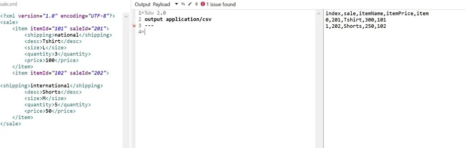

```js
// i.
%dw 2.0
output application/csv
---
payload.sale.item map ((value, index) -> {
index: index,
sale: value.saleId,
itemName: value.desc,
itemPrice: (value.quantity) * (value.price),
item: value.itemId
} )
```

```js
// ii.
%dw 2.0
output application/csv
---
payload.sale.item map ((value, index) -> {
index: index,
sale: value.@saleId,
itemName: value.desc,
itemPrice: (value.quantity) * (value.price),
item: value.@itemId
} )
```

```js
// iii.
%dw 2.0
output application/csv
---
payload.sale.*item map ((value, index) -> {
index: index,
sale: value.@saleId,
itemName: value.desc,
itemPrice: (value.quantity) * (value.price),
item: value.@itemId
} )
```

```js
// iv.
%dw 2.0
output application/csv
---
payload.sale.*item map ((value, index) -> {
index: index,
sale: value.saleId,
itemName: value.desc,
itemPrice: (value.quantity) * (value.price),
item: value.itemId
} ) a
```

12. Refer to the exhibits. The two Mule configuration files belong to the same Mule project. Each HTTP Listener is configured with the same host string. Port number, path and operation values are shown in display names. What is the minimum number of global elements that must be defined to support all these HTTP Listeners? <br/> 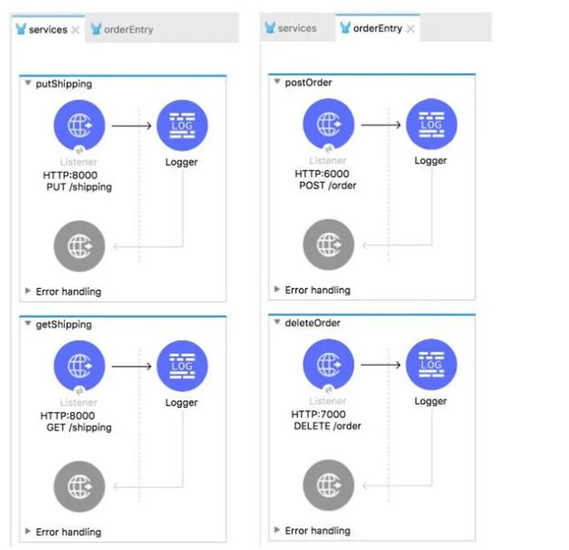
    1. 1
    2. 2
    3. 3
    4. 4 <br/><br/>
13. Refer to the below exhibit. A Mule application configures a property placeholder file named config.yaml to set some property placeholders for an HTTP connector. <br/> What is the valid properties placeholder file to set these values? <br/> 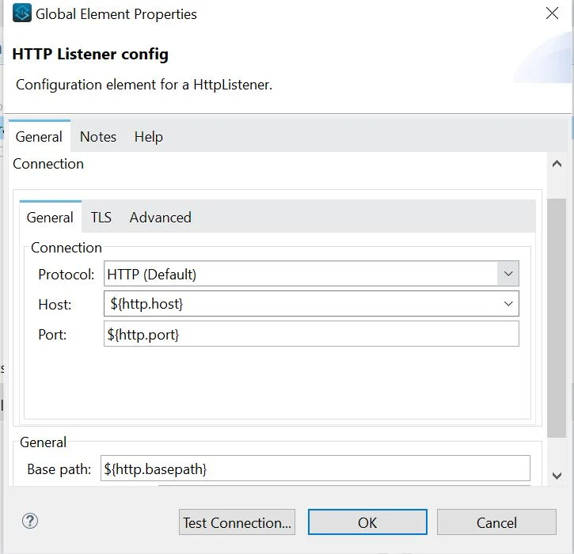

```yaml
# i.
http.host = localhost 
http.port = 8081
```

```yaml
# ii.
{  
    http:   
        basePath: "api",   
        port: "8081",   
        host: " localhost" 
}
```

```yaml
# iii.
http:  
    host = "localhost"  
    port = "8081"
```

```yaml
# iv.
http:  
    basepath: "api"  
    host : "localhost"  
    port : "8081"
```

14. How many Mule applications can run on a CloudHub worker?
    1. Depends
    2. At most one
    3. At least one
    4. None of these <br/><br/>
15. How can we scale deployed Mule application vertically on Cloudhub?
    1. Option 1 and 2 both can be used
    2. Mule applications can be scaled only horizontally
    3. Changing worker size
    4. Adding multiple workers <br/><br/>
16. A mule project contains MySQL database dependency . The project is exported from Anypoint Studio so that it can be deployed to Cloudhub.  What export options needs to be selected to create the smallest deployable archive that will successfully deploy to Cloudhub?
    1. Select only below option <br/> 1) Attach project sources
    2. Select only below option <br/> 2) Include project module and dependencies
    3. Select both the options <br/> 1) Attach project sources <br/> 2) Include project module and dependencies
    4. No need to select any of the below options: <br/> 1) Attach project sources <br/> 2) Include project module and dependencies <br/><br/>
17. Refer to the exhibits. The Batch Job processes, filters, and aggregates records. What is the outcome from the Logger component when the flow is executed? <br/> 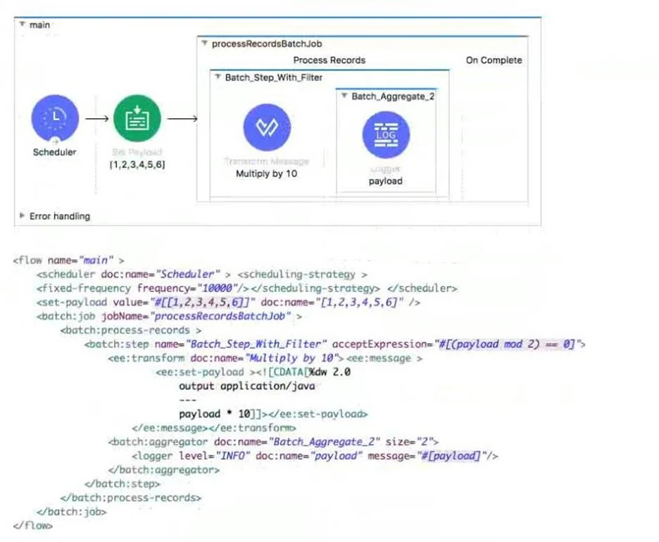
    1. [10,20] [30,40] [50,60]
    2. [10,20,30,40,50,60]
    3. [20,40] [60]
    4. [20,40,60] <br/><br/>
18. A shopping API contains a method to look up store details by department. <br/> To get the information for a particular store, web clients will submit requests with a query parameter named department and uri parameter named storeId <br/> What is valid RAML snippet that supports requests from a web client to get a data for a specific storeId and department name?

```yaml
# i.
get:	
    uriParameter:		
            {storeId}:	
    queryParameter:		
            department:
```

```yaml
# ii.
/department:   
    get:     
        uriParameter:       
        storeId:
```

```yaml
# iii.
get:  
    queryParameter:    
            department:  
    uriParameter:    
            {storeId}:
```

```yaml
# iv.
/{storeId}:  
        get:   
            queryParameter:    
              department:
```

19. A web client submits a request to http://localhost:8081?accountType=personal. <br/> The query parameter is captured using a Set Variable transformer and stored to a variable named accountType. What is the correct DataWeave expression to log accountType?
    1. Account Type: #[message.inboundProperties.accountType]
    2. Account Type: #[flowVars.accountType]
    3. Account Type: #[vars.accountType]
    4. Account Type: # [attributes.accountType] <br/><br/>
20. In the Database On Table Row operation, what does the Watermark column enable the On Table Row operation to do?
    1. To avoid duplicate processing of records in a database.
    2. To enable duplicate processing of records in a database
    3. To delete the most recent records retrieved from a database to enable database caching
    4. To save the most recent records retrieved from a database to enable database caching <br/><br/>
21. Refer to the exhibits. The mule application implements a REST API that accepts GET request from two URL's which are as follows <br/> 1) http://acme.com/order/status <br/> 2) http://acme.com/customer/status <br/> What path value should be set in HTTP listener configuration so that requests can be accepted for both these URL's using a single HTTP listener event source? <br/> 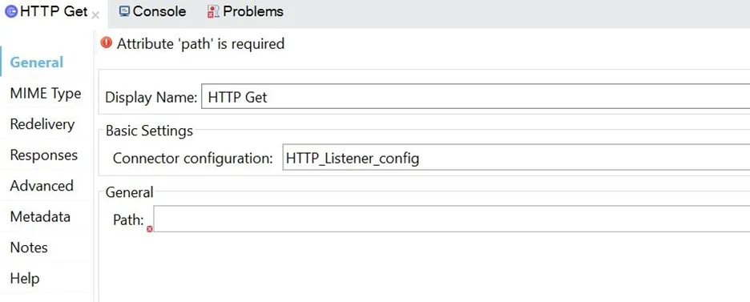
    1. *[order,customer]/status
    2. ?[order,customer]/status
    3. */status
    4. *status <br/><br/>
22. Where would you create SLA Tiers for an API?
    1. Anypoint Studio
    2. Exchange
    3. API Manager
    4. RAML Specifications <br/><br/>
23. What path setting is required for an HTTP Listener endpoint to route all requests to an APIKit router?
    1. /
    2. /*
    3. /{}
    4. /{*} <br/><br/>
24. What is not true about application properties?
    1. Application properties can be encrypted
    2. Application properties can be overridden with system properties
    3. Application properties can be defined in .yaml file only
    4. Application properties provide easier way to manage configurable values <br/><br/>
25. Which of the below is used by Mule application to manage dependencies which make sharing the projects lightweight and easier?
    1. Global element
    2. Cloudhub
    3. POM.xml
    4. Configuration file <br/><br/>
26. What is the purpose of the api:router element in APIkit?
    1. Creates native connectors using a 3rd party Java library
    2. Validates requests against RAML API specifications and routes them to API implementations
    3. Validates responses returned from API requests and routes them back to the caller
    4. Serves as an API implementation <br/><br/>
27. A function named toUpper needs to be defined that accepts a string named userName and returns the string in uppercase. <br/> What is the correct DW code to define the toUpper function?
    1. var toUpper(userName) -> upper(userName)
    2. fun toUpper(userName) -> upper(userName)
    3. var toUpper(userName) = upper(userName)
    4. ​fun toUpper(userName) = upper(userName) <br/><br/>
28. 