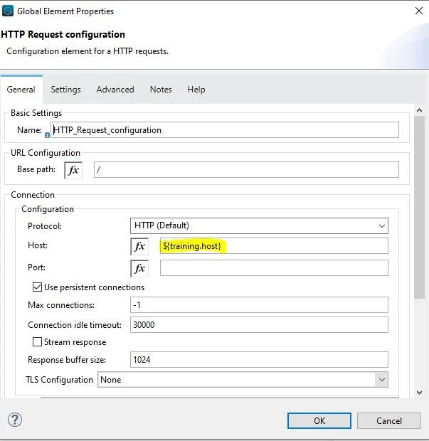
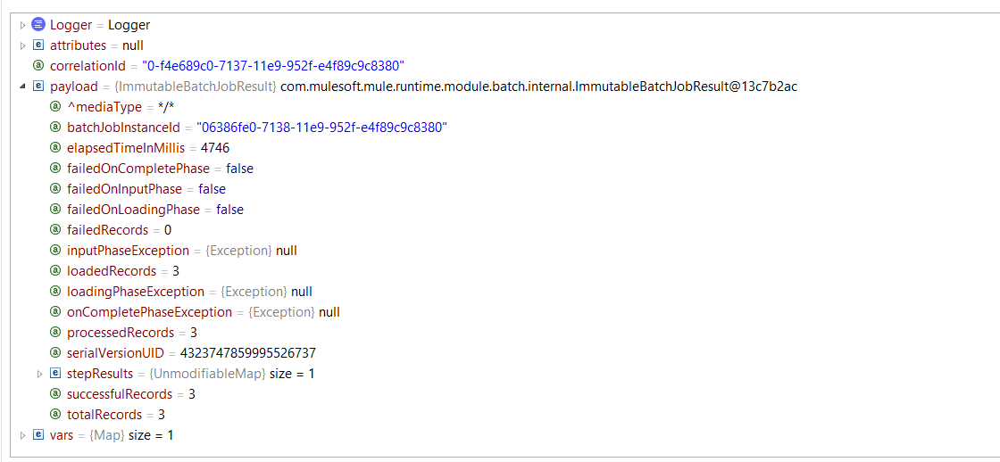

# Respuestas del primer cuestionario

1. `iv.` - `${training.host}`
   1. **Explicación:**  <br/><br/>
2. `i.`
   1. **Explicación**: Keyword to ad function in Dataweave transformation is fun. Hence option 2 and 4 are invalid. Also parameters needs to be passed exactly in same order as defined in function definition. Hence correct answer is `i.` [MuleSoft Documentation Reference](https://docs.mulesoft.com/mule-runtime/latest/logger-component-reference) <h3>DataWeave Function Definition Syntax</h3> To define a function in DataWeave use the following syntax: `fun myFunction(param1, param2, ...) = <code to execute>` The `fun` keyword starts the definition of a function. <br/> `myFunction` is the name you define for the function. <br/> Function names must be valid identifiers. <br/> `(param1, param2, …​ , paramn)` represents the parameters that your function accepts. <br/> You can specify from zero to any number of parameters, separated by commas (`,`) and enclosed in parentheses. <br/> The `=` sign marks the beginning of the code block to execute when the function is called. <br/> `<code to execute>` represents the actual code that you define for your function. <br/><br/>
3. `iii.` - `The payload is: #[payload]`
   1. **Explicación:** <h3>Logger Component</h3> This Core component helps you monitor & debug your Mule application by logging important information such as error messages, status notifications, payloads, and so on. You can add a Logger anywhere in a flow, and you can configure it to log a string that you specify, the output of a DataWeave expression you write, or any combination of strings and expressions. <br/> It is the only correct answer as it concatenates payload with String. <br/> Below option wont work. <br/> `#["The payload is " ++ payload]` <br/> Reason is concatenation function expects both arguments to be string. As the question says payload is json object , this will throw error while running it. You can try this in Anypoint Studio and you will get the same result which I mentioned. <br/> hence correct answer is <br/> `The payload is: #[payload]` <br/> [Reference](https://docs.mulesoft.com/mule-runtime/latest/logger-component-reference) <br/><br/>
4. `iii.`
   1. **Explicación:** As can be seen in error message , SOAP service findFlights expects the SOAP payload. <br/><br/>
5. `ii.` - `The city is #[payload.City]`
   1. **Explicación:** You may get confused with the option `#["The city is" ++ payload.City]` But note that this option will not print the space between is and city name. This will print The city isPune <br/><br/>
6. `i.` - `Summary statistics with No record data`
   1. **Explicación:** This is a tricky question. On complete phase payload consists of summary of records processed which gives insight on which records failed or passed. Hence option `i.` is correct answer. <br/> [MuleSoft Documentation Reference](https://docs.mulesoft.com/mule-runtime/latest/batch-processing-concept). <br/> **On Complete**: This is the optional phase of the batch. It provides the summary of the records processed and helps the developer to get an insight which record was successful and which one failed so that you can address the issue properly. <br/>  <br/><br/>
7. `iv.` - `In API Manager`
   1. **Explicación:** <h3>API Autodiscovery</h3> Configuring autodiscovery allows a deployed Mule runtime engine (Mule) application to connect with API Manager to download and manage policies and to generate analytics data. Additionally, with autodiscovery, you can configure your Mule applications to act as their own API proxy. <br/> When autodiscovery is correctly configured in your Mule application, you can say that your application’s API is tracked by (green dot) or paired to API Manager. You can associate an API in a Mule setup with only one autodiscovery instance at a given time. <h3>Prerequisites</h3> To [configure autodiscovery for your Mule application](https://docs.mulesoft.com/mule-gateway/mule-gateway-config-autodiscovery-mule4), ensure that: <br/> The API exists in API Manager and is configured as either a basic endpoint, or a proxy endpoint. <br/> The Mule application is configured to use Anypoint Platform credentials. <br/> The platform credentials give your application access to the API Configuration in API Manager. You must configure these credentials before starting the Mule runtime engine that executes your application. <br/> The autodiscovery element is configured in your Mule application. <br/> [Reference Doc](https://docs.mulesoft.com/mule-gateway/mule-gateway-autodiscovery-overview). <br/><br/>
8. `iv.` - `Process Layer`
   1. **Explicación:** Orchestration and transformation logic should be in process layer as per Mulesoft's recommended approach for API led connectivity. Our keyword here is "Orchestration" as well. <br/><br/>
9. `i.` - `Configure the correct JDBC Driver`
   1. **Explicación:** Correct answer is Configure the correct JDBC driver as error message suggests the same
      ```bash
      Caused by: java.sql.SQLException: Error trying to load driver:
      com.mysql.jdbc.Driver : Cannot load class 'com.mysql.jdbc.Driver': 
      [Class 'com.mysql.jdbc.Driver' has no package mapping for region 
      'domain/default/app/mule_app'.,Cannot load class 'com.mysql.jdbc.Driver': [
      ```
      <br/>
10. `iv.` - `Start`
    1. **Explicación:** Correct answer is **Start** as that is the payload set before start of the activity on which breakpoint is applied.