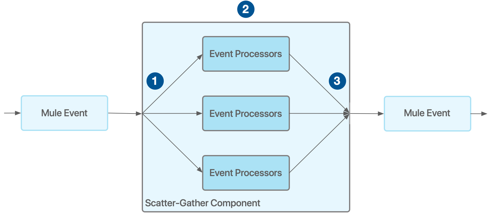
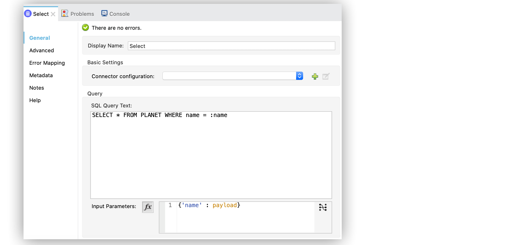
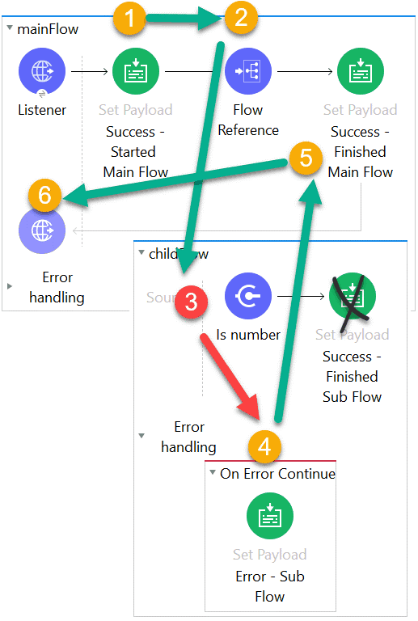
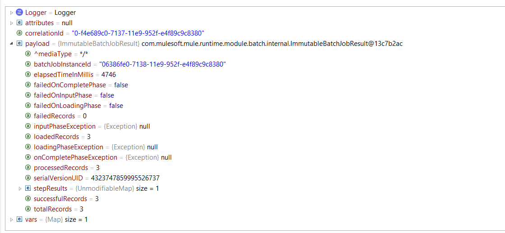
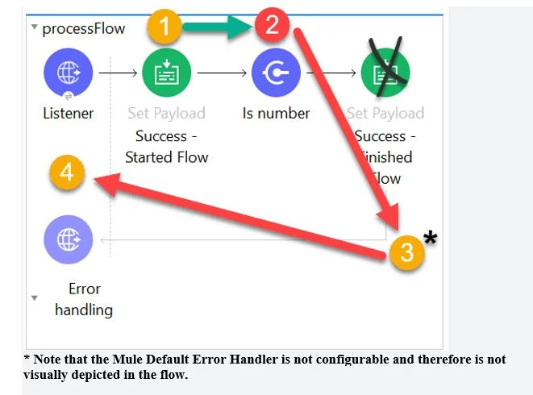
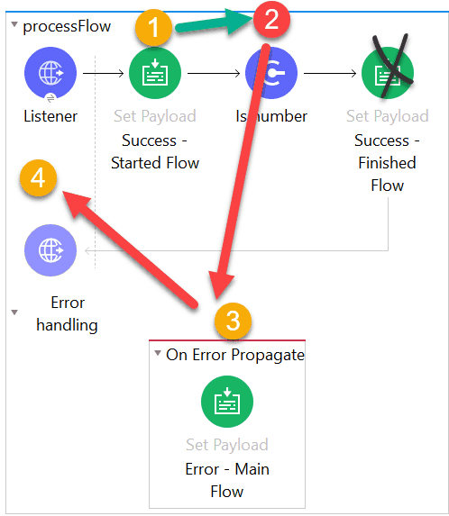
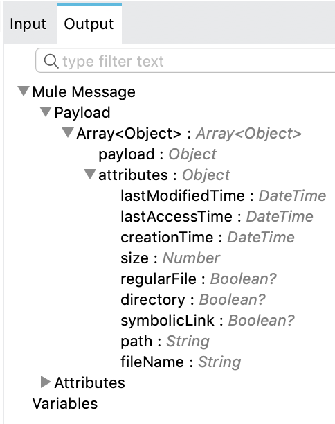

# Respuestas del primer cuestionario

1. `iv.` - `${training.host}`
   1. **Explicación:**  <br/><br/>
2. `i.`
   1. **Explicación**: Keyword to ad function in Dataweave transformation is fun. Hence option 2 and 4 are invalid. Also parameters needs to be passed exactly in same order as defined in function definition. Hence correct answer is `i.` [MuleSoft Documentation Reference](https://docs.mulesoft.com/mule-runtime/latest/logger-component-reference) <h3>DataWeave Function Definition Syntax</h3> To define a function in DataWeave use the following syntax: `fun myFunction(param1, param2, ...) = <code to execute>` The `fun` keyword starts the definition of a function. <br/> `myFunction` is the name you define for the function. <br/> Function names must be valid identifiers. <br/> `(param1, param2, …​ , paramn)` represents the parameters that your function accepts. <br/> You can specify from zero to any number of parameters, separated by commas (`,`) and enclosed in parentheses. <br/> The `=` sign marks the beginning of the code block to execute when the function is called. <br/> `<code to execute>` represents the actual code that you define for your function. <br/><br/>
3. `iii.` - `The payload is: #[payload]`
   1. **Explicación:** <h3>Logger Component</h3> This Core component helps you monitor & debug your Mule application by logging important information such as error messages, status notifications, payloads, and so on. You can add a Logger anywhere in a flow, and you can configure it to log a string that you specify, the output of a DataWeave expression you write, or any combination of strings and expressions. <br/> It is the only correct answer as it concatenates payload with String. <br/> Below option wont work. <br/> `#["The payload is " ++ payload]` <br/> Reason is concatenation function expects both arguments to be string. As the question says payload is json object , this will throw error while running it. You can try this in Anypoint Studio and you will get the same result which I mentioned. <br/> hence correct answer is <br/> `The payload is: #[payload]` <br/> [Reference](https://docs.mulesoft.com/mule-runtime/latest/logger-component-reference) <br/><br/>
4. `iii.` - `Set a SOAP payload before the Consume operation that contains the destination query parameter`
   1. **Explicación:** As can be seen in error message , SOAP service findFlights expects the SOAP payload. <br/><br/>
5. `ii.` - `The city is #[payload.City]`
   1. **Explicación:** You may get confused with the option `#["The city is" ++ payload.City]` But note that this option will not print the space between is and city name. This will print The city isPune <br/><br/>
6. `i.` - `Summary statistics with No record data`
   1. **Explicación:** This is a tricky question. On complete phase payload consists of summary of records processed which gives insight on which records failed or passed. Hence option `i.` is correct answer. <br/> [MuleSoft Documentation Reference](https://docs.mulesoft.com/mule-runtime/latest/batch-processing-concept). <br/> **On Complete**: This is the optional phase of the batch. It provides the summary of the records processed and helps the developer to get an insight which record was successful and which one failed so that you can address the issue properly. <br/>  <br/><br/>
7. `iv.` - `In API Manager`
   1. **Explicación:** <h3>API Autodiscovery</h3> Configuring autodiscovery allows a deployed Mule runtime engine (Mule) application to connect with API Manager to download and manage policies and to generate analytics data. Additionally, with autodiscovery, you can configure your Mule applications to act as their own API proxy. <br/> When autodiscovery is correctly configured in your Mule application, you can say that your application’s API is tracked by (green dot) or paired to API Manager. You can associate an API in a Mule setup with only one autodiscovery instance at a given time. <h3>Prerequisites</h3> To [configure autodiscovery for your Mule application](https://docs.mulesoft.com/mule-gateway/mule-gateway-config-autodiscovery-mule4), ensure that: <br/> The API exists in API Manager and is configured as either a basic endpoint, or a proxy endpoint. <br/> The Mule application is configured to use Anypoint Platform credentials. <br/> The platform credentials give your application access to the API Configuration in API Manager. You must configure these credentials before starting the Mule runtime engine that executes your application. <br/> The autodiscovery element is configured in your Mule application. <br/> [Reference Doc](https://docs.mulesoft.com/mule-gateway/mule-gateway-autodiscovery-overview). <br/><br/>
8. `iv.` - `Process Layer`
   1. **Explicación:** Orchestration and transformation logic should be in process layer as per Mulesoft's recommended approach for API led connectivity. Our keyword here is "Orchestration" as well. <br/><br/>
9. `i.` - `Configure the correct JDBC Driver`
   1. **Explicación:** Correct answer is Configure the correct JDBC driver as error message suggests the same
      ```bash
      Caused by: java.sql.SQLException: Error trying to load driver:
      com.mysql.jdbc.Driver : Cannot load class 'com.mysql.jdbc.Driver': 
      [Class 'com.mysql.jdbc.Driver' has no package mapping for region 
      'domain/default/app/mule_app'.,Cannot load class 'com.mysql.jdbc.Driver': [
      ```
      <br/>
10. `iv.` - `Start`
    1. **Explicación:** Correct answer is **Start** as that is the payload set before start of the activity on which breakpoint is applied. <br/><br/>
11. `iv.` - `Creates reusable APIs and assets designed to be consumed by other business units`
    1. **Explicación:** An application network is pretty simple; it is a way to connect applications, data and devices through APIs that exposes some or all of their assets and data on the network. That network allows other consumers from other parts of the business to come in and discover and use those assets. Building an application network involves developing reusable assets and then encouraging those in the business to reuse and self-serve those assets. Then, they can get used and reused in different ways inside the organization. Connections can then be built between these assets. It is necessary to allow development teams in the business to build what is needed — to self-serve the reusable assets created by others to in order to develop something new — and then expose it to the rest of the organization to be reused. <br/> [Reference Doc](https://www.mulesoft.com/api/what-is-an-application-network). <br/><br/>
12. `iv.`
    1. **Explicación:** The following diagram details the behavior of the Scatter-Gather component: <br/>  <br/> The Scatter-Gather component receives a Mule event and sends a reference of this Mule event to each processing route.Each of the processing routes starts executing in parallel. After all processors inside a route finish processing, the route returns a Mule event, which can be either the same Mule event without modifications or a new Mule event created by the processors in the route as a result of the modifications applied.After all processing routes have finished execution, the Scatter-Gather component creates a new Mule event that combines all resulting Mule events from each route, and then passes the new Mule event to the next component in the flow. <br/> After all processing routes have finished execution, the Scatter-Gather component creates a new Mule event that combines all resulting Mule events from each route, and then passes the new Mule event to the next component in the flow. <br/><br/>
13. `ii.` - `[[5,10,15,20], 5]`
    1. **Explicación:** ***Key thing to note here is that any changes made to payload in for each loop are not available outside for each scope where as variable value updated in for each loop is visible out side for each loop too.*** <br/> In this example , sequence can be described as follows <br/> 1) Payload is set to the value [5, 10, 15, 20] <br/> 2) Variable is set to the value of 1 <br/> 3) For each loop is executed four times and in each loop payload value is updated to append "Req" and variable is count is increased by 1 <br/> 4) Once control comes out of for each , payload changes made within for each are not visible. Hence payload at this point of time is equal to payload available before entering for each loop which was [5, 10, 15, 20]. Similarly variable value updated in for each loop is also available outside hence variable value is 5 as it was updated in loop. <br/> 5) Hence correct answer is [[5, 10, 15, 20], 5]<h3>For Each Scope</h3> The For Each scope splits a payload into elements and processes them one by one through the components that you place in the scope. It is similar to a `for-each`/`for` loop code block in most programming languages and can process any collection, including lists and arrays. The collection can be any supported content type, such as `application/json`, `application/java`, or `application/xml`. <br/> General considerations about the For Each scope: <br/> By default, For Each tries to split the payload. If the payload is a simple Java collection, the For Each scope can split it without any configuration. The payload inside the For Each scope is each of the split elements. Attributes within the original message are ignored because they are related to the entire message. <br/> For Each does not modify the current payload. The output payload is the same as the input. <br/> For non-Java collections, such as XML or JSON, use a DataWeave expression to split data. Use the **Collection** field for this purpose. <br/><br/>
14. `iv.` - `Publish consume: Synchronous. & Publish: Asynchronous`
    1. **Explicación:** [Reference Doc](https://docs.mulesoft.com/jms-connector/1.7/jms-publish-consume). <br/><br/>
15. `iii.` - `lookup function`
    1. **Explicación:** This function enables you to execute a flow within a Mule app and retrieve the resulting payload. <br/> It works in Mule apps that are running on Mule Runtime version 4.1.4 and later. <br/> Similar to the Flow Reference component (recommended), the `lookup` function enables you to execute another flow within your app and to retrieve the resulting payload. It takes the flow’s name and an input payload as parameters. For example, `lookup("anotherFlow", payload)` executes a flow named `anotherFlow`. <br/> The function executes the specified flow using the current attributes, variables, and any error, but it only passes in the payload without any attributes or variables. Similarly, the called flow will only return its payload. <br/> Note that `lookup` function does not support calling subflows. <br/> [Reference Doc](https://docs.mulesoft.com/dataweave/latest/dw-mule-functions-lookup). <br/><br/>
16. `i.` - `{customerID}`
    1. **Explicación:** URL parameters are always accessed using { } like => {customerID} <h3>Paths</h3> The path of an HTTP listener can be static, which requires exact matches, or feature placeholders. Placeholders can be wildcards (`*`), which match against anything they are compared to, or parameters (`{param}`), which not only match against anything but also capture those values on a URI parameters map. <br/> Take the following example paths for three listeners using a configuration that establishes `api/v1` as the base path: <br/> `account/mulesoft/main-contact`: only match the exact path request `http://awesome-company.com/api/v1/account/mulesoft/main-contact` <br/> `account/{accountId}/main-contact`: matches all path requests structured similarly, such as `http://awesome-company.com/api/v1/account/salesforce/main-contact`, and save `salesforce` as the value of `accountId`. <br/> `account/{accountId}/*`: matches all path requests different from `main-contact`, such as `http://awesome-company.com/api/v1/account/mulesoft/users`, and save `mulesoft` as the value of `accountId`. <br/><br/>
17. `iii.` - `#[{ city: "San Fransisco", state: "CA"}]`
    1. **Explicación:** <h3>Configure the Input Parameters Field in the Select Operation</h3> To protect database queries, configure the **Input parameters** field in the **Select** operation by adding variable values to the SQL statement you execute in the database. The primary goal of the Select operation is to supply a SQL query and use DataWeave for the parameters. <br/> The parameters you provide are a map in which keys are the name of an input parameter to be set on the JDBC prepared statement. Reference each parameter in the SQL text using a colon prefix, for example `where id = :myParamName`. The map’s values contain the actual assignation for each parameter. <br/> Use input parameters to configure the `WHERE` clause in a SQL `SELECT` statement to make the query immune to SQL injection attacks and to enable optimizations that are not possible otherwise, improving the application performance. <br/> For security reasons, do not directly write `<db:sql>SELECT * FROM PLANET WHERE name = #[payload] </db:sql>`. <br/> In the following example, you supply input parameters as key-value pairs: <br/> In your Studio flow, select the **Select** operation. <br/> In the operation configuration screen, set the **SQL Query Text** field to `SELECT * FROM PLANET WHERE name = :name`. <br/> Set the **Input Parameters** field to `{'name' : payload}`. <br/> The keys use the colon character (`:`) to reference a parameter value by name. <br/> The following screenshot shows the configuration in Studio: <br/>  <br/> [Reference Doc](https://docs.mulesoft.com/db-connector/1.9/database-connector-select). <br/><br/>
18. `i.` - `In the organization's public API portal in Anypoint Exchange, from an approved client application for the API proxy`
    1. **Explicación:** <br/> `*` When a client application is registered in Anypoint Platform, a pair of credentials consisting of a client ID and client secret is generated. <br/> `*` When the client application requests access to an API, a contract is created between the application and that API. <br/> `*` An API that is protected with a Client ID Enforcement policy is accessible only to applications that have an approved contract. <br/><br/>
19. `iii.` - `Success - main flow`
    1. **Explicación:** Note that private flow has error scope defined as On Error Continue . So when error occurs in private flow , it is handled by this On Error Continue scope which sends success response back to main flow and does not throw back an error. So main continues normally and payload is set to Success - main flow. <br/> Hence correct answer is **Success - main flow** <br/> 1. HTTP listener received request <br/> 2. The Flow Reference calls the child flow <br/> 3. The Is Number validator creates an Error Object because the payload isn’t an integer. Child Flow execution stops <br/> #[error.description] = “payload is not a valid INTEGER value” <br/> #[error.errorType] = VALIDATION:INVALID_NUMBER <br/> 4. The On Error Continue handles the errorThe payload is set to “Error – Sub Flow” <br/> 5. “Error – Sub Flow” is returned to the main flow as if the child flow was a success. The Set Payload is executed. The payload is reset to “Success – Finished Main Flow” <br/> 6. “Success – Main Flow” is returned to the requestor in the body of the HTTP request. HTTP Status Code: 200 <br/> As you can see, in the above example, because the error was caught by an On Error Continue scope in the child flow (RED in, GREEN out) when the Mule Message returns to the parent flow, the parent flow knows none-the-different that there was a failure because the on error continue returns a 200 success message. Note that because, to the mainFlow, the childFlow appeared to succeed, the processing of mainFlow resumed after the flow reference. <br/>  <br/><br/>
20. `iii.` <br/><br/>
21. `ii.`
    1. **Explicación:** On complete phase only has access to batch job result statistics and payload is not available. <h3>On Complete</h3> During this phase, you can optionally configure the runtime to create a report or summary of the records it processed for the particular batch job instance. This phase exists to give system administrators and developers some insight into which records failed to address any issues that might exist with the input data. <br/> Sample output is as below <br/>  <br/> [Reference Doc](https://docs.mulesoft.com/mule-runtime/latest/batch-processing-concept). <br/><br/>
22. `i.` - `lookup("createCustomerObject", {first: "Alice, last: "Green"})`
    1. **Explicación:** <h3>lookup(String, Any, Number)</h3> This function enables you to execute a flow within a Mule app and retrieve the resulting payload. <br/> It works in Mule apps that are running on Mule Runtime version 4.1.4 and later. <br/> Similar to the Flow Reference component (recommended), the lookup function enables you to execute another flow within your app and to retrieve the resulting payload. It takes the flow’s name and an input payload as parameters. For example, lookup("anotherFlow", payload) executes a flow named anotherFlow. <br/> [Reference Doc](https://docs.mulesoft.com/dataweave/latest/dw-mule-functions-lookup). <br/><br/>
23. `i.` - `String is not blank`
    1. **Explicación:** <br/> 1. Payload is successfully set to “Start” <br/> 2. The Is Blank String validator creates an Error Object because the payload is string "Start". Execution stops <br/> #[error.description] = “String is not blank” <br/> 3. Because no error handler is defined, the Mule default error handler handles the error. Remember, at its heart, **the Mule Default Error handler is an error handling scope with just an on error propagate** <br/> “String is not blank” is the error message returned to the requestor in the body of the HTTP requestHTTP Status Code: 500 <br/>  <br/><br/>
24. `i.` - `PUT`
    1. **Explicación:** PUT method is used to update resource available on the server. Typically, it replaces whatever exists at the target URL with something else. You can use it to make a new resource or overwrite an existing one. PUT requests that the enclosed entity must be stored under the supplied requested URI (Uniform Resource Identifier).
25. `iv.` - `To design and develop fully functional Mule applications in a hosted development environment`
    1. **[Explicación](https://docs.mulesoft.com/design-center/)** <br/><br/>
26. `iv.` - `8`
    1. **Explicación:** Answer is 8 as events are processed in parallel in case of scatter gather router. (Check answer **12.** for more details) <br/><br/>
27. `iii.` - `Hello-HTTP-JMS2-Three`
    1. **Explicación:** <br/> 1. JMS Publish is a asynchronous operation which means no response will be returned to main flow. <br/> Mule Ref: [Publish Messages Using the JMS Connector | MuleSoft Documentation](https://docs.mulesoft.com/jms-connector/1.8/jms-publish). <br/> 2. JMS Publish Consume is synchronous operation which means response would be sent back to the main process. <br/> Mule Ref: [Publish Messages and Consume Replies Using the JMS Connector | MuleSoft Documentation](https://docs.mulesoft.com/jms-connector/1.8/jms-publish-consume). <br/> Once we are clear with above two points , we can analyze the flow <br/> 1) Payload at the start of the flow is **Hello-** <br/> 2) Next activity is JMS Publish which will not sent any response back to main flow and main flow will move to next activity which is HTTP Request <br/> 3) HTTP request will call http flow. This flow will update the payload to **Hello-HTTP** and send it back to main flow <br/> 4) Next activity is Publish Consume which will call flow **twoJMSQueueListener**. As this is synchronous operation , it will update the payload to **Hello-HTTP-JMS2** and send it back to main flow. <br/> 5) Finally Set Payload activity will update the payload to **Hello-HTTP-JMS2-Three** <br/><br/>
28. `i.` - `Array`
    1. **Explicación:** Flatten turns a set of subarrays (such as `[ [1,2,3], [4,5,[6]], [], [null] ]`) into a single, flattened array (such as `[ 1, 2, 3, 4, 5, [6], null ]`). <br/> This example defines three arrays of numbers, creates another array containing those three arrays, and then uses the flatten function to convert the array of arrays into a single array with all values. <br/><br/>
29. `i.` - `Change the allowed method attributes value to "POST"`
    1. **Explicación:** It can be fixed in either of the two ways as below. <br/> 1. Changing method attribute to POST in ClientRequestFlow <br/> 2. Setting allowedMethods as PUT in ShippingFlow (but doesn't fit as question mentions about changing ClientRequestFlow) <br/><br/>
30. `iii.` - `The API interfaces are specified at a granularity intended for developers to consume specific aspect of integration processes`
    1. **Explicación:** Remember the keyword _"Granularity"_. <br/> [Reference Doc](https://www.salesforce.com/blog/api-led-connectivity/).
31. `iii.` - `Correlation of key performance indicators (KPI) of production applications with foundational assets`
    1. **Explicación:** Below are the Key performance indicators (KPIs), to measure and track the and success of the C4E and its activities, as well as the growth and health of the application network. Most of the metrics can be extracted automatically, through REST APIs, from Anypoint Platform. <br/> • # of assets published to Anypoint Exchange <br/> • # of interactions with Anypoint Exchange assets <br/> • # of APIs managed by Anypoint Platform <br/> • # of System APIs managed by Anypoint Platform <br/> • # of API clients registered for access to APIs <br/> • # of API implementations deployed to Anypoint Platform <br/> • # of API invocations <br/> • # or fraction of lines of code covered by automated tests in CI/CD pipeline <br/> • Ratio of info/warning/critical alerts to number of API invocations <br/><br/>
32. `iii.` - `The mule application start successfully. Web client requests can be received at URI on port 2222 and on port 3333`
    1. **Explicación:** In this case both the flows can start without any error and requests can be received on both ports. <br/><br/>
33. `iv.` - `Route 1`
    1. **Explicación:** Only one of the routes in the Choice router executes, meaning that the first expression that evaluates to true triggers that route’s execution and the others are not checked. If none of the expressions are true, then the default route executes. <br/> [Reference Doc](https://docs.mulesoft.com/mule-runtime/latest/choice-router-concept). <br/><br/>
34. `iii.` - `payload and all variable`
    1. **Explición:** Query parameters are replaced when external HTTP call is invoked. <br/><br/>
35. `i.` - `"Blk"`
    1. **Explicación:** First thing first, Payload will be "default as **blue**" as initial value of payload is null. <br/> _Once it goes into the Choice router it will be go first in the Default and will have the payload "Red" -> then it will go to color flow or "itself"_ <br/> The payload after the listener will be now "Red" and not "Blue" anymore since we have now a value of "Red" then first choice will be met in Choice Router, so payload will be "Blk" <br/> 1st Payload = Blue <br/> 2nd Payload = Red (In default) <br/> 3rd Payload = Red (After Listener) <br/> 4th Payload = "Blk" (Inside the First choice) <br/> 5th Payload = "Blk" <br/><br/>
36. `ii.` - `Creates a mock service for an API`
    1. **Explicación:** API Notebook is an open source, shareable web application for API documentation, interactive API tutorial and example generatation, and a client for your API endpoints. Using API Notebook, you can make requests and quickly transform the responses into readable format. However it cannot be used to mock service for an API. <br/> [Reference Doc](https://docs.mulesoft.com/api-manager/1.x/api-notebook-concept). <br/><br/>
37. `iii.` - `Using Debugger Component`
    1. **Explicación:** Anypoint Studio Visual Debugger allows you to run your application in Debug mode, setting these breakpoints to stop execution to check the contents of an event at a previously-specified event processor.
38. `iv.` - `APP: API RESOURCE NOT FOUND`
    1. **Explicación:** <br/> 1) A web client submits the request to the HTTP Listener. <br/> 2) The HTTP Request throws an "HTTP:NOT_FOUND" error, execution halts. <br/> 3) The On Error Propagate error Handler handles the error. In this case ,HTTP:NOT_FOUND error is mapped to custom error APP:API_RESOURCE_NOT_FOUND. This error processor sets payload to APP:API_RESOURCE_NOT_FOUND. <br/> 4) “APP:API_RESOURCE_NOT_FOUND. ” is the error message returned to the requestor in the body of the HTTP request with HTTP Status Code: 500 <br/>  <br/><br/>
39. `iii.` - `Patients from year 2022`
    1. **Explicación:** The thing to note here is that year is not a query parameter and not the URI parameter. Hence it will filter all the patients and return the ones for whom year is 2022. <h3>Filtering</h3> URL parameters is the easiest way to add basic filtering to REST APIs. If you have an `/items` endpoint which are items for sale, you can filter via the property name such as `GET /items?state=active` or `GET /items?state=active&seller_id=1234`. <br/><br/>
40. `iii.` - `dw::core`
    1. **Explicación:** Core (dw::Core) This module contains core DataWeave functions for data transformations. It is automatically imported into any DataWeave script. <br/><br/>
41. `i.` - `Array of Mule Event Objects`
    1. **Explicación:** <h3>List Files Using the File Connector</h3> Use the `List` operation to list the files and folders in the path pointed to by the `directoryPath` parameter. The `List` operation returns an array of messages in which: <br/> Each message holds the file’s content in its payload. <br/> The file’s attributes section carries the file’s metadata (such as name, creation time, and size). <br/> The payload is empty if the element is a folder. <br/> The `List` operation requires the `directoryPath` parameter, which represents the relative path of the directory to list, unless you specify the full path of the directory. The path is relative to the working directory value defined in the configuration referenced by the `config-ref` parameter. If no configuration is referenced, the working directory defaults to the value of the `user.home` system property. If the system property is not set, the connector fails to initialize. <br/> For an example of setting a configuration, see [File Connection Settings](https://docs.mulesoft.com/file-connector/1.3/#connection_settings). <br/> Next is an example of a `List` operation that references a file configuration and thus uses a relative path: <br/> `<file:list config-ref="File_Config" directoryPath="relativePath" />` <br/> As mentioned earlier, this returns an array of messages. In Anypoint Studio, DataSense displays the metadata for the operation’s output: <br/>  <br/><br/>
42. `ii.` - `[1,2,3,4]`
    1. **Explicación:** This is a trick question. For Each does not modify the current payload. The output payload is the same as the input. Hence output of logger is the same payload which is set before invoking For Each scope. Hence option 2 is correct answer. <h3>For Each Scope</h3> The For Each scope splits a payload into elements and processes them one by one through the components that you place in the scope. It is similar to a `for-each`/`for` loop code block in most programming languages and can process any collection, including lists and arrays. The collection can be any supported content type, such as `application/json`, `application/java`, or `application/xml`. <br/> General considerations about the For Each scope: <br/> By default, For Each tries to split the payload. If the payload is a simple Java collection, the For Each scope can split it without any configuration. The payload inside the For Each scope is each of the split elements. Attributes within the original message are ignored because they are related to the entire message. <br/> **For Each does not modify the current payload. The output payload is the same as the input.** <br/><br/>
43. `i.` - `Exchange`
    1. **Explicación:** Exchange is the odd man out here. Rest all are types of an asset. <h3>Asset Types</h3> Both the public and private content in Exchange can consist of the following kinds of elements: <br/> **Connectors -** Packaged connectivity to an endpoint developed and deployed on Anypoint Platform with third-party APIs and standard integration protocols <br/> Use connectors within your application’s flows to send and receive data using a protocol or specific API. Anypoint Studio comes with many bundled connectors, and Exchange has many more. <br/> **Templates -** Packaged integration patterns built on best practices to address common use cases <br/> You can add your information such as user credentials to complete the template’s use case or solution, and you can customize or extend templates as needed. <br/> **Examples -** Applications that are ready to run in Anypoint Studio and demonstrate a use case or solution <br/> **Policies -** Configuration modules to extend the functionality of an API and enforce capabilities such as security <br/> **REST APIs -** A RAML file or OAS file that specifies an API <br/> These APIs can be referenced by an HTTP Request connector to expose metadata to Anypoint Studio. <br/> **SOAP APIs -** A WSDL file that specifies an API <br/> **HTTP APIs -** A placeholder for an endpoint for use by private Exchange users who want to manage the endpoint with API Manager <br/> **API Groups -** A set of APIs bundled into a single asset. Instead of requesting access to multiple APIs to satisfy a use case, a developer can access the group in one step. <br/> **API Spec Fragments -** A RAML document that has a version and an identifier, but is not in itself a complete RAML specification. API spec fragments are also known as RAML fragments. <br/> **Custom -** A description and an optional file to explain aspects of your system, to provide instructional videos, or to describe product or organizational documentation <br/><br/>
44. `iv.`
    1. **Explicación:** <br/> * RAML file contains lot of information that could be considered as "not API-describing". Sort of "economy-class" members. <br/> Equally important, but not necessarily part of the main RAML file. <br/> * Through !includes, RAML allows us to build file-distributed API definitions, which is not only useful to encourage code reuse but also improves readability. <br/> * We can create RAML fragments with such code and then include them in main RAML project using !include like: <br/> types: <br/> Book: !include bookDataType.raml <br/> and examples: <br/> input: !include bookExample.raml <br/><br/>
45. `iii.` - `A dataweave syntax error`
    1. **Explicación:** To compare, DataWeave syntax is `#[payload == "FR"]`. In this case only one `=` is used so it will give syntax error. <br/><br/>
46. 