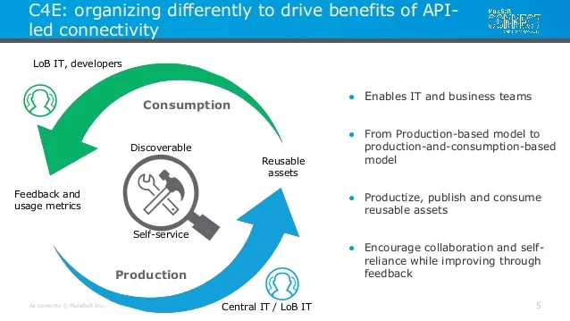
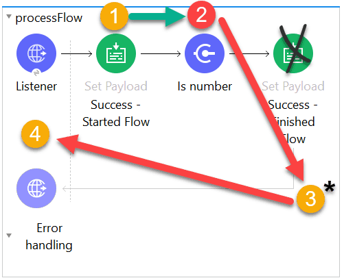
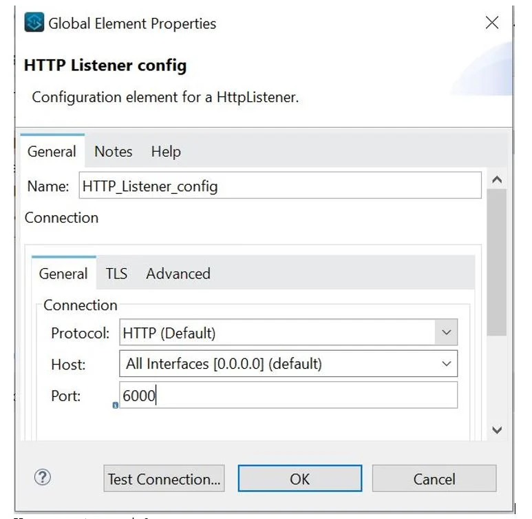
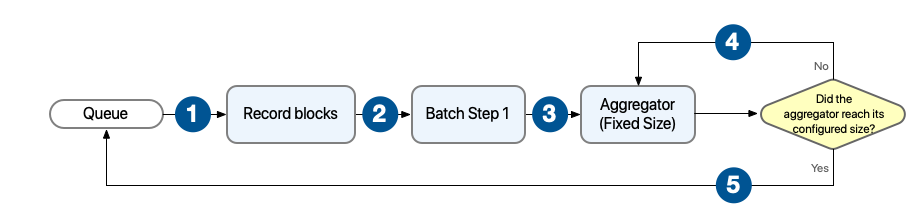
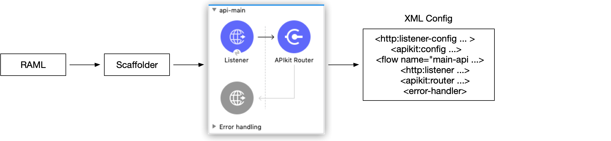
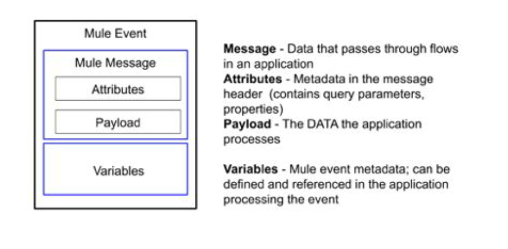

# Respuestas del segundo cuestionario

1. `i.` - `Install the dependency to the computer's local Maven repository`
   1. **Explicación:** As dependency is not present in Mulesoft Maven repository, we need to install the dependency on computer's local Maven repository. <br/><br/>
2. `ii.` - `Creates and manages discoverable assets to be consumed by line of business developers`
   1. **Explicación:** C4E does not get directly involved in projects. <br/>  <br/><br/>
3. `i.` - `{ port : p('db.port')}`
   1. **Explicación:** <h3>p(String): String</h3> This function returns a string that identifies the value of one of these input properties: Mule property placeholders, System properties, or Environment variables. <br/> The `p` function returns a `null` value if the property is not set or if the function does not find the property. <h3>Parameters</h3> `propertyName` --> A string that identifies property. <br/> **Example** <br/> This example logs the value of the property `http.port` in a Logger component.
      ```xml
      <flow name="simple"> 
          <logger level="INFO" doc:name="Logger"   
          message="#[Mule::p('http.port')]"/>
      </flow>
      ```
    <br/>
4. `iii.` - `3`
   1. **Explicación:** The flow can be described as below. <br/> 1) First HTTP POST requets is made in which paylaod is set to 1 and it gets returned to our mail flow. <br/> 2) Second call is initiated for JMS Publish Consume JMS: num1 which add 1 to the payload which makes it as 2. Note that pubih consume is a synchronous operation. Hence paylaod is returned to main flow. <br/> 3) Third call is initiated for JMS Publish JMS: num2 which add 1 to the payload . Note that pubih is asynchronous operation. Hence paylaod is never returned to main flow. So payload in main flow is still 2. <br/> 4) Finally Set Payload increments payload by 1 making payload as 3 which is returned by the flow. Hence option 3 is the correct answer. <br/><br/>
5. `iii.` - `String`
   1. **Explicación:** It will not be object. Because then you would need to set MIME Type as application/xml in Set Payload properties. But doing so will add that information in configuration xml which would be something like below. <br/> `doc:name="Set Payload" doc:id="e06e16d8-0b6e-41cd-af4e-08439bc9f8be" mimeType="application/xml"/>` <br/> In question , configuration xml snap does not mention about using any such mimeType so we can assume that it has default value which plaintext. Hence String is the correct answer as it is type associated with plain text. <br/><br/>
6. `i.` - `Merges elements of two lists (arrays) into a single list`
   1. **Explicación:** [Reference Doc](https://docs.mulesoft.com/dataweave/latest/dw-core-functions-zip). <br/><br/>
7. `iv.` - `Validation error`
   1. **Explicación:** Flow: <br/> 1) Payload is  set to “Before” <br/> 2) Is null validation is used which will pass the message only if payload is null. In this case as payload is not null, it creates an Error Object. Flow execution stops <br/> #[error.description] = “Validation error” <br/> 3) Because no error handler is defined, the Mule default error handler handles the error <br/> 4) “Validation error” is the error message returned to the requestor in the body of the HTTP request with HTTP Status Code: 500 <br/>  <br/><br/>
8. `iv.` - `Entire event would be sent to each route in parallel`
   1. **Explicación:** Entire event would be sent to each route in parallel. <br/> Scatter-Gather works as follows : <br/> - The Scatter-Gather component receives a Mule event and sends a reference of this Mule event to each processing route. <br/> - Each of the processing routes starts executing in parallel. After all processors inside a route finish processing, the route returns a Mule event, which can be either the same Mule event without modifications or a new Mule event created by the processors in the route as a result of the modifications applied. <br/> - After all processing routes have finished execution, the Scatter-Gather component creates a new Mule event that combines all resulting Mule events from each route, and then passes the new Mule event to the next component in the flow. <br/><br/>
9. `i.`
   1. **Explicación:** DataWeave 2.0 functions are packaged in modules. Before you begin, note that DataWeave 2.0 is for Mule 4 apps. For Mule 3 apps, refer to DataWeave Operators in the Mule 3.9 documentation. For other Mule versions, you can use the version selector for the Mule Runtime table of contents. <br/> Functions in the Core (`dw::Core`) module are imported automatically into your DataWeave scripts. To use other modules, you need to import the module or functions you want to use by adding the import directive to the head of your DataWeave script, for example: <br/> `import dw::core::Strings` <br/> `import camelize, capitalize from dw::core::Strings` <br/> `import * from dw::core::Strings` <br/> The way you import a module impacts the way you need to call its functions from a DataWeave script. If the directive does not list specific functions to import or use `* from` to import all functions from a function module, you need to specify the module when you call the function from your script. For example, this import directive does not identify any functions to import from the String module, so it calls the `pluralize` function like this: `Strings::pluralize("box")`.

      ```js
      %dw 2.0
      import dw::core::Strings
      output application/json
      ---
      { 
          'plural': Strings::pluralize("box") 
      }
      ```
    <br/>
10. `iii.` - `Set the watermark column to the login_date_time column`
    1. **Explicación:** * Watermark allows the poll scope to poll for new resources instead of getting the same resource over and over again. <br/> * The database table must be ordered so that the "watermark functionality" can move effectively in the ordered list. Watermark stores the current/last picked up "record id." <br/> * If the Mule application is shut down, it will store the last picked up "record id" in the Java Object Store and the data will continue to exist in the file. This watermark functionality is valuable and enables developers to have increased transparency. <br/> * Developers do not need to create code to handle caching; it is all configurable! * There are two columns and both are unique but user_id can't guaranty sequence whereas date_time will always be in increasing order and table content can easily be ordered on the basis of last processed date_time. <br/><br/>
11. `iii.`
    1. **Explicación:** Attributes in the incoming xml payload are always accessed using `@`. Similarly `*item` is required as we have multiple items in the request. <br/><br/>
12. `iii.` - `3`
    1. **Explicación:** <h3>HTTP Listener Configuration</h3> To use an HTTP listener, you need to declare a configuration with a corresponding connection. This declaration establishes the HTTP server that will listen to requests. <br/> Additionally, you can configure a base path that applies to all listeners using the configuration.
        ```xml
        <http:listener-config name="HTTP_Listener_config" basePath="api/v1">  
        <http:listener-connection host="0.0.0.0" port="8081" />
        </http:listener-config>
        ```
        In this case three configurations will be required each for port 8000, 6000 and 7000. <br/> There would be three global elements defined for HTTP connections. <br/> Each HTTP connection will have host and port. One example shown below with host as localhost and port 6000 <br/>  <br/><br/>
13. `iv.`
    1. **Explicación:** [Reference Doc](https://docs.mulesoft.com/mule-runtime/latest/mule-app-properties-to-configure). <br/><br/>
14. `ii.` - `At most one`
    1. **Explicación:** One cloudhub worker can host one Mule application only. <br/><br/>
15. `iii.` - `Changing worker size`
    1. **Explicación:** Mule applications can be scaled vertically by changing worker size. Mule applications can be scaled horizontally by adding more workers. <h3>Horizontal Scaling</h3> Multiple workers of small vCore capacity helps to improve throughput of high frequency small payload type applications. For example your application is a http API Proxy, and you have a lot of clients sending frequent requests, but each request is small payload and utilizes only little cpu or memory. Horizontally scaling will allow you to have more capacity as well as redundancy. <h3>Vertical Scaling</h3> Large single vCore workers are useful for high CPU intensive integrations or APIs. Ones that are processing large payloads but small number of actual requests. If you want these single large payloads to be processed even quicker, increase the vCore size. <br/> [Reference Doc](https://docs.mulesoft.com/cloudhub/cloudhub-architecture). <br/><br/>
16. `ii.` - `Select only below option` <br/> `2) Include project module and dependencies`
    1. **Explicación:** You can choose **Attach Project Sources** to include metadata that Studio requires to reimport the deployable file as an open Mule project into your workspace. You must keep the **Attach Project Sources** option selected to be able to import the packaged JAR file back into a Studio workspace. But requirement here is to create smallest deployable archive that will successfully deploy to Cloudhub. Hence we can ignore this option. <br/> We need to select Include project module and dependencies <br/> As actual modules and external dependencies required to run the Mule application in a Mule runtime engine <br/> Hence correct answer is `ii.` <br/><br/>
17. `iii.` - `[20,40] [60]`
    1. **Explicación:** Behavior with aggregator configured with fixed size <br/> In this scenario, the batch step sends the processed records to an aggregator, which starts processing the records and buffering them until the configured aggregator’s size is reached. After that, the aggregator sends the aggregated records to the stepping queue. <br/>  <br/> The batch job builds record blocks of the configured block size and sends them to their corresponding batch step for processing. Each batch step receives one or more record blocks and starts processing them in parallel. After the batch step processes a record, the batch step sends the record to the aggregator for further processing. The aggregator continues processing records until the number of aggregated records reaches the configured aggregator’s size. <br/> * Batch scope has filter criteria which says payload mod 2 = 0 which means only 2, 4 and 6 will be in batch scope. <br/> * So payload for each of these will be incremented by 10. <br/> * Aggregator has batch size defined as 2. So it will process in batch of two records. <br/> * Therefore, option 3 is correct answer. <br/> [Reference doc](https://docs.mulesoft.com/mule-runtime/latest/batch-processing-concept). <br/><br/>
18. `iv.`
    1. **Explicación** <h3>URI Parameters</h3> Look at below example.
        ```yaml
        /student:  
            /{id}:  
            /name/{name}:
        ```
        Here, the braces { } around property names define URI parameters. They represent placeholders in each URI and do not reference root-level RAML file properties as we saw above in the baseUri declaration. The added lines represent the resources /student/_{id}_ and /student/name/_{name}_. <h3>Query Parameters</h3> Now we'll define a way to query the foos collection using query parameters. Note that query parameters are defined using the same syntax that we used above for data types:
        ```yaml
        /student:  
                get:    
                    description: List all Foos matching query criteria, if provided;                             
                                    otherwise list all students    
                    queryParameters:      
                            name?: string      
                            ownerName?: string
        ```
        Based on the above information , below is the only option which defines storeid as uri parameter and department as query parameter.
        ```yaml
        /{storeId}:  
                get:   
                    queryParameter:    
                      department:
        ```
        <br/>
19. `iii.` - `Account Type: #[vars.accountType]`
    1. **Explicación:** vars: Keyword for accessing a variable, for example, through a DataWeave expression in a Mule component, such as the Logger, or from an Input or Output parameter of an operation. If the name of your variable is myVar, you can access it like this: vars.myVar <br/><br/>
20. `i.` - `To avoid duplicate processing of records in a database.`
    1. **Explicación:** If a watermark column is provided, the values taken from that column are used to filter the contents of the next poll, so that only rows with a greater watermark value are returned. If an ID column is provided, this component automatically verifies that the same row is not picked twice by concurrent polls. <br/><br/>
21. `iii.` - `*/status`
    1. **Explicación:** The path of an HTTP listener can be static, which requires exact matches, or feature placeholders. Placeholders can be wildcards (`*`), which match against anything they are compared to, or parameters (`{param}`), which not only match against anything but also capture those values on a URI parameters map. <br/><br/>
22. `iii.` - `API Manager`
    1. **Explicación:** [Reference doc](https://docs.mulesoft.com/mule-gateway/policies-mule3-tutorial-manage-an-api#to-add-the-tier) <br/> Steps to create SLA Tier are as follows: <br/> 1) In API Manager, in API Administration, click a version. <br/> 2) Check that the API supports resource-level policies: On the API version details page, in Status, click Configure Endpoint, and check that Type is RAML. <br/> 3) Choose the SLA Tiers, and click Add SLA Tier. Set up limit on SLA tier <br/><br/>
23. `ii.` - `/*`
    1. **Explicación:** /* is correct syntax to configure HTTP Listener endpoint <br/><br/>
24. `iii.` - `Application properties can be defined in .yaml file only`
    1. **Explicación:** Application properties can be defined in .yaml or in .properties file. <br/><br/>
25. `iii.` - `POM.xml`
    1. **Explicación:** POM.xml contains info about the project and configuration details used by Maven to build the project. <h3>pom.xml File</h3> `<project root>/pom.xml` <br/> Project Object Model file that defines settings for a Maven project describing an application. It includes all settings necessary to build the application such as build plugin configurations. Note that the `pom.xml` exists on a per-project basis and is distributed along with a project. <br/><br/>
26. `ii.` - `Validates requests against RAML API specifications and routes them to API implementations`
    1. **Explicación:** The APIkit router is a key message processor that validates requests against the RAML definition, enriches messages, for example by adding default values to the messages, and routes requests to a flow. "Bad request" is returned if the request is invalid, for example, and "Not implemented" is returned if the RAML resource that you request is not associated with a flow. <br/><br/>
27. `iv.` - `​fun toUpper(userName) = upper(userName)`
    1. **Explicación:** <h3>Define DataWeave Functions</h3> You can define your own DataWeave functions using the fun declaration in the header of a DataWeave script. For example, this a simple DataWeave function accepts a single String argument that outputs `"HELLO"`: <br/>
        ```js
        %dw 2.0
        output application/json
        fun toUpper(aString) = upper(aString)
        ---
        toUpper("hello")
        ```
        The argument to a DataWeave function can be any DataWeave expression. This function also outputs "HELLO": <br/> In view of above explanation correct answer to this question is `​fun toUpper(userName) = upper(userName)` <br/><br/>
28. `iv.` - `Request access to the API in Anypoint Exchange`
    1. **Explicación:** Correct answer is `iv`. This way we can get client ID and Client secret which we can use to access the API. <h3>Request Access</h3> To register a client application to an existing API instance or API Group instance, the client application requests access. When the owner of the instance approves the request, a contract is created between the client application and the instance, and the client application is registered. <br/> Instances that are protected by a client ID enforcement policy require client applications to provide a client ID and optional client secret. The client ID and client secret credentials are automatically created when the client application is registered. <br/><br/>
29. `iv.` - `/customers/1234`
    1. **Explicación:** URI parameter (Path Param) is basically used to identify a specific resource or resources . For eg : the URL to get employee details on the basis of employeeID will be GET /employees/{employeeID} where employees is resource and {employeeID} is URI parameter. Hence option 1 is the correct answer <br/><br/>
30. `ii.` - `#["Content-Type: " ++ attributes.headers.'content-type']`
    1. **Explicación:** It is the only correct choice due to two reasons. <br/> - Concatenation is always with ++ sign and not with + sign which makes other option wrong <br/> - Headers can be accessed with attributes.headers and not with only headers which makes remaining option wrong <br/><br/>
31. `ii.` - `application-types.xml`
    1. **Explicación:** Metadata is stored in application-types.xml flle located under src/main/resources. <br/> Mule 4 applications contain an application-types.xml file, which is where metadata around your data types is stored. For example, if you create a new CSV type, that metadata will be added to this file. This new file is easy to share, commit, and merge when conflicts arise, which enables you to do more metadata-driven development. <br/> [Reference doc](https://docs.mulesoft.com/mule-runtime/latest/intro-studio#metadata-storage). <br/><br/>
32. `iii.` - `4`
    1. **Explicación:** <h3>Start APIkit Project and Generate Mule Flows</h3> When you start a new APIkit project in Studio, you have the option to import an API definition file. When you import the file, the APIkit scaffolding mechanism generates different flows for the API. <br/> The following graphics illustrate the APIkit scaffolding: <br/>  <br/> **APIKIt Creates a separate flow for each resource method**. Hence 4 private flows would be generated. <br/> [Reference doc](https://docs.mulesoft.com/mule-runtime/latest/build-application-from-api). <br/><br/>
33. `iv` - `#[payload == 'US']`
    1. **Explicación:** The Choice router dynamically routes messages through a flow according to a set of DataWeave expressions that evaluate message content. Each expression is associated with a different routing option. The effect is to add conditional processing to a flow, similar to an `if`/`then`/`else` code block in most programming languages. <br/> Only one of the routes in the Choice router executes, meaning that the first expression that evaluates to `true` triggers that route’s execution and the others are not checked. If none of the expressions are `true`, then the default route executes. <h3>Properties of `<when>`</h3> PropertyDescription <br/> Expression (expression) <br/> Expression in DataWeave language to evaluate input. <br/> If the expression evaluates to true, this routing option is used:
        ```xml
        <when expression="#[vars.language == 'Spanish']" >
        ```
        Option `iv.` is the correct syntax as others are incorrect because of below reasons <br/> * Single = is not the correct syntax to validate the condition. It should be == <br/> * If keyword is not required in when condition. <br/><br/>
34. `i.` - `Centre for Enablement`
    1. Centre for Enablement **(C4E)** is an IT operating model that enables an enterprise to build reusable assets, accumulate API’s, leverage best practices and knowledge to enable self service and efficient delivery in the organization and implement new solutions faster. <br/> [Reference doc](https://www.salesforce.com/blog/what-is-a-center-for-enablement/). <br/><br/>
35. `iv.` - `6666`
    1. **Explicación:** By default, Debugger listens for incoming TCP connections on localhost port 6666 You can change this in a project's run configuration. <br/> [Reference doc](https://docs.mulesoft.com/studio/latest/visual-debugger-concept#configure-studio-debugger). <br/><br/>
36. `iv.` - `The HTTP Listener is listening on port 8081`
    1. **Explicación:** Cloudhub expose services on port 8081 and override value in http.port with this one.
        ```bash
        21:15:53.148 08/08/2021 Worker-0 ArtifactDeployer.start.01 INFOListening for connections on 'http://0.0.0.0:8081'
        ```
        <br/>
37. `i.` - `payload`
    1. **Explicación:** Attributes never move to child flow when using a HTTP Request connector. Only in case of Flow reference <br/><br/>
38. `ii.` - `Attributes`
    1. **Explicación:** Query parameters , URI parameters and headers are some of examples which are part of attributes. <br/>  <br/><br/>
39. 